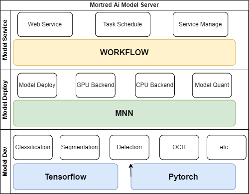

# Mortred AI Model Web Server

Morted AI Model Server is a flexible and easy to use tool for serving deep learning models.Models were trained using tensorflow/pytorch deployed via MNN toolkit and finally served as a web server based on workflow framework.

The three major components are illustrated on the architecture picture bellow.

A quick overview and examples for both serving and model benchmarking are provided below. Detailed documentation and examples will be provided in the docs folder.

You're welcomed to ask questions and help me to make it better!