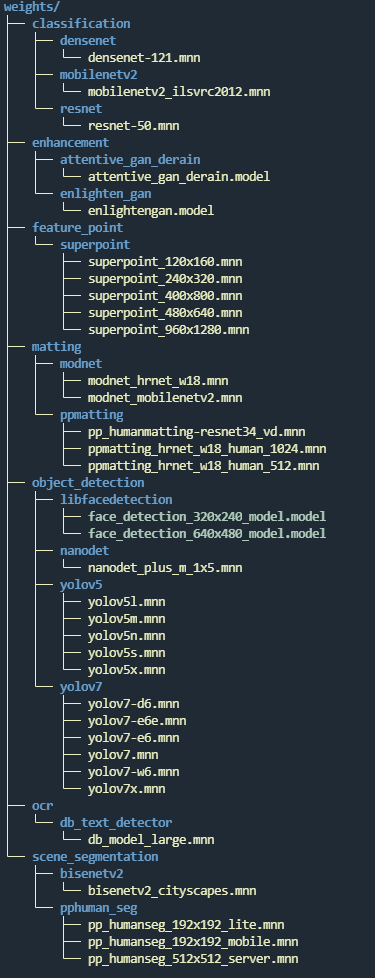
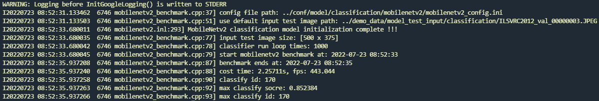

<div id="top" align="center">

  <h1 align="center">
    
  </h1>

  

   Mortred-AI-Web-Server: A Noob Web Server for AI Models

   | [English](README.md) | [中文](README.zh-cn.md) |

   [](https://github.com/MaybeShewill-CV/mortred_model_server/actions/workflows/ci.yml)

</div>

   Mortred AI Model Server is a toy web server for deep learning models. Server tries its best to make the most usage of your cpu and gpu resources. All dl models are trained by `tensorflow/pytorch` and deployed via [MNN](https://github.com/alibaba/MNN) toolkit and supply web service through [workflow](https://github.com/sogou/workflow) framework finally.

Do not hesitate to let me know if you find bugs here cause I'm a c-with-struct noob :upside_down_face:

The three major components are illustrated on the architecture picture below.

<p align="center">
  
</p>

A quick overview and examples for both serving and model benchmarking are provided below. Detailed documentation and examples will be provided in the docs folder.

You're welcomed to ask questions and help me to make it better!

All models and detectors can be downloaded from my [Hugging Face Page](https://huggingface.co/MaybeShewill-CV/mortred_model_server).

# `Contents of this document`

* [Quick Start](#quick-start)
* [Benchmark](#benchmark)
* [Tutorials](#tutorials)
* [How To](#how-to)
* [Web Server Configuration](#web-server-configuration)

# `Quick Start`

Before proceeding further with this document, make sure you have the following prerequisites

**1.** Make sure you have **CUDA&GPU&Driver** rightly installed. You may refer to [this](https://developer.nvidia.com/cuda-toolkit) to install them

**2.** Make sure you have **MNN** installed. For install instruction you may find some help [here](https://www.yuque.com/mnn/en/build_linux). MNN-2.7.0 release version was recommended.

**3.** Make sure you have **WORKFLOW** installed. For install instruction you may find some help [here](https://github.com/sogou/workflow)

**4.** Make sure you have **OPENCV** installed. For install instruction you may find some help [here](https://docs.opencv.org/4.x/d7/d9f/tutorial_linux_install.html)

**5.** Make sure your **GCC** tookit support cpp-17

**6.** Segment-Anything needs **ONNXRUNTIME** and **TensorRT** library. You may refer to [this](https://onnxruntime.ai/) to install onnxruntime>=1.16.0 and [this](https://developer.nvidia.com/tensorrt) to install TensorRT-8.6.1.6

After all prerequisites are settled down you may start to build the mortred ai server frame work.

### Setup :fire::fire::fire:

> Linux is the only supported build/run platform. Two build paths are provided:
>
> - **Path A (tests-only)**: builds the `common` library and unit tests only, for
>   CI and quick verification. Dependencies come from vcpkg (recommended) or system
>   apt packages.
> - **Path B (full build)**: builds all models, servers and tools. Requires the
>   vendored engines under `3rd_party` (MNN / WORKFLOW / ONNXRUNTIME / TensorRT /
>   and a CUDA toolkit.

#### Path A: tests-only

Option A1 - vcpkg (recommended, reproducible):

```bash
# 1. Install vcpkg (or reuse an existing checkout)
git clone https://github.com/microsoft/vcpkg.git /path/to/vcpkg
/path/to/vcpkg/bootstrap-vcpkg.sh -disableMetrics

# 2. Configure (vcpkg installs opencv/glog/eigen3/gtest from vcpkg.json automatically)
cd $PROJECT_ROOT_DIR
cmake -B build -DMORTRED_BUILD_FULL=OFF \
      -DCMAKE_TOOLCHAIN_FILE=/path/to/vcpkg/scripts/buildsystems/vcpkg.cmake

# 3. Build and run the unit tests
cmake --build build --target check -j10
ctest --test-dir build --output-on-failure
```

`builtin-baseline` is intentionally not hard-coded in `vcpkg.json`; if your vcpkg
instance requires an explicit baseline, run
`vcpkg x-update-baseline --add-initial-baseline` once and reconfigure. CI pins the
baseline to a fixed vcpkg release tag (`VCPKG_TAG` in `.github/workflows/ci.yml`)
in a workspace-external manifest copy, so CI builds are reproducible without
touching this file. For fully reproducible local builds, commit the result of the
`x-update-baseline` command above.

Option A2 - system packages (Ubuntu 22.04):

```bash
sudo apt-get install -y build-essential cmake \
  libopencv-dev libgoogle-glog-dev libeigen3-dev libgtest-dev
# Ubuntu's libgtest-dev ships sources only; build it once:
cd /usr/src/googletest && sudo cmake . && sudo make -j$(nproc) && sudo make install

cd $PROJECT_ROOT_DIR
cmake -B build -DMORTRED_BUILD_FULL=OFF
cmake --build build --target check -j10
ctest --test-dir build --output-on-failure
```

#### Path B: full build

```bash
# 1. Verify / fill in the vendored 3rd-party dependencies
#    (MNN / WORKFLOW / ONNXRUNTIME / TensorRT + CUDA).
#    If something is missing, set the corresponding *_ROOT_DIR env vars and re-run.
./scripts/setup_full_deps.sh

# 2. Configure and build
mkdir build && cd build
cmake ..            # optionally add -DCMAKE_TOOLCHAIN_FILE=... to also use vcpkg
make -j10
```

By default executables go to `$PROJECT_ROOT_DIR/_bin` and shared libraries to
`$PROJECT_ROOT_DIR/_lib`; both are configurable with
`-DMORTRED_BIN_OUTPUT_DIR=...` and `-DMORTRED_LIB_OUTPUT_DIR=...`.

Additional CMake options:

| Option | Default | Description |
| --- | --- | --- |
| `MORTRED_BUILD_FULL` | `ON` | Build all models/servers/apps (needs CUDA + vendored engines). Set `OFF` for tests-only. |
| `MORTRED_ENABLE_WERROR` | `OFF` | Treat compiler warnings as errors (`-Wall -Wextra -Werror`), used by the CI quality gate. |
| `MORTRED_BIN_OUTPUT_DIR` | `$PROJECT_ROOT_DIR/_bin` | Executable output directory. |
| `MORTRED_LIB_OUTPUT_DIR` | `$PROJECT_ROOT_DIR/_lib` | Shared library output directory. |

Predefined CMake presets are available in `CMakePresets.json`:

```bash
cmake --preset tests-only
cmake --build --preset tests-only
ctest --preset tests-only
```

See [docs/repository-layout.md](docs/repository-layout.md) for the canonical source/config/executable mapping and repository hygiene policy.

**Step 3:** Download Pre-Built Models :tea::tea::tea:

Download pre-built models with the built-in script (Hugging Face source, no manual download):

```bash
cd $PROJECT_ROOT_DIR
python3 scripts/fetch_weights.py            # download all weights into weights/
python3 scripts/fetch_weights.py --check    # verify integrity (sha256)
```

If your GPU/TRT version differs from the prebuilt engines, regenerate
hardware-adapted TensorRT engines first (see [Deployment](#deployment)):

```bash
cd $PROJECT_ROOT_DIR
./scripts/convert_trt_engines.sh --list     # show the engine manifest
./scripts/convert_trt_engines.sh            # convert missing engines for this machine
```

The weights directory structure should look like

<p align="left">
  
</p>

**Step 4:** Test MobileNetv2 Benchmark Tool

The benchmark and server apps will be built in \$PROJECT_ROOT_DIR/_bin and libs will be built in \$PROJECT_ROOT_DIR/_lib.
Benchmark the mobilenetv2 classification model

```bash
cd $PROJECT_ROOT_DIR/_bin
./mobilenetv2_benchmark.out ../conf/model/classification/mobilenetv2/mobilenetv2_config.toml
```

You should see the mobilenetv2 model benchmark profile as follows:

<p align="left">
  
</p>

**Step 5:** Run MobileNetV2 Server Locally

The detailed description about web server configuration will be found at [Web Server Configuration](#web-server-configuration). Now start serving the model

```bash
cd $PROJECT_ROOT_DIR/_bin
./mobilenetv2_classification_server.out ../conf/server/classification/mobilenetv2/mobilenetv2_server_config.toml
```

Model service will start at the `port` configured in the server config (`conf/server/classification/mobilenetv2/mobilenetv2_server_config.toml`, default `9002`, `worker_nums=1`). A demo python client was supplied to test the service

```bash
cd $PROJECT_ROOT_DIR/scripts
export PYTHONPATH=$PWD:$PYTHONPATH
python server/test_server.py --server mobilenetv2 --mode single
```

The client will repeatly post [demo images](./demo_data/model_test_input/classification/ILSVRC2012_val_00000003.JPEG) 1000 times. Server output should be like

Client output should be like


For more server demo you may find them in [Tutorials](#tutorials) :point_down::point_down::point_down:

# `Benchmark`

The benchmark test environment is as follows：

**OS:** Ubuntu 20.04.5 LTS / 5.15.0-87-generic

**MEMORY:** 32G DIMM DDR4 Synchronous 2666 MHz

**CPU:** Intel(R) Core(TM) i5-10400 CPU @ 2.90GHz

**GCC:** gcc (Ubuntu 9.4.0-1ubuntu1~20.04.2) 9.4.0

**GPU:** GeForce RTX 3080

**CUDA:** CUDA Version: 11.5

**GPU Driver:** Driver Version: 495.29.05

### Model Inference Benchmark

All models loop several times to avoid the influence of gpu's warmup and only model's inference time has been counted.

`Benchmark Code Snappit`


* [Details Of Model Inference Benchmark](./docs/model_inference_benchmark.md)
* [About Model Configuration](./docs/about_model_configuration.md)

# `Tutorials`

* [Image Classification Model Server Tutorials](./docs/tutorials_of_classification_model_server.md)
* [Image Segmentation Model Server Tutorials](./docs/tutorials_of_segmentation_model_server.md)
* [Image Object Detection Model Server Tutorials](./docs/tutorials_of_object_detection_model_server.md)
* [Image Enhancement Model Server Tutorials](./docs/tutorials_of_enhancement_model_server.md)
* [Image Feature Point Model Server Tutorials](./docs/tutorials_of_feature_point_model_server.md)

# `How To`

* [How To Add New Model](./docs/how_to_add_new_model.md) :fire::fire:
* [How To Add New Server](./docs/how_to_add_new_server.md) :fire::fire:

# `Web Server Configuration`

* [Description About Model Server](./docs/about_model_server_configuration.md)

# `Deployment`

## One-command dependency install

Build and install all third-party dependencies (MNN / WORKFLOW / ONNXRUNTIME /
TensorRT / CUDA / fmt / header-only libs) into `3rd_party/{include,libs}` with
a single script — no manual compilation or copying:

```bash
./scripts/install_deps.sh --all     # build/install everything (CUDA 11 baseline)
./scripts/install_deps.sh --check   # verify integrity and print versions
./scripts/install_deps.sh --cuda-version 12   # switch to the CUDA 12 / TRT 10 line
```

## Docker (fully automated build)

```bash
docker build -t mortred_model_server .
docker run --gpus all -p 8787:8787 \
  -v $PWD/weights:/opt/mortred/weights \
  -e APP_AUTH_TOKEN=your-token \
  mortred_model_server
# or: docker compose up -d   (see docker-compose.yml)
```

The image builds all deps + the full project, runs the unit/e2e tests, and
ships the web console; model weights are mounted, not baked in.

## TensorRT engine regeneration (hardware-adapted)

Prebuilt engines may mismatch your GPU architecture / TRT version. Regenerate
them from the ONNX sources for this machine:

```bash
./scripts/convert_trt_engines.sh --list    # show the manifest (19 engines)
./scripts/convert_trt_engines.sh           # convert missing engines (FP16 + dynamic profiles)
./scripts/convert_trt_engines.sh --force   # rebuild everything
```

See [docs/deployment-and-deps-plan.md](docs/deployment-and-deps-plan.md) for the
full plan, version matrix and acceptance criteria.

# `TODO`

* [ ] Add more model into model zoo

# `Repo-Status`


# `Star History`

[](https://star-history.com/#MaybeShewill-CV/mortred_model_server&Date)

## Visitor Count


# `Acknowledgement`

mortred_model_server refers to the following projects:

* <https://github.com/sogou/workflow>
* <https://github.com/alibaba/MNN>
* <https://github.com/PaddlePaddle/PaddleSeg>
* <https://github.com/Tencent/rapidjson>
* <https://github.com/ToruNiina/toml11>
