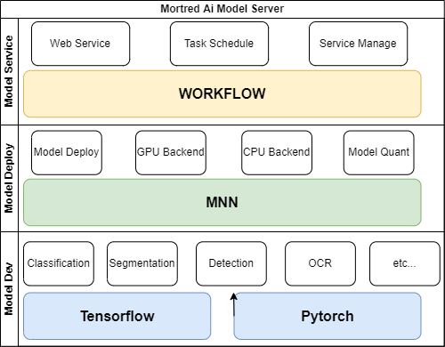
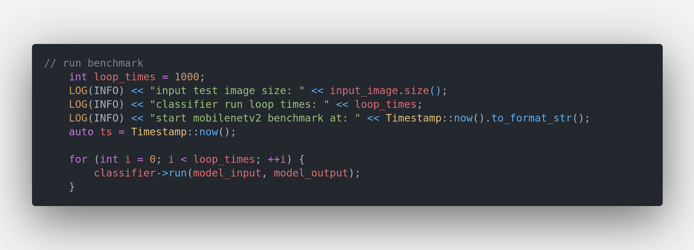

<div id="top" align="center">

  <h1 align="center">
    
  </h1>

  

   Mortred-AI-Web-Server: A Noob Web Server for AI Models

   | [English](README.md) | [中文](README.zh-cn.md) |

   [](https://github.com/MaybeShewill-CV/mortred_model_server/actions/workflows/ci.yml)

</div>

   Mortred AI Model Server is a toy web server for deep learning models. Server tries its best to make the most usage of your cpu and gpu resources. All dl models are trained by `tensorflow/pytorch` and deployed via [MNN](https://github.com/alibaba/MNN) toolkit and supply web service through [workflow](https://github.com/sogou/workflow) framework finally.

Do not hesitate to let me know if you find bugs here cause I'm a c-with-struct noob :upside_down_face:

The three major components are illustrated on the architecture picture below.

<p align="center">
  
</p>

A quick overview and examples for both serving and model benchmarking are provided below. Detailed documentation and examples will be provided in the docs folder.

You're welcomed to ask questions and help me to make it better!

All models and detectors can be downloaded from my [Hugging Face Page](https://huggingface.co/MaybeShewill-CV/mortred_model_server).

# `Contents of this document`

* [Quick Start](#quick-start)
* [Benchmark](#benchmark)
* [Tutorials](#tutorials)
* [How To](#how-to)
* [Web Server Configuration](#web-server-configuration)
* [HTTP API Contract](./docs/api-contract.md)

# `Quick Start`

> Linux is the only supported platform. Two deployment profiles exist and one
> switch drives everything (build, dependencies, model catalog, weight subset):
>
> | | `gpu` (default) | `cpu` |
> |---|---|---|
> | backends | MNN-CUDA / ORT-CUDA / TensorRT | MNN-CPU / ORT-CPU |
> | hardware | NVIDIA GPU + CUDA 11/12 | any x64 machine |
> | models | full zoo | curated set (mobilenetv2, resnet50, yolov8, hrnet) |
>
> Three entries, one core (`mortredctl`): pick whichever fits; they all end at
> the same `mortredctl doctor` acceptance gate.

### Entry 1: one-line bootstrap (fastest)

```bash
curl -fsSL https://raw.githubusercontent.com/MaybeSheewill-CV/mortred_model_server/main/scripts/bootstrap.sh | bash
```

Detects your hardware (NVIDIA GPU → `gpu`, otherwise `cpu`), then delegates to
the docker track (if docker is present) or downloads the latest release
tarball and runs its installer.

### Entry 2: docker compose

```bash
git clone https://github.com/MaybeSheewill-CV/mortred_model_server.git
cd mortred_model_server
python3 scripts/fetch_weights.py --profile cpu        # or: gpu
MORTRED_API_TOKEN=<mgmt-token> MORTRED_GATEWAY_AUTH_TOKEN=<infer-token> \
    docker compose --profile cpu up -d                # or: --profile gpu
curl -fs http://localhost:8787/api/v1/health
```

### Entry 3: release tarball + systemd (bare metal)

Download `mortred_model_server-<version>-<profile>-linux-x64.tar.gz` from
[Releases](https://github.com/MaybeSheewill-CV/mortred_model_server/releases),
verify its `.sha256`, then:

```bash
tar -xzf mortred_model_server-*-linux-x64.tar.gz && cd mortred_model_server-*-linux-x64
sudo ./install.sh                                  # runtime deps + /opt/mortred + systemd
sudoedit /etc/mortred/supervisor.env               # set both tokens
cd /opt/mortred && python3 scripts/fetch_weights.py --profile cpu
sudo systemctl start mortred-supervisor
```

### First-hour core: mortredctl

```bash
mortredctl init [--profile cpu|gpu]   # detect hw, fetch weight subset, verify
mortredctl doctor                     # live acceptance + non-fatal security warnings
mortredctl status | catalog           # runtime introspection
```

GPU note: TensorRT engines are per-machine artifacts; convert missing ones
with `scripts/convert_trt_engines.sh`, or start the container with
`-e MORTRED_AUTO_BUILD_ENGINES=true` to convert before autostart.

### Building from source

```bash
# dependencies (version matrix + sha256 pinned + idempotent stamps)
./scripts/install_deps.sh --all              # gpu line (CUDA 11 default)
./scripts/install_deps.sh --cpu --all        # cpu line (no NVIDIA/TRT at all)

# configure + build (presets carry the profile)
cmake --preset full && cmake --build --preset full            # gpu
cmake --preset full-cpu && cmake --build --preset full-cpu    # cpu

# verify
./scripts/verify_deployment.sh --basic
```

Unit tests only (no engines needed; system packages or vcpkg):

```bash
cmake --preset tests-only && cmake --build --preset tests-only && ctest --preset tests-only
```

> The complete operations manual - architecture diagrams, per-track walkthroughs,
> security checklist, upgrades, troubleshooting - lives in
> [docs/deployment.md](docs/deployment.md) / [中文版](docs/deployment.zh-cn.md).


# `Benchmark`

The benchmark test environment is as follows：

**OS:** Ubuntu 20.04.5 LTS / 5.15.0-87-generic

**MEMORY:** 32G DIMM DDR4 Synchronous 2666 MHz

**CPU:** Intel(R) Core(TM) i5-10400 CPU @ 2.90GHz

**GCC:** gcc (Ubuntu 9.4.0-1ubuntu1~20.04.2) 9.4.0

**GPU:** GeForce RTX 3080

**CUDA:** CUDA Version: 11.5

**GPU Driver:** Driver Version: 495.29.05

### Model Inference Benchmark

All models loop several times to avoid the influence of gpu's warmup and only model's inference time has been counted.

`Benchmark Code Snappit`


* [Details Of Model Inference Benchmark](./docs/model_inference_benchmark.md)
* [About Model Configuration](./docs/about_model_configuration.md)

# `Tutorials`

* [Image Classification Model Server Tutorials](./docs/tutorials_of_classification_model_server.md)
* [Image Segmentation Model Server Tutorials](./docs/tutorials_of_segmentation_model_server.md)
* [Image Object Detection Model Server Tutorials](./docs/tutorials_of_object_detection_model_server.md)
* [Image Enhancement Model Server Tutorials](./docs/tutorials_of_enhancement_model_server.md)
* [Image Feature Point Model Server Tutorials](./docs/tutorials_of_feature_point_model_server.md)

# `How To`

* [How To Add New Model](./docs/how_to_add_new_model.md) :fire::fire:
* [How To Add New Server](./docs/how_to_add_new_server.md) :fire::fire:
* [Model Developer Guide (task-oriented paths, contract / golden / debugging)](./docs/model-developer-guide.md)
* [Inference CI (hosted MNN smoke vs maintainer GPU golden)](./docs/ci-golden-regression.md)
* [P4: Modern Model Developer Experience Plan (Chinese)](./docs/model-developer-experience-p4.zh-cn.md)

# `Web Server Configuration`

* [Description About Model Server](./docs/about_model_server_configuration.md)
* [HTTP API Contract (topology, auth, status mapping, overload behaviour)](./docs/api-contract.md)

# `Deployment`

## One-command dependency install

Build and install all third-party dependencies (MNN / WORKFLOW / ONNXRUNTIME /
TensorRT / CUDA / fmt / header-only libs) into `3rd_party/{include,libs}` with
a single script — no manual compilation or copying:

```bash
./scripts/install_deps.sh --all     # build/install everything (CUDA 11 baseline)
./scripts/install_deps.sh --check   # verify integrity and print versions
./scripts/install_deps.sh --cuda-version 12   # switch to the CUDA 12 / TRT 10 line
```

## Docker (fully automated build)

```bash
docker build -t mortred_model_server .
docker run --gpus all -p 127.0.0.1:8080:8080 -p 127.0.0.1:8787:8787 \
  -v $PWD/weights:/opt/mortred/weights \
  -e MORTRED_GATEWAY_AUTH_TOKEN=your-inference-token \
  -e MORTRED_API_TOKEN=your-management-token \
  mortred_model_server
# or: docker compose up -d   (see docker-compose.yml)
```

The image builds all deps + the full project, runs the unit/e2e tests, and
ships the control plane. In-container topology: `mortred-supervisor`
(management :8787, embedded web UI + REST API) supervises `mortred-gateway`
(data plane :8080, the single inference entry) and all model servers; model
processes bind loopback only and are no longer exposed port by port. The
compose and `docker run` examples bind 8080/8787 to `127.0.0.1` on the host.
External exposure must terminate TLS at a reverse proxy; do not publish
those ports on `0.0.0.0` without one (Bearer tokens would travel in the
clear). Gateway `GET /metrics` is public unless `MORTRED_METRICS_TOKEN` is
set. Fail-closed only refuses a non-loopback listener with no auth configured. A copy-paste Caddyfile is
in [deploy/caddy/Caddyfile](deploy/caddy/Caddyfile). `mortredctl doctor`
warns about non-loopback listeners and weak/identical tokens but does not
fail for missing TLS.

## TensorRT engine regeneration (hardware-adapted)

Prebuilt engines may mismatch your GPU architecture / TRT version. Regenerate
them from the ONNX sources for this machine. Conversion uses the external
`trtexec` CLI (TensorRT official tool): `sudo ./scripts/install_deps.sh --nvidia`
installs it into `3rd_party/bin/`, or point to your system TensorRT copy with
`--trtexec /path/to/trtexec`:

```bash
./scripts/convert_trt_engines.sh --list    # show the manifest (19 engines)
./scripts/convert_trt_engines.sh           # convert missing engines (FP16 + dynamic profiles)
./scripts/convert_trt_engines.sh --force   # rebuild everything
```

The script detects the local TensorRT major version and emits the matching
workspace flag. Use `--trtexec` when multiple TensorRT installations coexist.

# `TODO`

* [ ] Add more model into model zoo

# `Repo-Status`


# `Star History`

[](https://star-history.com/#MaybeShewill-CV/mortred_model_server&Date)

## Visitor Count


# `Acknowledgement`

mortred_model_server refers to the following projects:

* <https://github.com/sogou/workflow>
* <https://github.com/alibaba/MNN>
* <https://github.com/PaddlePaddle/PaddleSeg>
* <https://github.com/Tencent/rapidjson>
* <https://github.com/ToruNiina/toml11>
