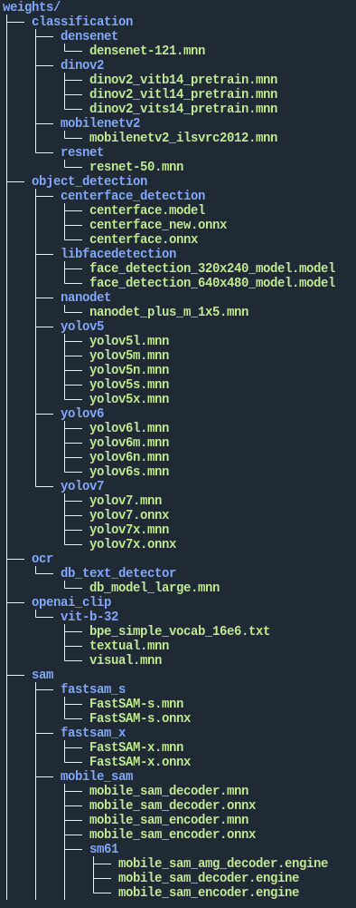

<div id="top" align="center">

  <h1 align="center">
    
  </h1>

  

   Mortred-AI-Web-Server: A Noob Web Server for AI Models

   | [English](README.md) | [中文](README.zh-cn.md) |

</div>

Morted AI Model Server is a toy web server for deep learning models. Server tries its best to make the most usage of your cpu and gpu resources. All dl models are trained by `tensorflow/pytorch` and deployed via [MNN](https://github.com/alibaba/MNN) toolkit and supply web service through [workflow](https://github.com/sogou/workflow) framework finally.

Do not hesitate to let me know if you find bugs here cause I'm a c-with-struct noob :upside_down_face:

The three major components are illustrated on the architecture picture bellow.

<p align="center">
  
</p>

A quick overview and examples for both serving and model benchmarking are provided below. Detailed documentation and examples will be provided in the docs folder.

You're welcomed to ask questions and help me to make it better!

All models and detectors can be downloaded from my [Hugging Face Page](https://huggingface.co/MaybeShewill-CV/mortred_model_server).

# `Contents of this document`

* [Quick Start](#quick-start)
* [Benchmark](#benchmark)
* [Tutorials](#tutorials)
* [How To](#how-to)
* [Web Server Configuration](#web-server-configuration)

# `Quick Start`

Before proceeding further with this document, make sure you have the following prerequisites

**1.** Make sure you have **CUDA&GPU&Driver** rightly installed. You may refer to [this](https://developer.nvidia.com/cuda-toolkit) to install them

**2.** Make sure you have **MNN** installed. For install instruction you may find some help [here](https://www.yuque.com/mnn/en/build_linux). MNN-2.7.0 release version was recommended.

**3.** Make sure you have **WORKFLOW** installed. For install instruction you may find some help [here](https://github.com/sogou/workflow)

**4.** Make sure you have **OPENCV** installed. For install instruction you may find some help [here](https://docs.opencv.org/4.x/d7/d9f/tutorial_linux_install.html)

**5.** Make sure your **GCC** tookit support cpp-17

**6.** Segment-Anything needs **ONNXRUNTIME** and **TensorRT** library. You may refer to [this](https://onnxruntime.ai/) to install onnxruntime>=1.16.0 and [this](https://developer.nvidia.com/tensorrt) to install TensorRT-8.6.1.6

After all prerequisites are settled down you may start to build the mortred ai server frame work.

### Setup :fire::fire::fire:

**Step 1:** Prepare 3rd-party Libraries

Copy MNN headers and libs

```bash
cp -r $MNN_ROOT_DIR/include/MNN ./3rd_party/include
cp $MNN_ROOT_DIR/build/libMNN.so ./3rd_party/libs
cp $MNN_ROOT_DIR/build/source/backend/cuda/libMNN_Cuda_Main.so ./3rd_party/libs
```

Copy WORKFLOW headers and libs

```bash
cp -r $WORKFLOW_ROOT_DIR/_include/workflow ./3rd_party/include
cp -r $WORKFLOW_ROOT_DIR/_lib/libworkflow.so* ./3rd_party/libs
```

Copy ONNXRUNTIME headers and libs

```bash
cp -r $ONNXRUNTIME_ROOT_DIR/include/* ./3rd_party/include/onnxruntime
cp -r $ONNXRUNTIME_ROOT_DIR/_lib/libonnxruntime*.so* ./3rd_party/libs
```

Copy TensorRT headers and libs

```bash
cp -r $TENSORRT_ROOT_DIR/include/* ./3rd_party/include/TensorRT-8.6.1.6
cp -r $TENSORRT_ROOT_DIR/_lib/libnvinfer.so* ./3rd_party/libs
cp -r $TENSORRT_ROOT_DIR/_lib/libnvinfer_builder_resource.so.8.6.1 ./3rd_party/libs
cp -r $TENSORRT_ROOT_DIR/_lib/libnvinfer_plugin.so* ./3rd_party/libs
cp -r $TENSORRT_ROOT_DIR/_lib/libnvonnxparser.so* ./3rd_party/libs
```

**Step 2:** Build Mortred AI Server :coffee::coffee::coffee:

```bash
mkdir build && cd build
cmake ..
make -j10
```

**Step 3:** Download Pre-Built Models :tea::tea::tea:

Download pre-built image models via [BaiduNetDisk](https://pan.baidu.com/s/1yneu-7X5IMIuv31Gn5ZIzg) and extract code is `1y98`. Create a directory named `weights` in $PROJECT_ROOT_DIR and unzip the downloaded models in it. The weights directory  structure should looks like

<p align="left">
  
</p>

**Step 4:** Test MobileNetv2 Benchmark Tool

The benchmark and server apps will be built in \$PROJECT_ROOT_DIR/_bin and libs will be built in \$PROJECT_ROOT_DIR/_lib.
Benchmark the mobilenetv2 classification model

```bash
cd $PROJECT_ROOT_DIR/_bin
./mobilenetv2_benchmark.out ../conf/model/classification/mobilenetv2/mobilenetv2_config.ini
```

You should see the mobilenetv2 model benchmark profile as follows:

<p align="left">
  
</p>

**Step 5:** Run MobileNetV2 Server Locally

The detailed description about web server configuration will be found at [Web Server Configuration](#web-server-configuration). Now start serving the model

```bash
cd $PROJECT_ROOT_DIR/_bin
./mobilenetv2_classification_server.out ../conf/server/classification/mobilenetv2/mobilenetv2_server_config.ini
```

Model service will be start at `http://localhost:8091` with 4 workers waiting to serve. A demo python client was supplied to test the service

```bash
cd $PROJECT_ROOT_DIR/scripts
export PYTHONPATH=$PWD:$PYTHONPATH
python server/test_server.py --server mobilenetv2 --mode single
```

The client will repeatly post [demo images](./demo_data/model_test_input/classification/ILSVRC2012_val_00000003.JPEG) 1000 times. Server output should be like

Client output should be like


For more server demo you may find them in [Torturials](#tutorials) :point_down::point_down::point_down:

# `Benchmark`

The benchmark test environment is as follows：

**OS:** Ubuntu 20.04.5 LTS / 5.15.0-87-generic

**MEMORY:** 32G DIMM DDR4 Synchronous 2666 MHz

**CPU:** Intel(R) Core(TM) i5-10400 CPU @ 2.90GHz

**GCC:** gcc (Ubuntu 9.4.0-1ubuntu1~20.04.2) 9.4.0

**GPU:** GeForce RTX 3080

**CUDA:** CUDA Version: 11.5

**GPU Driver:** Driver Version: 495.29.05

### Model Inference Benchmark

All models loop several times to avoid the influence of gpu's warmup and only model's inference time has been counted.

`Benchmark Code Snappit`


* [Details Of Model Inference Benchmark](./docs/model_inference_benchmark.md)
* [About Model Configuration](./docs/about_model_configuration.md)

# `Tutorials`

* [Image Classification Model Server Tutorials](./docs/tutorials_of_classification_model_server.md)
* [Image Segmentation Model Server Tutorials](./docs/tutorials_of_segmentation_model_server.md)
* [Image Object Detection Model Server Tutorials](./docs/tutorials_of_object_detection_model_server.md)
* [Image Enhancement Model Server Tutorials](./docs/tutorials_of_enhancement_model_server.md)
* [Image Feature Point Model Server Tutorials](./docs/tutorials_of_feature_point_model_server.md)

# `How To`

* [How To Add New Model](./docs/how_to_add_new_model.md) :fire::fire:
* [How To Add New Server](./docs/how_to_add_new_server.md) :fire::fire:

# `Web Server Configuration`

* [Description About Model Server](./docs/about_model_server_configuration.md)
* [Description About Proxy Server](./docs/about_proxy_server_configuration.md)

# `TODO`

* [ ] Add more model into model zoo

# `Repo-Status`


# `Star History`

[](https://star-history.com/#MaybeShewill-CV/mortred_model_server&Date)

## Visitor Count


# `Acknowledgement`

mortred_model_server refers to the following projects:

* <https://github.com/sogou/workflow>
* <https://github.com/alibaba/MNN>
* <https://github.com/PaddlePaddle/PaddleSeg>
* <https://github.com/Tencent/rapidjson>
* <https://github.com/ToruNiina/toml11>
