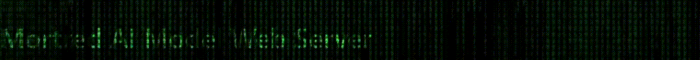

<div id="top" align="center">

  <h1 align="center">
    
  </h1>

  

   Mortred-AI-Web-Server: 一个面向DL模型的Web服务器

   | [English](README.md) | [中文](README.zh-cn.md) |

</div>

这是一个易于使用的面向DL模型的Web服务器，致力于充分发挥单机的cpu和gpu性能。整个服务器的架构大致可以分成三层，最底层的DL模型开发依赖于 `tensorflow/pytorch` 框架，中间的DL模型推理引擎主要依赖 [MNN](https://github.com/alibaba/MNN) 它具有高性能、易于适配多种计算后端的优势，上层的DL模型网络服务依赖高性能C++服务器引擎 [workflow](https://github.com/sogou/workflow) 来完成.

欢迎你反馈任何你发现的bug，本人还是一个c with struct 弱鸡 :upside_down_face:

整个项目的简要架构图如下

<p align="center">
  
</p>

欢迎你提出改进意见或者pr来帮助我把它建设的更好 :smile::fire:

# `文档目录`

* [快速开始](#快速开始)
* [Benchmark](#benchmark)
* [模型说明](#模型说明)
* [文档教程](#文档教程)
* [网络服务器配置说明](#网络服务器配置说明)
* [Model_Zoo](#model_zoo)

# `快速开始`

在开始使用本项目之前，有如下的准备工作需要完成，以确保项目可以正常运行

**1.** 确保 **CUDA&GPU&Driver** 正确安装，否则只能使用cpu做服务器的计算后端，一些复杂模型cpu计算耗时非常久，不推荐使用cpu作为计算后端. 你可以参考 [nvidia文档](https://developer.nvidia.com/cuda-toolkit) 来正确安装。

**2.** 确保 **MNN** 已正常安装. 同样可以参考他们的 [官方安装文档](https://www.yuque.com/mnn/en/build_linux). 值得一提的是 `MNN-2.0.0` 的 `cuda` 计算后端目前暂时不可用，推荐在本项目中使用 `MNN-1.2.0`

**3.** 确保 **WORKFLOW** 正确安装. 可以参考 [官方安装文档](https://github.com/sogou/workflow)

**4.** 确保 **OPENCV** 正确安装. 可以参考 [官方安装文档](https://docs.opencv.org/4.x/d7/d9f/tutorial_linux_install.html)

**5.** 确保你的开发环境中的 **GCC** 编译工具链支持 `CPP11`

准备工作都完成之后可以愉快的安装本项目了 :tea:

### 编译安装 :fire::fire::fire:

**Step 1:** 准备一些第三方库的头文件和库文件

拷贝`MNN`的头文件和库文件到 `./3rd_party/include` 和 `./3rd_party/libs` 文件夹, `$PROJECT_ROOT_DIR` 在该文档中代表此项目的根目录，`MNN_ROOT_DIR` 代表 `MNN` 项目在你机器的根目录

```bash
cd $PROJECT_ROOT_DIR
cp -r $MNN_ROOT_DIR/include/MNN ./3rd_party/include
cp $MNN_ROOT_DIR/build/libMNN.so ./3rd_party/libs
cp $MNN_ROOT_DIR/build/source/backend/cuda/libMNN_Cuda_Main.so ./3rd_party/libs
```

同样的方式拷贝workflow的头文件和库文件, `WORKFLOW_ROOT_DIR` 代表 `workflow` 项目在你机器的根目录

```bash
cp -r $WORKFLOW_ROOT_DIR/_include/workflow ./3rd_party/include
cp -r $WORKFLOW_ROOT_DIR/_lib/libworkflow.so* ./3rd_party/libs
```

**Step 2:** 开始编译本项目 :coffee::coffee::coffee:

```bash
mkdir build && cd build
cmake ..
make -j10
```

**Step 3:** 下载项目提供的一些预训练模型 :tea::tea::tea:

可以通过 [百度网盘](https://pan.baidu.com/s/1yneu-7X5IMIuv31Gn5ZIzg) 下载预训练模型，提取码为 `1y98`. 在项目根目录新建 `weights` 文件夹并将刚下载的预训练模型解压在该目录中。完成后的文件夹结构应该如图所示。

<p align="left">
  
</p>

**Step 4:** 测试 MobileNetv2 基准测试工具

至此你已经完成的项目的编译工作，可以开始测试体验项目提供的预训练模型了。所有的模型基准测试工具都被编译产出在 `$PROJECT_ROOT_DIR/_bin` 文件夹中且都被命名为 `xxx_benchmark.out`

现在你可以通过如下方式来愉快的进行 `mobilenetv2` 图像分类基准测试

```bash
cd $PROJECT_ROOT_DIR/_bin
./mobilenetv2_benchmark.out ../conf/model/classification/mobilenetv2/mobilenetv2_config.ini
```

如果没有任何错误的话（应该不会有:dog:），你可以看到如下的测试结果，包含使用的模型，模型预测耗时、fps等信息

<p align="left">
  
</p>

**Step 5:** 运行 MobileNetV2 图像分类服务器

有关网络服务器的一些细节参数可以查看 [网络服务器配置说明](#网络服务器配置说明)。下面让我们愉快的开启服务

```bash
cd $PROJECT_ROOT_DIR/_bin
./mobilenetv2_classification_server.out ../conf/server/classification/mobilenetv2/mobilenetv2_server_config.ini
```

按照默认的配置文件，服务端口为`8091`，有四个模型worker等待被调用。项目中含有一个简单的python客户端来测试该服务，使用方法如下

```bash
cd $PROJECT_ROOT_DIR/scripts
export PYTHONPATH=$PWD:$PYTHONPATH
python server/test_server.py --server mobilenetv2 --mode single
```

该客户端会重复向服务端发送 [demo images](./demo_data/model_test_input/classification/ILSVRC2012_val_00000003.JPEG) 1000 次. 服务端应该输出如下，包含任务的 `id`、`提交时间`、`完成时间` 等信息


客户端得到的返回信息如下，包含图像的类别id和相应的置信度得分


你可以在下文的 [模型说明](#模型说明) 章节获取更多的服务示例 :point_down::point_down::point_down:

# `Benchmark`

基准测试环境如下：

**OS:** Ubuntu 18.04.5 LTS / 5.4.0-53-generic

**MEMORY:** 32G DIMM DDR4 Synchronous 2666 MHz

**CPU:** Intel(R) Core(TM) i5-10400 CPU @ 2.90GHz

**GCC:** gcc (Ubuntu 7.5.0-3ubuntu1~18.04) 7.5.0

**GPU:** GeForce RTX 3080

**CUDA:** CUDA Version: 11.1

**GPU Driver:** Driver Version: 455.23.04

### DL模型推理基准测试

所有模型的测试过程都重复推理若干次以抵消GPU的warmup损耗，并且没有任何的io时间被算入

`Benchmark 代码段`


* [Model_Zoo 所有模型的详细基准测试结果](./docs/model_inference_benchmark.zh-cn.md)
* [关于模型推理的配置文件说明](./docs/about_model_configuration.zh-cn.md)

# `模型说明`

* [图像分类服务部署说明与示例](./docs/tutorials_of_classification_model_server.zh-cn.md)
* [图像分割服务部署说明与示例](./docs/tutorials_of_segmentation_model_server.zh-cn.md)
* [图像目标检测服务部署说明与示例](./docs/tutorials_of_object_detection_model_server.zh-cn.md)
* [图像增强服务部署说明与示例](./docs/tutorials_of_enhancement_model_server.zh-cn.md)
* [图像特征点检测服务部署说明与示例](./docs/tutorials_of_feature_point_model_server.zh-cn.md)

# `文档教程`

* [快速添加新的DL模型](./docs/how_to_add_new_model.zh-cn.md) :fire::fire:
* [快速添加新的DL服务](./docs/how_to_add_new_server.zh-cn.md) :fire::fire:

# `网络服务器配置说明`

* [模型网络服务器配置说明](./docs/about_model_server_configuration.zh-cn.md)
* [代理服务器配置说明](./docs/about_proxy_server_configuration.zh-cn.md)

# `Model Zoo`

<table>
  <tbody>
    <tr>
      <td>
        <b>模型</b>
      </td>
      <td>
        <b>BenchMark</b>
      </td>
    </tr>
    <tr>
      <td width="300">
        <ul>
        <details><summary><b>图像分类</b></summary>
          <ul>
            <li>ResNet </li>
            <li>MobileNetv2 </li>
            <li>DenseNet </li>
          </ul>
        </details>
        <details><summary><b>图像增强</b></summary>
          <ul>
            <details><summary><b>低光照补偿</b></summary>
                <ul>
                    <li>EnlightGan</li>
                </ul>
            </details>
            <details><summary><b>图像去雨滴</b></summary>
                <ul>
                    <li>AttentiveGan</li>
                </ul>
            </details>
          <ul>
        </details>
        <details><summary><b>图像特征点检测</b></summary>
          <ul>
              <li>SuperPoint</li>
          </ul>
        </details>
        <details><summary><b>图像Matting</b></summary>
          <ul>
            <li>paddleseg-modnet</li>
            <li>paddleseg-ppmatting</li>
          </ul>
        </details>
        <details><summary><b>图像目标检测</b></summary>
          <ul>
            <li>yolov5</li>
            <li>yolov7</li>
            <li>nanodet</li>
            <li>libface</li>
          </ul>
        </details>
        <details><summary><b>图像OCR</b></summary>
          <ul>
            <li>DbNet</li>
          </ul>
        </details>
        <details><summary><b>图像分割</b></summary>
          <ul>
            <li>bisenetv2</li>
            <li>pp-humanseg</li>
          </ul>
        </details>
        </ul>
      </td>
    </tr>
  </tbody>
</table>

# `TODO`

* [ ] 增加更多的DL模型
* [ ] 创建docker环境

# `开发状态`


# `致谢`

mortred_model_server 项目参考、借鉴了以下项目:

* <https://github.com/sogou/workflow>
* <https://github.com/alibaba/MNN>
* <https://github.com/PaddlePaddle/PaddleSeg>
* <https://github.com/Tencent/rapidjson>
* <https://github.com/ToruNiina/toml11>
