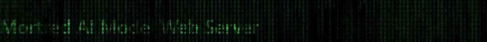

<div id="top" align="center">

  <h1 align="center">
    
  </h1>

  

   Mortred-AI-Web-Server: 一个面向DL模型的Web服务器

   | [English](README.md) | [中文](README.zh-cn.md) |

   [](https://github.com/MaybeShewill-CV/mortred_model_server/actions/workflows/ci.yml)

</div>

这是一个易于使用的面向DL模型的Web服务器，致力于充分发挥单机的cpu和gpu性能。整个服务器的架构大致可以分成三层，最底层的DL模型开发依赖于 `tensorflow/pytorch` 框架，中间的DL模型推理引擎主要依赖 [MNN](https://github.com/alibaba/MNN) 它具有高性能、易于适配多种计算后端的优势，上层的DL模型网络服务依赖高性能C++服务器引擎 [workflow](https://github.com/sogou/workflow) 来完成.

欢迎你反馈任何你发现的bug，本人还是一个c with struct 弱鸡 :upside_down_face:

模型文件可以访问我的 [Hugging Face Page](https://huggingface.co/MaybeShewill-CV/mortred_model_server)

整个项目的简要架构图如下

<p align="center">
  
</p>

欢迎你提出改进意见或者pr来帮助我把它建设的更好 :smile::fire:

# `文档目录`

* [快速开始](#快速开始)
* [Benchmark](#benchmark)
* [模型说明](#模型说明)
* [文档教程](#文档教程)
* [网络服务器配置说明](#网络服务器配置说明)
* [HTTP API 契约](./docs/api-contract.zh-cn.md)
* [Model_Zoo](#model_zoo)

# `快速开始`

在开始使用本项目之前，有如下的准备工作需要完成，以确保项目可以正常运行

**1.** 确保 **CUDA&GPU&Driver** 正确安装，否则只能使用cpu做服务器的计算后端，一些复杂模型cpu计算耗时非常久，不推荐使用cpu作为计算后端. 你可以参考 [nvidia文档](https://developer.nvidia.com/cuda-toolkit) 来正确安装。

**2.** 确保 **MNN** 已正常安装. 同样可以参考他们的 [官方安装文档](https://www.yuque.com/mnn/en/build_linux). 推荐在本项目中使用 `MNN-2.7.0`

**3.** 确保 **WORKFLOW** 正确安装. 可以参考 [官方安装文档](https://github.com/sogou/workflow)

**4.** 确保 **OPENCV** 正确安装. 可以参考 [官方安装文档](https://docs.opencv.org/4.x/d7/d9f/tutorial_linux_install.html)

**5.** 确保你的开发环境中的 **GCC** 编译工具链支持 `CPP17`

**6.** Segment-Anything 目前需要使用到 **ONNXRUNTIME** 和 **TensorRT** 库. 可以参考 [官方安装文档](https://onnxruntime.ai/) 安装onnxruntime>=1.16.0, [官方安装文档](https://developer.nvidia.com/tensorrt) 安装TensorRT-8.6.1.6

准备工作都完成之后可以愉快的安装本项目了 :tea:

### 编译安装 :fire::fire::fire:

> Linux 是唯一受支持的构建/运行平台。构建分为两条路径：
>
> - **路径 A（tests-only）**：只构建 `common` 库与单元测试，适合 CI 与快速验证。依赖来源为系统 apt 包（推荐）或 vcpkg。
> - **路径 B（full build）**：构建全部模型、服务与工具，需要 `3rd_party` 下的 vendored 引擎（MNN / WORKFLOW / ONNXRUNTIME / TensorRT）以及 CUDA 工具链。

#### 路径 A：tests-only

方案 A1 - 系统包（推荐，与 CI 一致）：

```bash
sudo apt-get install -y build-essential cmake \
  libopencv-dev libgoogle-glog-dev libeigen3-dev libgtest-dev libssl-dev
# Ubuntu 22.04 的 libgtest-dev 自带预编译库与 CMake 配置，可直接 find_package(GTest)

cd $PROJECT_ROOT_DIR
cmake -B build -DMORTRED_BUILD_FULL=OFF
cmake --build build --target check -j10
ctest --test-dir build --output-on-failure
```

方案 A2 - vcpkg（可选；仅本地开发用，CI 不使用）：

```bash
# 1. 安装 vcpkg（或复用已有实例）
git clone https://github.com/microsoft/vcpkg.git /path/to/vcpkg
/path/to/vcpkg/bootstrap-vcpkg.sh -disableMetrics

# 2. 配置（vcpkg 会按 vcpkg.json 自动安装 opencv/glog/eigen3/gtest）
cd $PROJECT_ROOT_DIR
cmake -B build -DMORTRED_BUILD_FULL=OFF \
      -DCMAKE_TOOLCHAIN_FILE=/path/to/vcpkg/scripts/buildsystems/vcpkg.cmake

# 3. 构建并运行单元测试
cmake --build build --target check -j10
ctest --test-dir build --output-on-failure
```

`vcpkg.json` 中故意不写死 `builtin-baseline`；若你的 vcpkg 实例要求显式 baseline，执行一次
`vcpkg x-update-baseline --add-initial-baseline` 后重新配置即可。

#### 路径 B：full build

```bash
# 1. 校验/补齐 vendored 第三方依赖
#    （MNN / WORKFLOW / ONNXRUNTIME / TensorRT + CUDA）。
#    缺失时按提示设置对应的 *_ROOT_DIR 环境变量后重试。
./scripts/setup_full_deps.sh

# 2. 配置并构建
mkdir build && cd build
cmake ..            # 可选：追加 -DCMAKE_TOOLCHAIN_FILE=... 以同时使用 vcpkg
make -j10
```

默认可执行文件输出到 `$PROJECT_ROOT_DIR/_bin`，动态库输出到 `$PROJECT_ROOT_DIR/_lib`；
两者均可用 `-DMORTRED_BIN_OUTPUT_DIR=...` 与 `-DMORTRED_LIB_OUTPUT_DIR=...` 覆盖。

常用 CMake 选项：

| 选项 | 默认值 | 说明 |
| --- | --- | --- |
| `MORTRED_BUILD_FULL` | `ON` | 构建全部模型/服务/工具（需要 CUDA 与 vendored 引擎）；置 `OFF` 进入 tests-only 模式。 |
| `MORTRED_ENABLE_WERROR` | `OFF` | 将编译器警告视为错误（`-Wall -Wextra -Werror`），供 CI 质量门禁使用。 |
| `MORTRED_BIN_OUTPUT_DIR` | `$PROJECT_ROOT_DIR/_bin` | 可执行文件输出目录。 |
| `MORTRED_LIB_OUTPUT_DIR` | `$PROJECT_ROOT_DIR/_lib` | 动态库输出目录。 |

项目提供了 CMake Presets（见 `CMakePresets.json`）：

```bash
cmake --preset tests-only
cmake --build --preset tests-only
ctest --preset tests-only
```

仓库目录规范与源码/配置/可执行文件映射见 [docs/repository-layout.md](docs/repository-layout.md)。

**Step 3:** 下载项目提供的一些预训练模型 :tea::tea::tea:

通过内置脚本自动下载预训练模型（Hugging Face 源，无需手动下载）：

```bash
cd $PROJECT_ROOT_DIR
python3 scripts/fetch_weights.py            # 下载全部权重到 weights/
python3 scripts/fetch_weights.py --check    # 校验完整性（sha256）
```

如果本机 GPU/TRT 版本与预置引擎不匹配，请先按 [部署说明](#部署说明) 重新生成
硬件适配的 TensorRT engine：

```bash
cd $PROJECT_ROOT_DIR
./scripts/convert_trt_engines.sh --list     # 查看引擎清单
./scripts/convert_trt_engines.sh            # 为当前机器生成缺失引擎
```

完成后的文件夹结构应该如图所示。

<p align="left">
  
</p>

**Step 4:** 测试 MobileNetv2 基准测试工具

至此你已经完成的项目的编译工作，可以开始测试体验项目提供的预训练模型了。统一基准测试入口是 `$PROJECT_ROOT_DIR/_bin/mortred-model-benchmark.out`，用 `--model` 选择 catalog 里的模型。

现在你可以通过如下方式来进行 `mobilenetv2` 图像分类基准测试

```bash
cd $PROJECT_ROOT_DIR/_bin
./mortred-model-benchmark.out --model MOBILENETV2 ../conf/model/classification/mobilenetv2/mobilenetv2_config.toml
```

如果没有任何错误的话（应该不会有:dog:），你可以看到如下的测试结果，包含使用的模型，模型预测耗时、fps等信息

<p align="left">
  
</p>

**Step 5:** 运行 MobileNetV2 图像分类服务器

有关网络服务器的一些细节参数可以查看 [网络服务器配置说明](#网络服务器配置说明)。下面让我们愉快的开启服务

```bash
cd $PROJECT_ROOT_DIR/_bin
./mortred-model-server.out --model MOBILENETV2 ../conf/server/classification/mobilenetv2/mobilenetv2_server_config.toml
```

按照默认的配置文件（`conf/server/classification/mobilenetv2/mobilenetv2_server_config.toml`），服务端口为`9002`，`worker_nums=1` 个模型 worker 等待被调用。项目中含有一个简单的python客户端来测试该服务，使用方法如下

```bash
cd $PROJECT_ROOT_DIR/scripts
export PYTHONPATH=$PWD:$PYTHONPATH
python server/test_server.py --server mobilenetv2 --mode single
```

该客户端会重复向服务端发送 [demo images](./demo_data/model_test_input/classification/ILSVRC2012_val_00000003.JPEG) 1000 次. 服务端应该输出如下，包含任务的 `id`、`提交时间`、`完成时间` 等信息


客户端得到的返回信息如下，包含图像的类别id和相应的置信度得分


你可以在下文的 [模型说明](#模型说明) 章节获取更多的服务示例 :point_down::point_down::point_down:

# `Benchmark`

基准测试环境如下：

**OS:** Ubuntu 20.04.5 LTS / 5.15.0-87-generic

**MEMORY:** 32G DIMM DDR4 Synchronous 2666 MHz

**CPU:** Intel(R) Core(TM) i5-10400 CPU @ 2.90GHz

**GCC:** gcc (Ubuntu 9.4.0-1ubuntu1~20.04.2) 9.4.0

**GPU:** GeForce RTX 3080

**CUDA:** CUDA Version: 11.5

**GPU Driver:** Driver Version: 495.29.05

### DL模型推理基准测试

所有模型的测试过程都重复推理若干次以抵消GPU的warmup损耗，并且没有任何的io时间被算入

`Benchmark 代码段`


* [Model_Zoo 所有模型的详细基准测试结果](./docs/model_inference_benchmark.zh-cn.md)
* [关于模型推理的配置文件说明](./docs/about_model_configuration.zh-cn.md)

# `模型说明`

* [图像分类服务部署说明与示例](./docs/tutorials_of_classification_model_server.zh-cn.md)
* [图像分割服务部署说明与示例](./docs/tutorials_of_segmentation_model_server.zh-cn.md)
* [图像目标检测服务部署说明与示例](./docs/tutorials_of_object_detection_model_server.zh-cn.md)
* [图像增强服务部署说明与示例](./docs/tutorials_of_enhancement_model_server.zh-cn.md)
* [图像特征点检测服务部署说明与示例](./docs/tutorials_of_feature_point_model_server.zh-cn.md)

# `文档教程`

* [快速添加新的DL模型](./docs/how_to_add_new_model.zh-cn.md) :fire::fire:
* [快速添加新的DL服务](./docs/how_to_add_new_server.zh-cn.md) :fire::fire:
* [模型开发者指南（任务路径 / 契约 / golden / 调试）](./docs/model-developer-guide.md)
* [推理 CI（托管 MNN 冒烟 vs 维护者 GPU golden）](./docs/ci-golden-regression.md)
* [P4：现代模型开发者体验改造计划](./docs/model-developer-experience-p4.zh-cn.md)

# `网络服务器配置说明`

* [模型网络服务器配置说明](./docs/about_model_server_configuration.zh-cn.md)
* [HTTP API 契约（含网关拓扑、鉴权、状态码映射、过载行为）](./docs/api-contract.zh-cn.md)

# `Model Zoo`

<table>
  <tbody>
    <tr>
      <td>
        <b>模型</b>
      </td>
      <td>
        <b>BenchMark</b>
      </td>
    </tr>
    <tr>
      <td width="300">
        <ul>
        <details><summary><b>图像分类</b></summary>
          <ul>
            <li>ResNet </li>
            <li>MobileNetv2 </li>
            <li>DenseNet </li>
          </ul>
        </details>
        <details><summary><b>图像增强</b></summary>
          <ul>
            <details><summary><b>低光照补偿</b></summary>
                <ul>
                    <li>EnlightGan</li>
                </ul>
            </details>
            <details><summary><b>图像去雨滴</b></summary>
                <ul>
                    <li>AttentiveGan</li>
                </ul>
            </details>
          <ul>
        </details>
        <details><summary><b>图像特征点检测</b></summary>
          <ul>
              <li>SuperPoint</li>
          </ul>
        </details>
        <details><summary><b>图像Matting</b></summary>
          <ul>
            <li>paddleseg-modnet</li>
            <li>paddleseg-ppmatting</li>
          </ul>
        </details>
        <details><summary><b>图像目标检测</b></summary>
          <ul>
            <li>yolov5</li>
            <li>yolov7</li>
            <li>nanodet</li>
            <li>libface</li>
          </ul>
        </details>
        <details><summary><b>图像OCR</b></summary>
          <ul>
            <li>DbNet</li>
          </ul>
        </details>
        <details><summary><b>图像分割</b></summary>
          <ul>
            <li>bisenetv2</li>
            <li>pp-humanseg</li>
          </ul>
        </details>
        </ul>
      </td>
    </tr>
  </tbody>
</table>

# `部署说明`

## 一键安装第三方依赖

通过单个脚本把全部第三方依赖（MNN / WORKFLOW / ONNXRUNTIME / TensorRT / CUDA /
fmt / 头文件库）构建并安装进 `3rd_party/{include,libs}`，无需手动编译与拷贝：

```bash
./scripts/install_deps.sh --all     # 构建/安装全部（CUDA 11 基线线）
./scripts/install_deps.sh --check   # 校验完整性并打印版本
./scripts/install_deps.sh --cuda-version 12   # 切换到 CUDA 12 / TRT 10 线
```

## Docker（全自动构建运行环境）

```bash
docker build -t mortred_model_server .
docker run --gpus all -p 127.0.0.1:8080:8080 -p 127.0.0.1:8787:8787 \
  -v $PWD/weights:/opt/mortred/weights \
  -e MORTRED_GATEWAY_AUTH_TOKEN=your-inference-token \
  -e MORTRED_API_TOKEN=your-management-token \
  mortred_model_server
# 或：docker compose up -d（见 docker-compose.yml）
```

镜像会自动构建全部依赖与完整项目、运行单元/e2e 测试并交付控制面；
模型权重通过 volume 挂载，不内置于镜像。容器内拓扑：`mortred-supervisor`
（管理面 :8787，内嵌 Web UI + REST API）监督 `mortred-gateway`（数据面
:8080，推理统一入口）与全部模型进程；模型进程仅绑定 127.0.0.1，不再
逐端口暴露。compose 与 `docker run` 示例把 8080/8787 绑在宿主机
`127.0.0.1` 上。对外暴露必须由反向代理终结 TLS；不要在没有反代时把
这些端口发到 `0.0.0.0`（Bearer 会明文传输）。网关 `GET /metrics` 在环回上默认公开；
非环回必须设置独立的 `MORTRED_METRICS_TOKEN`，否则拒绝启动。scrape token 不能与
推理/管理 token 相同。反代样例见
[deploy/caddy/Caddyfile](deploy/caddy/Caddyfile)。`mortredctl doctor`
会对非环回监听和过短/相同的 token 告警；`doctor --strict` 会因这些警告失败。
TLS 仍在反代上终结。

## TensorRT 引擎重建（硬件适配）

预置引擎可能与你的 GPU 架构 / TRT 版本不匹配，请用 ONNX 源为本机重新生成。
转换依赖外部 `trtexec`（TensorRT 官方 CLI）：`sudo ./scripts/install_deps.sh --nvidia`
会自动安装到 `3rd_party/bin/`，或使用系统 TensorRT 包自带版本（可用
`--trtexec /path/to/trtexec` 指定）：

```bash
./scripts/convert_trt_engines.sh --list    # 查看引擎清单（19 个）
./scripts/convert_trt_engines.sh           # 生成缺失引擎（FP16 + 动态 profile）
./scripts/convert_trt_engines.sh --force   # 全部重建
```

脚本会探测本机 TensorRT 主版本并选择对应的 workspace 参数；本机存在多个 TensorRT 时可用 `--trtexec` 指定。

# `TODO`

* [ ] 增加更多的DL模型
* [ ] 创建docker环境

# `开发状态`


# `致谢`

mortred_model_server 项目参考、借鉴了以下项目:

* <https://github.com/sogou/workflow>
* <https://github.com/alibaba/MNN>
* <https://github.com/PaddlePaddle/PaddleSeg>
* <https://github.com/Tencent/rapidjson>
* <https://github.com/ToruNiina/toml11>
