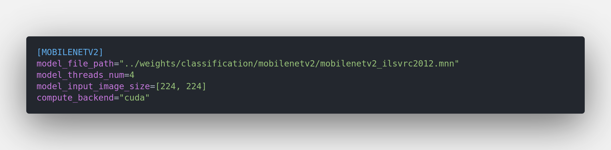
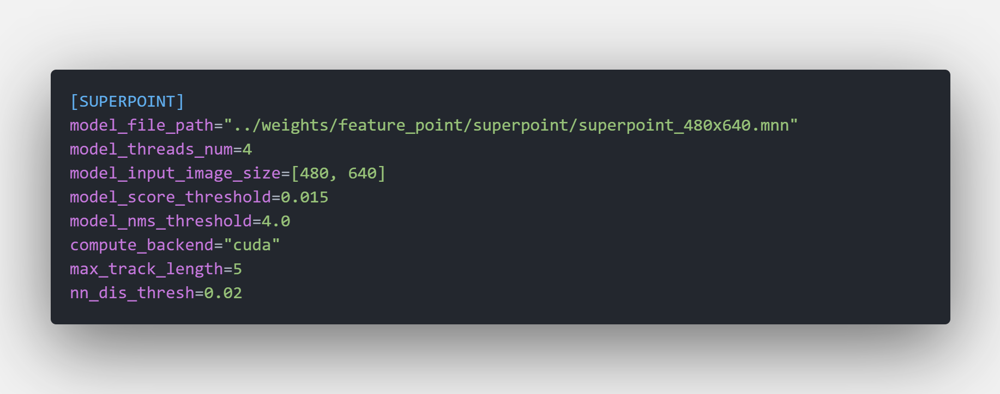

<b> 模型Inference配置文件说明 </b>

所有的模型inference配置文件都存放在 `$PROJECT_ROOT_DIR/conf/model` 文件夹下

<b> 通用字段说明 </b>

以 `MobilenetV2` 模型为例说明

**model_file_path:** 模型文件路径

**model_threads_num:** 使用cpu作为计算后端时的线程数量，推荐使用和cpu物理核心数相同的线程数。

**compute_backend:** 计算后端，目前支持 `cpu` 和 `cuda` 两种配置，这也是服务器端最常见的计算后端。

<b> 一些特殊的模型配置参数说明 </b>

<b> ----- 图像目标检测模型配置 </b>

以 `yolov5` 模型为例说明

**model_score_threshold:** 目标bbox得分阈值，检测结果仅保存得分超过阈值的目标

**model_nms_threshold:** nms阈值

**model_keep_top_k:** 一幅图像上可检测的最大目标数量

**model_class_nums:** 模型可识别的所有目标类别数量

<b> ----- SuperPoint模型配置 </b>

**model_nms_threshold:** nms阈值，阈值范围内只保留一个特征点

**max_track_length:** 只track阈值距离内的图像序列

**nn_dis_thresh:** 最近邻阈值，特征距离小于阈值的会被认为是同一个对象
