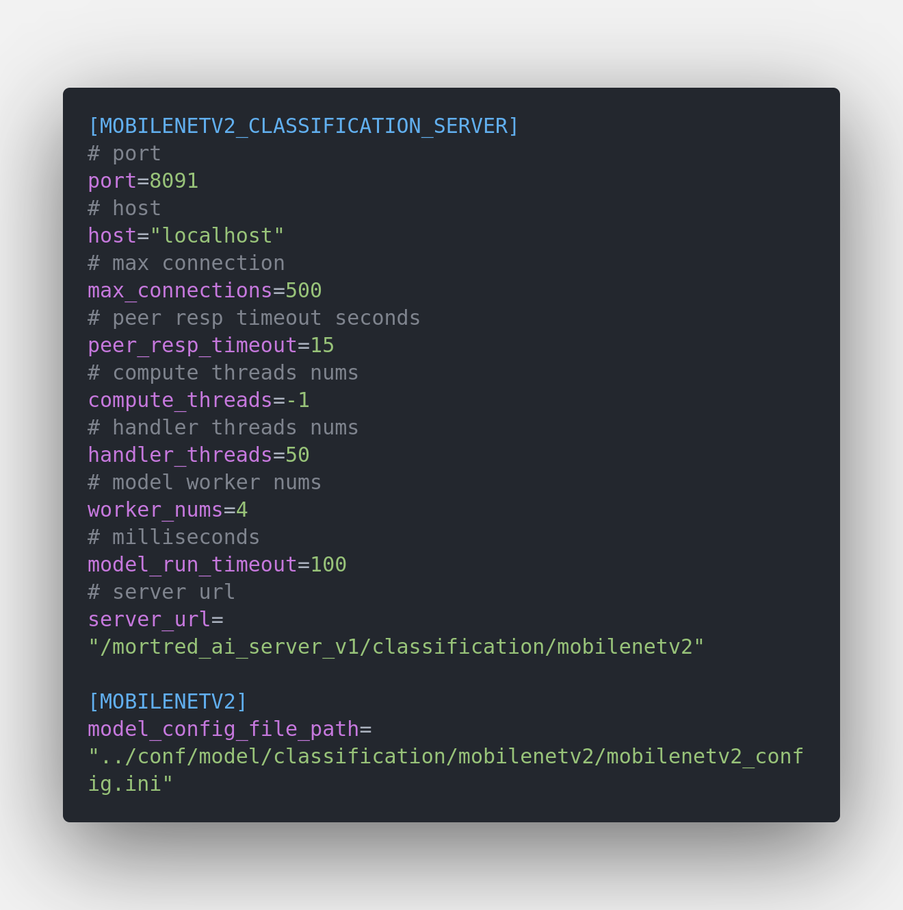
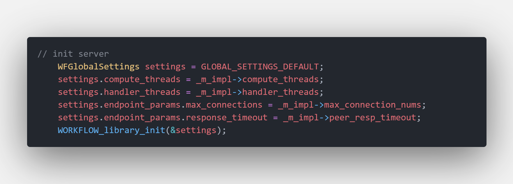

<b><b> About Model Sercver Configuration </b> </b>

All model server's configurations are stored in $PROJECT_ROOT_DIR/conf/server folder.

<b> Common Configuration </b>

Use mobilenetv2's model server configuration for example

**host:** server's host address

**port:** server's port

**max connections:** server's max connections. old connection will be kicked off if no spare connection left. Connections will be refused if no extra connections can be kicked. Enlarge this param when the amount of concurrency is large. You may find some useful disscussion on [#issue463](https://github.com/sogou/workflow/issues/463), [#issue906](https://github.com/sogou/workflow/issues/906) and [tutorial-05-http_proxy](https://github.com/sogou/workflow/blob/516da621aea136c4c25c048b89875f62c9d20af6/docs/en/tutorial-05-http_proxy.md)

**peer_resp_timeout:** the maximum duration for reading or sending out a block of data. The default setting is 15 seconds.

**compute_threads:** thread nums for computing. -1 mean default nums which equals your cpu core nums

**handler_threads:** thread nums for network process function and callback function

**model_run_timeout:** the time limit of a model's inference process. inference process will be interruptted if cost more time.

**server_url:** server's uri path

**model_config_file_path:** model's configuration file path. For detailed description of it you may refer to [about_model_configuration](../docs/about_model_configuration.md)

<b> Other Web Service Configuration </b>

For other web service configuration you may find help at [workflow_docs_about_global_configuration](https://github.com/sogou/workflow/blob/f7979e46f3b1f9c0052adb9e2ffa959730dcda6e/docs/en/about-config.md)

And if you want to adjust some of those configuration params you may do it by modifying your server's `init` function. For example global configuration for mobilenetv2 classification server can be modified at [../src/server/classification/mobilenetv2_server.cpp#L197-L202](../src/server/classification/mobilenetv2_server.cpp)

`Init Workflow Global Configuration Code Snappit`

