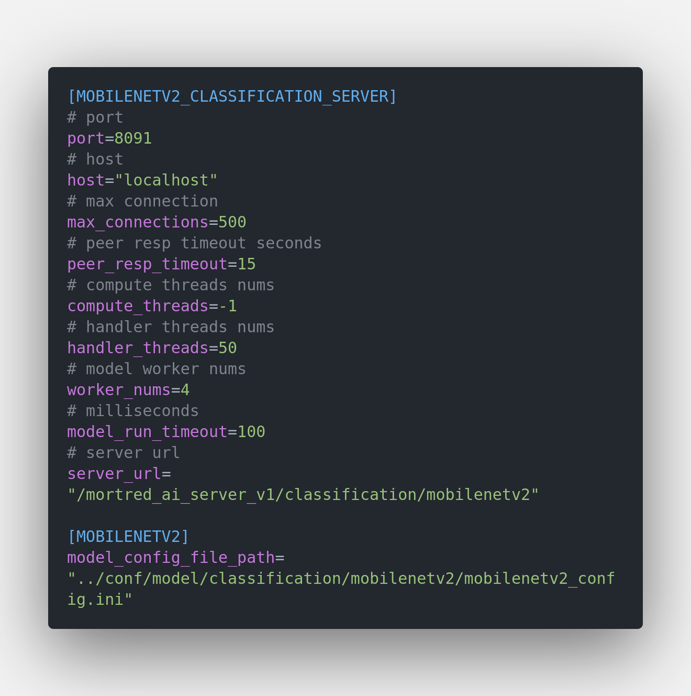
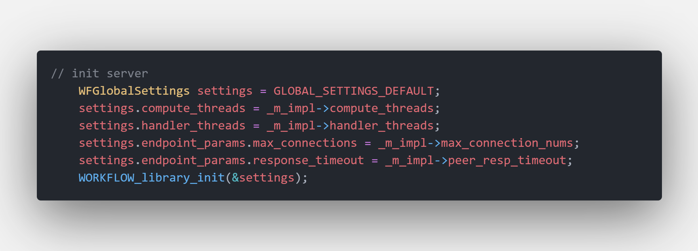

<b><font color='black' size='8' face='Helvetica'><b><font color='black' size='8' face='Helvetica'> 模型服务器配置参数说明 </font></b> </font></b>

所有的模型服务器参数配置均存放在 `$PROJECT_ROOT_DIR/conf/server` 文件夹。

<b><font color='GrayB' size='6' face='Helvetica'> 常规配置参数 </font></b>

以 `mobilenetv2` 图像分类服务器为例


**host:** 服务host地址

**port:** 服务端口号

**max connections:** 服务支持的最大连接数。旧链接会被踢出如果超过最大连接数。在没有链接可用的情况下新的链接请求会被拒绝。在并发量大的情况下可以增大这个参数. 你可以在以下issue和tutorial中找到一些有用信息 [#issue463](https://github.com/sogou/workflow/issues/463), [#issue906](https://github.com/sogou/workflow/issues/906) and [tutorial-05-http_proxy](https://github.com/sogou/workflow/blob/516da621aea136c4c25c048b89875f62c9d20af6/docs/en/tutorial-05-http_proxy.md)

**peer_resp_timeout:** 服务读取和发送一段数据的超时设置，默认15秒。

**compute_threads:** 计算线程池的线程数， -1 代表使用默认值即cpu的核心数。

**handler_threads:** 处理网络任务、回调函数的线程个数

**model_run_timeout:** 模型inference的超时设置，超时的任务会被中断，-1代表该值无限大。

**server_url:** 服务的url地址

**model_config_file_path:** 服务使用的DL模型配置。关于DL模型参数配置说明可参考 [about_model_configuration](../docs/about_model_configuration.md)

<b><font color='GrayB' size='6' face='Helvetica'> 其他一些网络服务参数配置 </font></b>

其余一些有关网络服务的全局配置可以参考 [workflow_docs_about_global_configuration](https://github.com/sogou/workflow/blob/f7979e46f3b1f9c0052adb9e2ffa959730dcda6e/docs/about-config.md)

Listen / timeout / worker 参数写在对应的 `conf/server/**/*.toml` 里。Workflow 级默认值在 [src/server/base_server_impl.h](../src/server/base_server_impl.h) 里统一设置，由 `mortred-model-server.out --model <ID>` 服务所有模型。

`workflow全局配置参数代码段`

# 过载保护与动态批处理（可选）

详细语义见 [HTTP API 契约 · 过载行为](api-contract.zh-cn.md#过载行为)。

```toml
# 等待队列上限：超过后立即返回 429 + Retry-After（0 = 不限制）
max_queue_depth=32
# 动态批处理：收集并发请求打包成一次 [N,...] 推理（默认 1 = 关闭）
# 适用于全部单 session 图像模型（分类/检测/分割/OCR/抠图/增强/深度/
# 特征点/FastSAM）：引擎支持动态 batch（MNN）即获得真批收益；TRT 静态
# batch=1 引擎会自动逐条回退（行为正确、无收益，重建带 batch profile
# 的引擎后获得收益）。多 session 模型（lightglue/SAM/CLIP）与 diffusion
# 采样器不适用批处理。
max_batch_size=8
# 批收集窗口毫秒数：首条请求到达后最多等待这么久凑批
max_batch_delay_ms=5
```

队列上限调优公式：`max_queue_depth ≈ worker_nums × 目标排队秒数 / 单次推理时长（秒）`。
