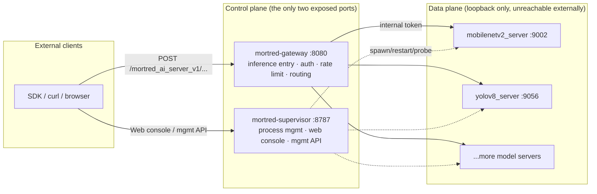
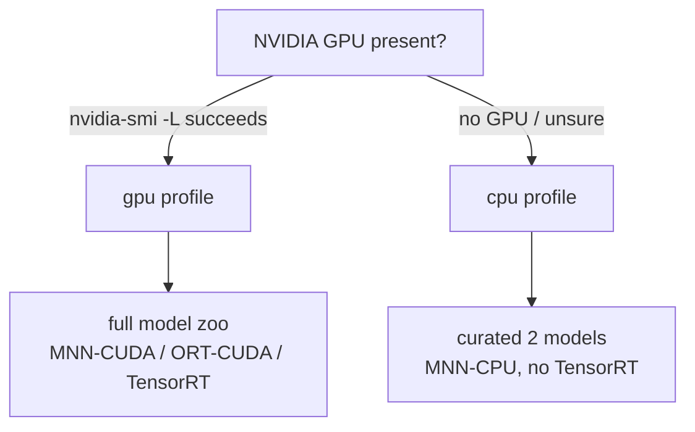

# Deployment Guide (Linux)

> Mortred targets Linux only. This is the complete operations manual behind the
> [Quick Start](../README.md): architecture, decision guide, step-by-step
> walkthroughs of all three install tracks, the profile system, weights and
> engine management, security, upgrades/rollback, monitoring and troubleshooting.
>
> **After reading this you can**: bring Mortred up on a clean Ubuntu machine in
> 20 minutes and pass the acceptance gates.

---

## Contents

- [1. Architecture](#1-architecture)
- [2. Five-Minute Decision Guide](#2-five-minute-decision-guide)
- [3. Prerequisites](#3-prerequisites)
- [4. Entry 1: One-Line Bootstrap](#4-entry-1-one-line-bootstrap)
- [5. Entry 2: Docker Compose](#5-entry-2-docker-compose)
- [6. Entry 3: Tarball + systemd](#6-entry-3-tarball--systemd)
- [7. Building from Source](#7-building-from-source)
- [8. The Profile System](#8-the-profile-system)
- [9. Weights Management](#9-weights-management)
- [10. Machine pack and TensorRT](#10-machine-pack-and-tensorrt)
- [11. Authentication & Security](#11-authentication--security)
- [12. Upgrades & Rollback](#12-upgrades--rollback)
- [13. Monitoring](#13-monitoring)
- [14. Troubleshooting](#14-troubleshooting)
- [15. FAQ](#15-faq)
- [16. Acceptance Gates](#16-acceptance-gates)

---

## 1. Architecture

A Mortred deployment is **one control plane** plus **a set of model processes**,
all on the same machine (or inside the same container):



**Key design decisions**:

| Decision | Meaning |
|---|---|
| Only 2 external ports | gateway `8080` (inference), supervisor `8787` (management + web UI) |
| Model servers bind loopback only | Nothing bypasses the gateway; supervisor injects an internal token |
| The supervisor manages a **pack** | Listed `conf/packs/*.toml` ids autostart; `MORTRED_AUTOSTART=true` does **not** boot the whole `conf/server` tree |
| Fail-closed | Missing inference/management auth or scrape token **refuses to start**, including loopback. Wildcard bind needs `MORTRED_EXPOSE=docker` or `unsafe`. TLS is Nginx (`mortredctl init-edge`). |

**Ports at a glance**:

| Port | Process | Purpose | Auth |
|---|---|---|---|
| `8080` | mortred-gateway | inference `/mortred_ai_server_v1/...`, `/healthz`, `/metrics` | Bearer on infer/jobs; `/healthz` public; `/metrics` requires `MORTRED_METRICS_TOKEN` (including loopback) |
| `8787` | mortred-supervisor | mgmt API `/api/v1/*`, web console | Bearer token |
| `9002+` | model servers | loopback only | internal token (including `GET /metrics`) |

---

## 2. Five-Minute Decision Guide

### 2.1 First, the profile: cpu or gpu?



| | `gpu` (default) | `cpu` |
|---|---|---|
| **Backends** | MNN-CUDA / ORT-CUDA / TensorRT | MNN-CPU / ORT-CPU (TensorRT compiled out) |
| **Hardware** | NVIDIA GPU + driver, CUDA 11.8 or 12 line | any x64 machine |
| **Models** | everything (classification/detection/OCR/seg/SAM/diffusion/CLIP/MOT...) | curated: mobilenetv2, resnet50 |
| **Weight size** | full manifest (tens of GB) | curated subset (~1 GB) |
| **Engine conversion** | pack engines on this GPU (§10.2); zoo-wide convert is opt-in | not needed |

> **Unsure? Pick cpu.** The worst case of a wrong choice is redoing with the other
> profile; the data-plane configs are fully compatible.

### 2.2 Then, the track: Docker or tarball?

| | Docker track | Tarball track |
|---|---|---|
| **For** | Docker shops; fastest path to a running service | bare-metal prod; no Docker; native systemd |
| **Artifact** | dual images (`ghcr.io/...:vX.Y.Z-cpu/-gpu`) | self-contained tarball + `install.sh` + systemd unit |
| **Upgrade** | swap image tag | `mortredctl upgrade` (in place, conf backed up) |
| **Isolation** | container-level | apt deps installed by the installer |
| **Shared** | same `verify_deployment.sh` acceptance, same profile system, same `mortredctl` core | |

All three entries (bootstrap / compose / tarball) **share one mortredctl core**
and converge on `mortredctl doctor` - there are no divergent paths.

---

## 3. Prerequisites

### 3.1 Hardware

| Profile | Minimum | Recommended |
|---|---|---|
| cpu | 2 cores / 4 GB / 10 GB disk | 8 cores / 16 GB / SSD |
| gpu | the above + any CUDA 11/12 GPU | RTX 3060+ / 8 GB VRAM / 50 GB disk |

### 3.2 OS and software

| Item | Requirement | Check |
|---|---|---|
| OS | Ubuntu 20.04 / 22.04 (x64) | `lsb_release -rs` |
| curl | any recent version | `curl --version` |
| python3 | ≥ 3.8 (weights only) | `python3 --version` |
| docker + compose | Docker track only | `docker compose version` |
| sudo | tarball installer only | - |
| NVIDIA driver | gpu profile only | `nvidia-smi` |

### 3.3 Network

- **Install time**: access to GitHub Releases / Hugging Face (weights). Offline: §9.4.
- **Runtime**: compose/`docker run` examples bind 8080/8787 to `127.0.0.1` on
  the host. LAN/WAN exposure is your reverse proxy's decision (TLS belongs
  there). Publishing those ports on `0.0.0.0` without a proxy sends Bearer
  tokens in the clear.

---

## 4. Entry 1: One-Line Bootstrap

The fastest path - hardware detection, track selection, straight through:

```bash
curl -fsSL https://raw.githubusercontent.com/MaybeSheWill-CV/mortred_model_server/main/scripts/bootstrap.sh | bash
```

**What it does**:

1. Probes `nvidia-smi -L` → recommends `gpu` or `cpu`;
2. Docker present → prints the three-step compose instructions (§5);
3. No Docker → downloads the latest release tarball for the profile, verifies
   sha256, runs `sudo ./install.sh` (§6);
4. Neither possible → prints the source-build path (§7).

**Expected output** (no GPU, Docker present):

```text
== Mortred bootstrap ==
  detected profile: cpu
== docker track ==
next:
  1. git clone https://github.com/MaybeShewill-CV/mortred_model_server.git && cd mortred_model_server
  2. python3 scripts/fetch_weights.py --profile cpu
  3. MORTRED_API_TOKEN=<mgmt> MORTRED_GATEWAY_AUTH_TOKEN=<infer> \
         docker compose --profile cpu up -d
  4. curl -fs http://localhost:8787/api/v1/health
```

> The bootstrap stays deliberately thin: detection and delegation only. Upgrading
> mortredctl upgrades every entry point.

---

## 5. Entry 2: Docker Compose

### 5.1 Install (four steps)

```bash
# 1. get the code (compose file + weight scripts live in the repo)
git clone https://github.com/MaybeShewill-CV/mortred_model_server.git
cd mortred_model_server

# 2. fetch the weight subset for your profile (resumable + sha256 verified)
python3 scripts/fetch_weights.py --profile cpu     # gpu machines: gpu

# 3. set the two tokens (fail-closed without them)
export MORTRED_API_TOKEN="$(openssl rand -hex 24)"          # management
export MORTRED_GATEWAY_AUTH_TOKEN="$(openssl rand -hex 24)" # inference

# 4. start (builds locally; first build ~10-25 min)
docker compose --profile cpu up -d      # GPU machines: --profile gpu
```

Compose publishes 8080/8787 on `127.0.0.1` of the host. `localhost` clients
keep working; other machines cannot reach those ports until you put a TLS
proxy in front or override the port mappings.

The gpu track needs the NVIDIA Container Toolkit (`docker run --gpus all` works = installed).

### 5.2 Verify

```bash
curl -fs http://localhost:8787/api/v1/health        # supervisor health
curl -fs http://localhost:8080/healthz               # gateway health (public)
curl -fs http://localhost:8080/metrics | head -5     # gateway metrics

curl -fs -H "Authorization: Bearer $MORTRED_API_TOKEN" \
    http://localhost:8787/api/v1/catalog | python3 -m json.tool | head -20
```

**Expected**: `/api/v1/health` returns OK; the catalog lists exactly the profile's
models (cpu: the two `*_cpu` entries - mobilenetv2 / resnet50).

### 5.3 Day-2 operations

| Operation | Command |
|---|---|
| Logs | `docker compose --profile cpu logs -f mortred-cpu` |
| Restart | `docker compose --profile cpu restart` |
| Stop | `docker compose --profile cpu down` |
| Upgrade image | `docker compose --profile cpu pull && docker compose --profile cpu up -d` |
| Shell into container | `docker exec -it mortred-cpu bash` |
| GPU pack engines | `mortredctl prepare` (§10.2); zoo-wide `MORTRED_AUTO_BUILD_ENGINES` stays opt-in |

### 5.4 Prebuilt images (no local build)

```bash
docker pull ghcr.io/maybeshewill-cv/mortred_model_server:v0.1.0-cpu
docker run -d --name mortred \
  -p 127.0.0.1:8787:8787 -p 127.0.0.1:8080:8080 \
  -v "$PWD/weights:/opt/mortred/weights" \
  -e MORTRED_API_TOKEN=... -e MORTRED_GATEWAY_AUTH_TOKEN=... \
  ghcr.io/maybeshewill-cv/mortred_model_server:v0.1.0-cpu
```

---

## 6. Entry 3: Tarball + systemd

For bare-metal production: no Docker dependency, native systemd, self-healing restarts.

### 6.1 Download and verify

From [Releases](https://github.com/MaybeSheWill-CV/mortred_model_server/releases)
(example: v0.1.0 / cpu):

```bash
VER=0.1.0
curl -fLO https://github.com/MaybeShewill-CV/mortred_model_server/releases/download/v$VER/mortred_model_server-$VER-cpu-linux-x64.tar.gz
curl -fLO https://github.com/MaybeShewill-CV/mortred_model_server/releases/download/v$VER/mortred_model_server-$VER-cpu-linux-x64.tar.gz.sha256
sha256sum -c mortred_model_server-$VER-cpu-linux-x64.tar.gz.sha256   # must print OK
```

> Tarball contents: `opt/mortred/` (installed tree) + `deploy/mortred-supervisor.service`
> + `install.sh` + a `PROFILE` marker. Weights are NOT bundled (tens of GB) -
> fetch them per §9 after installing.

### 6.2 Install (root)

```bash
tar -xzf mortred_model_server-$VER-cpu-linux-x64.tar.gz
cd mortred_model_server-$VER-cpu-linux-x64
sudo ./install.sh
```

**What install.sh does, step by step** (idempotent, safe to re-run):

| Step | Content |
|---|---|
| 1 | apt runtime deps (glog / OpenCV / openssl; gpu adds TensorRT/cuDNN runtime) |
| 2 | install tree to `/opt/mortred`; create the `mortred` system user |
| 3 | install + enable the systemd unit (cpu profile injects `MORTRED_PROFILE=cpu`) |
| 4 | generate `/etc/mortred/supervisor.env` (mode 600) and print next steps |

### 6.3 Tokens and weights

```bash
sudoedit /etc/mortred/supervisor.env
#   MORTRED_API_TOKEN=<output of openssl rand -hex 24>
#   MORTRED_GATEWAY_AUTH_TOKEN=<another random value>

cd /opt/mortred
sudo -u mortred python3 scripts/fetch_weights.py --profile cpu
```

### 6.4 Start and verify

```bash
sudo systemctl start mortred-supervisor
sudo systemctl status mortred-supervisor --no-pager    # active (running)
curl -fs http://127.0.0.1:8787/api/v1/health
```

Unit highlights: `Restart=always`, `TimeoutStopSec=120` (ordered shutdown -
models first, gateway last), `EnvironmentFile=/etc/mortred/supervisor.env` (600).

---

## 7. Building from Source

For contributors and custom builds.

### 7.1 Dependencies (version matrix + sha256 pinned + idempotent stamps)

```bash
./scripts/install_deps.sh --check          # inspect current 3rd_party
./scripts/install_deps.sh --all            # gpu line (CUDA 11 default; --cuda-version 12)
./scripts/install_deps.sh --cpu --all      # cpu line: MNN-CPU + ORT-CPU, no NVIDIA/TRT
sudo ./scripts/install_deps.sh --nvidia    # gpu line CUDA/TRT/cuDNN (root; nothing else needs it)
```

Offline: `--offline DIR` uses a pre-downloaded package dir. ORT tarballs are
sha256-verified fail-closed (a missing hash refuses the install).

### 7.2 Build (presets carry the profile)

```bash
cmake --preset full && cmake --build --preset full            # gpu full
cmake --preset full-cpu && cmake --build --preset full-cpu    # cpu full
cmake --preset tests-only && cmake --build --preset tests-only && ctest --preset tests-only
```

| Preset | Purpose |
|---|---|
| `tests-only` / `tests-only-werror` | unit tests (apt deps, no engines) |
| `tests-only-tsan` / `tests-only-asan` | sanitizer gates (§16) |
| `full` / `full-werror` | gpu full |
| `full-cpu` | cpu full (no CUDA/TRT) |

### 7.3 Pack a tarball yourself

```bash
./scripts/make_release_tarball.sh cpu 0.1.0 build    # -> dist/*.tar.gz + .sha256
```

---

## 8. The Profile System

**One switch, four layers** - profiles are not two products but two resource
tiers of one product:

| Layer | Switch | cpu effect | gpu effect |
|---|---|---|---|
| Build | `MORTRED_BUILD_PROFILE` | TRT compiled out; factory errors clearly for `type="tensorrt"` | full build |
| Deps | `install_deps.sh --cpu` | MNN built `MNN_CUDA=OFF`; **cpu** ORT tarball; NVIDIA deb skipped | + CUDA/TRT/cuDNN |
| Catalog | server TOML `profile` field + runtime `MORTRED_PROFILE` | only `profile="cpu"`/`"any"` entries; **absent field = gpu**, so the cpu catalog is always explicitly curated | everything |
| Weights | `fetch_weights.py --profile` | only files tagged `profiles=["cpu","gpu"]` | full manifest |

### 8.1 Runtime switching

```bash
export MORTRED_PROFILE=cpu     # read by both supervisor and gateway; default gpu
```

Filtering happens during catalog load, **before the duplicate checks** - cpu and
gpu variants of one model may therefore reuse the same port (only one variant
set is active at a time).

### 8.2 Extending the cpu curated set (a CHANGELOG-level change)

1. point a `conf/server/...` file with `profile="cpu"` at the **same** model toml (do not add a second `*_cpu_config.toml`);
2. that toml must use `mnn`/`onnx` — `type=tensorrt` with `device=cpu` is a configuration error;
3. on a CPU box set `device = "cpu"` in that one file (git defaults are `gpu`);
4. add the weight path to `CPU_WEIGHTS` in `scripts/gen_weights_manifest.py`;
5. regenerate the manifest;
6. add a cpu smoke verification for the model; record it in CHANGELOG.

> The curated set is deliberately **frozen per release**: extending it is a
> release decision (performance + acceptance ownership), not a config tweak.

---

## 9. Weights Management

### 9.1 Mechanism

- Manifest: `conf/weights_manifest.json` - per file `path / size / sha256 / hf_path / profiles`;
- Downloads: Hugging Face, resumable, **skipped when present with matching sha256**;
- Verification: `--check` verifies without downloading.

### 9.2 Commands

```bash
python3 scripts/fetch_weights.py --profile cpu     # curated subset (~1 GB)
python3 scripts/fetch_weights.py --profile gpu     # full set (tens of GB)
python3 scripts/fetch_weights.py --only yolov8     # paths containing yolov8
python3 scripts/fetch_weights.py --check           # verify local integrity
python3 scripts/fetch_weights.py --dry-run         # print what would happen
```

### 9.3 Disk planning

| Profile | First download | Reserve |
|---|---|---|
| cpu | ~1 GB | 5 GB |
| gpu | tens of GB (model-dependent) | 60 GB+ |

Partial gpu install? Pull in batches with `--only <keyword>` and confirm with
`verify_deployment.sh --full`.

### 9.4 Offline environments

Fetch `weights/` on a networked machine → copy to the target → run
`fetch_weights.py --check`. Dependencies work the same way (`--offline DIR`).

---

## 10. Machine pack and TensorRT

Compose and the container entrypoint set `MORTRED_AUTOSTART=true` **and**
`MORTRED_PACK` (default `conf/packs/demo.toml`). That combination starts the
**listed catalog ids**, not every file under `conf/server/`. Identity is still
one process per catalog id; `conf/server` `worker_nums` stays `1`. Pack
`worker_nums` / `model_config` override the child via env.

### 10.1 Pack file

```toml
# conf/packs/demo.toml — shipped example; keep worker_nums=1 in git
[pack.MOBILENETV2]
worker_nums = 1

# machine-local copy, e.g. /etc/mortred/pack.toml
[pack.YOLOV8]
worker_nums = 4
# model_config = "conf/model/object_detection/yolov8/yolov8_config.toml"  # optional variant
```

Unknown ids fail supervisor start. Point `MORTRED_PACK` at the machine file
(compose env, systemd `supervisor.env`, or the process environment). Do not
commit calibrated `worker_nums` in the git example packs.

### 10.2 Prepare pack TensorRT engines (GPU)

Engines are bound to **this GPU + this TensorRT**. Convert only what the pack
uses:

```bash
mortredctl prepare --pack conf/packs/yolov8.toml          # or: scripts/prepare_pack.sh
mortredctl doctor --strict                                 # missing pack engines fail
```

The supervisor **refuses to spawn** a TensorRT id whose engine file is missing
or empty (status `failed`, no crash-loop). `/ready` is real loadability, not
just a nonempty file.

Demo pack is MobilenetV2 (no TensorRT). A YOLOV8 pack needs prepare on the
target GPU. `MORTRED_AUTO_BUILD_ENGINES=true` still converts the **whole zoo**
and stays **off** by default.

### 10.3 Calibrate `worker_nums`

Stop supervisor / leftover `mortred-model-server` first. The script starts its
own server on the catalog port (YOLOV8 = 9056); a busy port is `start_failed`,
not OOM.

```bash
ss -ltnp | grep 9056 || true
python3 scripts/calibrate_pack.py --pack conf/packs/yolov8.toml \
    --workers 1,2,4,8 --duration 8s --output logs/calibrate-yolov8.json
# persist w* into that pack file only (never conf/server):
python3 scripts/calibrate_pack.py --pack /path/to/machine-pack.toml --write-pack
```

JSON `gpu_mem_mib_*` is process occupancy (`nvml_pid` / `nvml_name`) or a
pre-spawn **device delta** on WSL — not whole-card `memory.used`. Restart the
supervisor after `--write-pack` so pack `worker_nums` is injected.

### 10.4 Zoo-wide convert (optional)

```bash
./scripts/convert_trt_engines.sh --list
./scripts/convert_trt_engines.sh            # every missing engine in the manifest
./scripts/convert_trt_engines.sh --force
```

Needs `trtexec` (`sudo ./scripts/install_deps.sh --nvidia` → `3rd_party/bin/`).

### 10.5 First-start auto-conversion in containers (optional)

```bash
docker compose --profile gpu up -d -e MORTRED_AUTO_BUILD_ENGINES=true
```

Runs before supervisor autostart, minutes-long, **off by default**. Prefer
§10.2 for a pack. `mortredctl doctor` warns on missing pack engines;
`--strict` fails.

### 10.6 ONNX Runtime CUDA arena

ORT CUDA used to set `gpu_mem_limit = 0` (arena grows without bound). The
default is now **2048 MiB per session** (`gpu_mem_limit_mb` on
`[MODEL.backend]`, or `MORTRED_ORT_GPU_MEM_LIMIT_MB`). `worker_nums=4` means
up to four arenas. `0` restores unlimited. MNN and TensorRT have no equivalent
knob; stay inside the pack + calibrate budget (§10.3).

## 11. Authentication & Security

### 11.1 Tokens

| Token | Protects | Where |
|---|---|---|
| `MORTRED_API_TOKEN` | supervisor mgmt API + web console | `/etc/mortred/supervisor.env` (tarball) / container env |
| `MORTRED_GATEWAY_AUTH_TOKEN` | gateway inference entry | same |
| `MORTRED_METRICS_TOKEN` | gateway `GET /metrics` scrape Bearer | same (required on every listen; distinct from the two above) |

```bash
openssl rand -hex 24    # generate (one independent value per token)
```

**Fail-closed semantics**: a listener without its token **refuses to start**
and prints why, including on loopback. The gateway also refuses if
`MORTRED_METRICS_TOKEN` is empty or matches the inference/management token.
Wildcard bind requires `MORTRED_EXPOSE=docker` (containers) or `unsafe`.
That gate does **not** terminate TLS (`mortredctl init-edge` / Nginx) or
reject a short token at process start. `mortredctl doctor --strict`
fails on those warnings (plaintext listen, missing scrape token, short
tokens, identical tokens). Default `doctor` still prints them without failing.
Do not reuse the inference token as the scrape secret.

### 11.2 Multi-tenant API keys (gateway layer)

Beyond the single static token, the gateway supports per-key management
(hashed at rest, scopes, rate limits, hot reload):

```toml
# conf/api_keys.toml
[keys.client-a]
hash = "sha256(...)"          # echo -n "your-secret-key" | sha256sum
scope = "inference"
rate_limit_qps = 100
enabled = true
```

```bash
curl -X POST -H "Authorization: Bearer $MORTRED_API_TOKEN" \
     http://localhost:8787/api/v1/keys/reload      # hot reload, no restart
```

See [api-keys.md](api-keys.md) for the full guide incl. zero-downtime rotation.

### 11.3 Pre-launch security checklist

- [ ] both tokens are ≥32-char random values, distinct from each other
- [ ] `/etc/mortred/supervisor.env` is mode 600, owned by mortred
- [ ] 8080/8787 published on `127.0.0.1` unless a TLS reverse proxy sits in front
- [ ] keep 8787 off the public internet even behind TLS
- [ ] `conf/api_keys.toml` (if used) mode 600, never committed or baked into images
- [ ] TLS terminated at Nginx on the host network (Mortred itself is plain HTTP); see [§11.4](#114-tls-reverse-proxy-nginx)
- [ ] no model-server ports in the firewall allowlist (they are loopback-only anyway)
- [ ] Grafana/Prometheus ports stay on loopback; Grafana password is not the image default
- [ ] Prometheus does not scrape model ports that have been published off-loopback
- [ ] if 8080 is reachable off-loopback, `MORTRED_METRICS_TOKEN` is set and distinct from the inference token

### 11.4 TLS reverse proxy (Nginx)

Mortred does not terminate TLS. First-class edge is **Nginx on the host
network** (`mortredctl init-edge`). Do not put TLS inside the gateway or
supervisor process. Do not run Nginx in a Docker bridge network and expect
it to reach `127.0.0.1:8080` on the host.

```bash
mortredctl init-trust
set -a && . conf/local/trust.env && set +a
mortredctl init-edge --mode lan --server-name localhost
# optional: sudo cp -a conf/local/edge /etc/mortred/edge
#           sudo cp deploy/nginx/mortred-edge.service /etc/systemd/system/
#           sudo systemctl enable --now mortred-edge
nginx -t -p conf/local/edge -c nginx.conf
# LAN: trust conf/local/edge/tls/ca.pem once in the browser
# Public DNS: mortredctl init-edge --mode acme --server-name infer.example.com
#   then: certbot certonly --webroot -w /var/www/mortred-acme -d infer.example.com
#   (do not use certbot --nginx; it rewrites the site file)
```

Keep 8080/8787 on `127.0.0.1`. Compose `profile: edge` is Linux
`network_mode: host` only.

`mortredctl doctor` warns when the effective listen is not loopback, when a
token is shorter than 32 characters, when tokens are identical, or when
`MORTRED_METRICS_TOKEN` is unset. Those lines fail `doctor --strict`.
Doctor does not implement TLS.

---

## 12. Upgrades & Rollback

### 12.1 mortredctl upgrade (in place, recommended)

```bash
mortredctl upgrade              # latest release, keeps the running profile
mortredctl upgrade v0.2.0       # a specific version
```

Flow: download the profile's tarball → verify sha256 → **back up conf/ to
`conf.backup-<timestamp>`** → install over `/opt/mortred` (weights untouched) →
restart → run `doctor` automatically.

### 12.2 Rollback

```bash
cd /opt/mortred
sudo cp -a conf.backup-<timestamp> conf          # restore config
# reinstall the old tarball (or switch the docker tag back), then:
mortredctl doctor
```

### 12.3 Version policy

- In-place upgrades are supported between **adjacent minor versions**;
- Larger jumps: export configs → fresh-install the target → migrate manually
  (`scripts/migrate_model_config.py` helps);
- Config compatibility breaks are recorded per version in [CHANGELOG.md](../CHANGELOG.md).

---

## 13. Monitoring

Out-of-the-box Prometheus endpoints:

| Endpoint | Content |
|---|---|
| `GET :8080/metrics` | gateway: HTTP counts/latency, inference latency, queue wait, worker availability (`MORTRED_METRICS_TOKEN` required, including loopback) |
| `GET :8787/api/v1/metrics` | supervisor: process states, restart counters (Bearer `MORTRED_API_TOKEN`) |

A **local** monitoring stack ships in the repo (Prometheus + Grafana + alert
rules). Ports bind loopback; set a Grafana password before `up`. Default
Prometheus scrape is gateway `/metrics` only — see [monitoring-guide.md](monitoring-guide.md).

```bash
export GRAFANA_ADMIN_PASSWORD="$(openssl rand -hex 16)"
docker compose -f deploy/docker-compose.monitoring.yml up -d
# Grafana: http://localhost:3000
# Alert rules: deploy/alert-rules.yml (includes overload-rejection alerting)
```

---

## 14. Troubleshooting

**Run this first - it localizes most problems directly**:

```bash
mortredctl doctor          # or: verify_deployment.sh --live
```

### 14.1 Symptom quick-reference

| Symptom | Most likely cause | Fix |
|---|---|---|
| refuses to start, log says so | non-loopback listener without token | set both tokens (§11.1) |
| `401` with `WWW-Authenticate` | wrong/missing token | check `Authorization: Bearer ...` |
| empty catalog | `MORTRED_PROFILE` mismatch | check the env var; cpu needs the `*_cpu` configs |
| model server crash-loops | missing weights / missing engine / bad config | `mortredctl status`, `mortredctl logs <id>`; TRT: `mortredctl prepare` |
| calibrate `Cannot start server` / port busy | supervisor or leftover model still listening | stop systemd/compose/supervisor first, then `ss -ltnp` on the catalog port (§10.3) |
| weight download 404/timeout | HF unreachable | offline flow (§9.4) or a mirror |
| container has zero engines | pack not prepared, auto-build off | §10.2; zoo-wide convert is opt-in |
| sha256 mismatch | corrupted download / stale manifest | delete the file and refetch; regenerate the manifest |
| `429` responses | queue full or key rate-limited | tune `max_queue_depth` / `rate_limit_qps`; check `/metrics` |
| gpu model init: "tensorrt backend is not compiled" | cpu build given a trt config | use the gpu build/image, or a cpu config for that model |

### 14.2 Log locations

| Track | Command |
|---|---|
| Docker | `docker compose --profile <p> logs -f` |
| systemd | `journalctl -u mortred-supervisor -f` |
| one model server | `mortredctl logs <server-id> --limit 200` |

### 14.3 Deep dives

<details>
<summary>Why does the supervisor bind model servers to loopback?</summary>

Security-boundary design: external traffic can only reach models through the
gateway (auth/rate-limit/audit as a single choke point); supervisor↔model uses
an internal token as a second factor. Even a accidentally exposed 9xxx port
cannot serve inference without it.
</details>

<details>
<summary>A model stopped working after an upgrade - now what?</summary>

1. `mortredctl logs <id>` for the model-server error;
2. diff the model's config against `conf.backup-<timestamp>`;
3. check CHANGELOG for a config-incompatibility note on that version;
4. still stuck → roll back with the config backup + the old tarball (§12.2).
</details>

---

## 15. FAQ

<details>
<summary>Will the cpu profile support more models over time?</summary>

Yes, version by version via the formal process in §8.2 - but it stays a curated
set: every addition carries CPU-performance and acceptance ownership. See
CHANGELOG for the extension history.
</details>

<details>
<summary>Can I run cpu and gpu side by side?</summary>

One runtime profile per machine (`MORTRED_PROFILE`). To serve both load classes,
deploy two instances with distinct ports.
</details>

<details>
<summary>Any functional difference between the Docker and tarball tracks?</summary>

None. Same binaries, same configs, same acceptance script. Choose by ops habit.
</details>

<details>
<summary>Must weights live in /opt/mortred/weights?</summary>

Model configs resolve paths relative to the install tree. The tarball track
defaults to `/opt/mortred/weights`; the Docker track mounts into that container
path - the host-side location is up to you.
</details>

<details>
<summary>Where do I set worker_nums?</summary>

Git `conf/server` stays `worker_nums=1`. Put concurrency on the machine pack
(`[pack.<ID>] worker_nums`) and inject via `MORTRED_PACK`. Calibrate with
`mortredctl calibrate`; persist with `--write-pack` on a machine-local pack
file, then restart the supervisor (§10.3).
</details>

Fetch on any machine with python, copy the whole `weights/` directory over, and
run `fetch_weights.py --check` on the target (verification also needs python3;
in a fully python-less environment, verify before copying).
</details>

---

## 16. Acceptance Gates

| Gate | Command | Coverage |
|---|---|---|
| Static | `./scripts/verify_deployment.sh --basic` | script syntax / manifests / compose YAML / dependency inventory / `security_warn.sh --self-test` |
| Full | `./scripts/verify_deployment.sh --full` | + local weight sha256 + 3rd_party completeness |
| Live | `./scripts/verify_deployment.sh --live` | + gateway probes (public healthz, authed inference) |
| One-shot | `mortredctl doctor` | live wrapper + security warnings (non-fatal unless `--strict`) |

**CI side**: every change runs the cpu-profile full build + full unit suite on a
GPU-less runner - the conditional-compilation path cannot silently rot; the
`sanitizers` job keeps the TSAN/ASan gates running.

---

*Found a discrepancy between this document and actual behavior? That is a bug -
please open an issue.*
