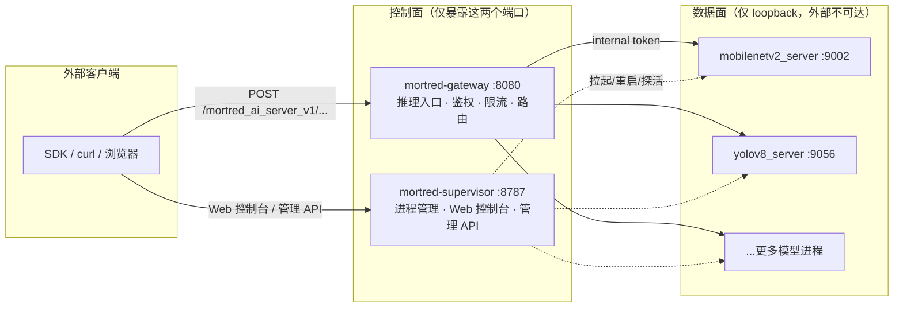
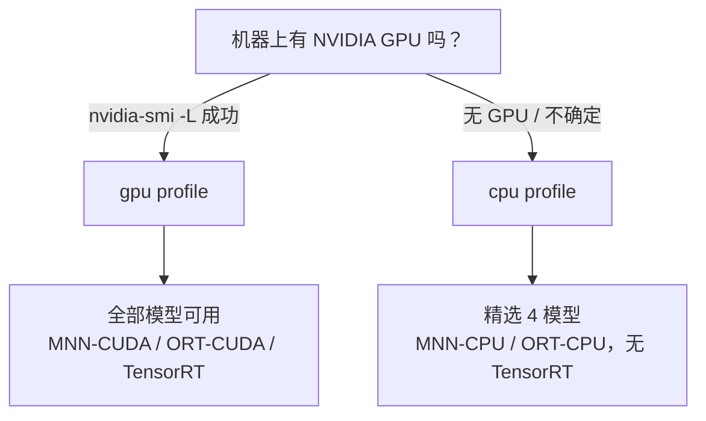

# 部署指南（Linux）

> Mortred 仅面向 Linux。本文是[快速开始](../README.md)的完整运维手册：架构、选型决策、
> 三条安装轨道的逐步流程、Profile 体系、权重与 Engine 管理、安全、升级回滚、监控与故障排查。
>
> **读完本文你可以做到**：在一台干净的 Ubuntu 机器上，20 分钟内把 Mortred跑起来并通过验收门禁。

---

## 目录

- [1. 架构总览](#1-架构总览)
- [2. 五分钟选型](#2-五分钟选型)
- [3. 前置要求](#3-前置要求)
- [4. 入口一：一行 Bootstrap](#4-入口一一行-bootstrap)
- [5. 入口二：Docker Compose](#5-入口二docker-compose)
- [6. 入口三：Tarball + systemd](#6-入口三tarball--systemd)
- [7. 源码构建](#7-源码构建)
- [8. Profile 体系详解](#8-profile-体系详解)
- [9. 权重管理](#9-权重管理)
- [10. TensorRT Engine（仅 GPU）](#10-tensorrt-engine仅-gpu)
- [11. 认证与安全](#11-认证与安全)
- [12. 升级与回滚](#12-升级与回滚)
- [13. 监控集成](#13-监控集成)
- [14. 故障排查](#14-故障排查)
- [15. FAQ](#15-faq)
- [16. 验收门禁汇总](#16-验收门禁汇总)

---

## 1. 架构总览

一套 Mortred 部署由**一个控制面**和**一组模型进程**组成，全部跑在同一台机器（或同一个容器）内：



**关键设计**：

| 设计点 | 说明 |
|---|---|
| 只有 2 个对外端口 | 网关 `8080`（推理流量）、supervisor `8787`（管理 + Web 控制台） |
| 模型进程仅绑 loopback | 外部无法绕过网关直连模型；supervisor 注入 internal token |
| supervisor 管理一切 | 模型进程崩溃自动按退避策略重启；crash-loop 有保护 |
| fail-closed | 非环回监听且未配置 token 时，**拒绝启动**而非带洞运行。不是 TLS、不是 `/metrics` 保密、也不是 token 强度检查 |

**端口一览**：

| 端口 | 进程 | 用途 | 鉴权 |
|---|---|---|---|
| `8080` | mortred-gateway | 推理入口 `/mortred_ai_server_v1/...`、`/healthz`、`/metrics` | infer/jobs 要 Bearer；`/healthz` 与 `/metrics` 公开 |
| `8787` | mortred-supervisor | 管理 API `/api/v1/*`、Web 控制台 | Bearer token |
| `9002+` | 各模型进程 | 仅 loopback | internal token |

---

## 2. 五分钟选型

### 2.1 先选 Profile：cpu 还是 gpu？



| | `gpu`（默认） | `cpu` |
|---|---|---|
| **推理后端** | MNN-CUDA / ORT-CUDA / TensorRT | MNN-CPU / ORT-CPU（TensorRT 编译排除） |
| **硬件要求** | NVIDIA GPU + 驱动，CUDA 11.8 或 12 线 | 任意 x64 机器 |
| **可用模型** | 全部（分类/检测/OCR/分割/SAM/扩散/CLIP/MOT…） | 精选集：mobilenetv2、resnet50、yolov8、hrnet |
| **权重体积** | 全量 manifest（数十 GB） | 精选子集（约 1 GB） |
| **Engine 转换** | 需要（每机器一次，见 §10） | 不需要 |

> **不确定就选 cpu**：选错的最坏结果是换个 profile 重来，数据面配置完全兼容。

### 2.2 再选轨道：Docker 还是 Tarball？

| | Docker 轨道 | Tarball 轨道 |
|---|---|---|
| **适合** | 已有 Docker 习惯；想最快起服务 | 裸机/虚拟机生产；无 Docker；要 systemd 原生管理 |
| **安装内容** | 双镜像（`ghcr.io/...:vX.Y.Z-cpu/-gpu`） | 自包含 tarball + `install.sh` + systemd 单元 |
| **升级** | 换镜像 tag | `mortredctl upgrade`（原地，含 conf 备份） |
| **环境隔离** | 容器级 | 依赖 apt 包，脚本自动安装 |
| **共同点** | 同一验收脚本 `verify_deployment.sh`；同一 profile 体系；同一 `mortredctl` 内核 | |

三条入口（bootstrap / compose / tarball）**共享同一个 mortredctl 内核**，殊途同归于 `mortredctl doctor` 验收——不存在三条互相漂移的路径。

---

## 3. 前置要求

### 3.1 硬件

| Profile | 最低 | 推荐 |
|---|---|---|
| cpu | 2 核 / 4 GB / 10 GB 磁盘 | 8 核 / 16 GB / SSD |
| gpu | 上述 + 任意 CUDA 11/12 显卡 | RTX 3060+ / 8 GB 显存 / 50 GB 磁盘 |

### 3.2 操作系统与软件

| 项 | 要求 | 检查命令 |
|---|---|---|
| 操作系统 | Ubuntu 20.04 / 22.04（x64） | `lsb_release -rs` |
| curl | 任意近期版本 | `curl --version` |
| python3 | ≥ 3.8（仅权重下载需要） | `python3 --version` |
| docker + compose | 仅 Docker 轨道 | `docker compose version` |
| sudo | 仅 Tarball 轨道安装时 | — |
| NVIDIA 驱动 | 仅 gpu profile | `nvidia-smi` |

### 3.3 网络

- **安装时**：需要访问 GitHub Releases / Hugging Face（权重）。离线环境见 §9.4。
- **运行时**：compose / `docker run` 示例把 8080/8787 绑在宿主机 `127.0.0.1`。
  局域网/公网暴露由你的反代决定（TLS 也在反代上终结）。没有反代就把这些
  端口发到 `0.0.0.0`，Bearer 会明文传输。

---

## 4. 入口一：一行 Bootstrap

最快路径——检测硬件、选轨道、一路到底：

```bash
curl -fsSL https://raw.githubusercontent.com/MaybeSheewill-CV/mortred_model_server/main/scripts/bootstrap.sh | bash
```

**它会做什么**：

1. `nvidia-smi -L` 探测 → 推荐 `gpu` 或 `cpu` profile；
2. 有 Docker → 打印 compose 轨道的三步指令（见 §5）；
3. 无 Docker → 自动下载当前 profile 的最新 release tarball、校验 sha256、执行 `sudo ./install.sh`（见 §6）；
4. 两者都不可用 → 打印源码构建路径（见 §7）。

**预期输出（无 GPU + 有 Docker 的机器）**：

```text
== Mortred bootstrap ==
  detected profile: cpu
== docker track ==
next:
  1. git clone https://github.com/MaybeSheewill-CV/mortred_model_server.git && cd mortred_model_server
  2. python3 scripts/fetch_weights.py --profile cpu
  3. MORTRED_API_TOKEN=<mgmt> MORTRED_GATEWAY_AUTH_TOKEN=<infer> \
         docker compose --profile cpu up -d
  4. curl -fs http://localhost:8787/api/v1/health
```

> bootstrap 本身刻意保持"薄"：它只做检测与委托，不复制任何业务逻辑——升级 mortredctl 即升级全部入口。

---

## 5. 入口二：Docker Compose

### 5.1 安装（四步）

```bash
# ① 获取代码（compose 文件与权重脚本随仓库走）
git clone https://github.com/MaybeSheewill-CV/mortred_model_server.git
cd mortred_model_server

# ② 拉取当前 profile 的权重子集（断点续传 + sha256 校验）
python3 scripts/fetch_weights.py --profile cpu     # GPU 机器换成 gpu

# ③ 设置两个 token（缺省即 fail-closed，服务拒绝对外监听）
export MORTRED_API_TOKEN="$(openssl rand -hex 24)"        # 管理面
export MORTRED_GATEWAY_AUTH_TOKEN="$(openssl rand -hex 24)" # 推理面

# ④ 启动（本地构建镜像；首次约 10-25 分钟编译）
docker compose --profile cpu up -d      # GPU 机器换成 --profile gpu
```

compose 把 8080/8787 发布在宿主机 `127.0.0.1` 上。本机 `localhost` 客户端
不受影响；其他机器要访问必须前面加 TLS 反代，或改写 port mapping。

GPU 轨道需要 NVIDIA Container Toolkit（`docker run --gpus all` 可用即已装好）。

### 5.2 验证

```bash
# 健康探针（supervisor）
curl -fs http://localhost:8787/api/v1/health

# 网关健康 + 指标（公开端点）
curl -fs http://localhost:8080/healthz
curl -fs http://localhost:8080/metrics | head -5

# 带鉴权的目录查询
curl -fs -H "Authorization: Bearer $MORTRED_API_TOKEN" \
    http://localhost:8787/api/v1/catalog | python3 -m json.tool | head -20
```

**预期**：`/api/v1/health` 返回 OK；catalog 只列出当前 profile 的模型（cpu profile 应恰好看到 mobilenetv2 / resnet50 / yolov8 / hrnet 四个 `*_cpu` 条目）。

### 5.3 常用操作

| 操作 | 命令 |
|---|---|
| 查看日志 | `docker compose --profile cpu logs -f mortred-cpu` |
| 重启 | `docker compose --profile cpu restart` |
| 停止 | `docker compose --profile cpu down` |
| 升级镜像 | `docker compose --profile cpu pull && docker compose --profile cpu up -d` |
| 进入容器排查 | `docker exec -it mortred-cpu bash` |
| GPU 首启转换缺失 engine | 环境变量加 `MORTRED_AUTO_BUILD_ENGINES=true`（见 §10.3） |

### 5.4 使用预构建镜像（免本地编译）

```bash
docker pull ghcr.io/maybeshewill-cv/mortred_model_server:v0.1.0-cpu
docker run -d --name mortred \
  -p 127.0.0.1:8787:8787 -p 127.0.0.1:8080:8080 \
  -v "$PWD/weights:/opt/mortred/weights" \
  -e MORTRED_API_TOKEN=... -e MORTRED_GATEWAY_AUTH_TOKEN=... \
  ghcr.io/maybeshewill-cv/mortred_model_server:v0.1.0-cpu
```

---

## 6. 入口三：Tarball + systemd

适合裸机生产：无 Docker 依赖，systemd 原生管理，重启自愈。

### 6.1 下载与校验

从 [Releases](https://github.com/MaybeSheewill-CV/mortred_model_server/releases) 下载对应 profile 的包（以 v0.1.0 / cpu 为例）：

```bash
VER=0.1.0
curl -fLO https://github.com/MaybeShewill-CV/mortred_model_server/releases/download/v$VER/mortred_model_server-$VER-cpu-linux-x64.tar.gz
curl -fLO https://github.com/MaybeSheewill-CV/mortred_model_server/releases/download/v$VER/mortred_model_server-$VER-cpu-linux-x64.tar.gz.sha256
sha256sum -c mortred_model_server-$VER-cpu-linux-x64.tar.gz.sha256   # 必须输出 OK
```

> tarball 内容：`opt/mortred/`（安装树）+ `deploy/mortred-supervisor.service` + `install.sh` + `PROFILE` 标记。
> **权重不打包**（全量数十 GB）——安装后按 §9 拉取。

### 6.2 安装（root）

```bash
tar -xzf mortred_model_server-$VER-cpu-linux-x64.tar.gz
cd mortred_model_server-$VER-cpu-linux-x64
sudo ./install.sh
```

**install.sh 逐步做什么**（幂等，可重复执行）：

| 步骤 | 内容 |
|---|---|
| 1 | apt 安装运行时依赖（glog / OpenCV / openssl；gpu profile 另装 TensorRT/cuDNN 运行库） |
| 2 | 部署安装树到 `/opt/mortred`；创建 `mortred` 系统用户 |
| 3 | 安装 systemd 单元并 `enable`（cpu profile 自动注入 `MORTRED_PROFILE=cpu`） |
| 4 | 生成 `/etc/mortred/supervisor.env` 模板（600 权限）并打印后续步骤 |

### 6.3 配置 token 与权重

```bash
# ① 编辑 token（两个都必填，否则 fail-closed 只监听 loopback）
sudoedit /etc/mortred/supervisor.env
#   MORTRED_API_TOKEN=<openssl rand -hex 24 的输出>
#   MORTRED_GATEWAY_AUTH_TOKEN=<另一个随机值>

# ② 拉权重（在安装树内执行）
cd /opt/mortred
sudo -u mortred python3 scripts/fetch_weights.py --profile cpu
```

### 6.4 启动与验证

```bash
sudo systemctl start mortred-supervisor
sudo systemctl status mortred-supervisor --no-pager    # active (running)
curl -fs http://127.0.0.1:8787/api/v1/health
```

systemd 单元要点：`Restart=always`、`TimeoutStopSec=120`（有序关停：先模型后网关）、`EnvironmentFile=/etc/mortred/supervisor.env`（600 权限）。

---

## 7. 源码构建

适合贡献者与需要自定义的场景。

### 7.1 依赖安装（版本矩阵 + sha256 锁定 + 幂等 stamp）

```bash
./scripts/install_deps.sh --check          # 查看当前 3rd_party 完整性
./scripts/install_deps.sh --all            # gpu 线（CUDA 11 默认；--cuda-version 12 切 12 线）
./scripts/install_deps.sh --cpu --all      # cpu 线：MNN-CPU + ORT-CPU，完全不装 NVIDIA/TRT
sudo ./scripts/install_deps.sh --nvidia    # gpu 线的 CUDA/TRT/cuDNN（需 root，其余步骤无需）
```

离线安装：`--offline DIR` 使用预下载包目录；ORT tarball 强制 sha256 校验（缺哈希直接拒绝，绝不静默跳过）。

### 7.2 编译（preset 自带 profile）

```bash
cmake --preset full && cmake --build --preset full            # gpu 全量
cmake --preset full-cpu && cmake --build --preset full-cpu    # cpu 全量
cmake --preset tests-only && cmake --build --preset tests-only && ctest --preset tests-only
```

| Preset | 用途 |
|---|---|
| `tests-only` / `tests-only-werror` | 单测（apt 依赖，无引擎） |
| `tests-only-tsan` / `tests-only-asan` | sanitizer 门禁（见 §16） |
| `full` / `full-werror` | gpu 全量 |
| `full-cpu` | cpu 全量（无 CUDA/TRT） |

### 7.3 打包 tarball（自己出 release）

```bash
./scripts/make_release_tarball.sh cpu 0.1.0 build    # 产出 dist/*.tar.gz + .sha256
```

---

## 8. Profile 体系详解

**一个开关，四层贯穿**——profile 不是两套产品，而是同一产品的两种资源档位：

| 层 | 开关 | cpu 生效方式 | gpu 生效方式 |
|---|---|---|---|
| 构建 | `MORTRED_BUILD_PROFILE` | TRT 源码编译排除；factory 对 `type="tensorrt"` 返回明确错误 | 全量编译 |
| 依赖 | `install_deps.sh --cpu` | MNN 以 `MNN_CUDA=OFF` 构建；ORT 用 **cpu** tarball；跳过 NVIDIA deb | + CUDA/TRT/cuDNN |
| 目录 | server TOML `profile` 字段 + 运行时 `MORTRED_PROFILE` | 只加载 `profile="cpu"` 与 `"any"` 条目；**缺省字段按 gpu**，故 cpu 目录永远显式精选 | 加载全部 |
| 权重 | `fetch_weights.py --profile` | 只拉 `profiles=["cpu","gpu"]` 标记的精选文件 | 全量 manifest |

### 8.1 运行时切换

```bash
export MORTRED_PROFILE=cpu     # supervisor 与 gateway 都读它；缺省 = gpu
```

过滤发生在 catalog 加载期、**去重检查之前**——因此 cpu/gpu 变体可安全复用同一端口（同一时刻只有一套在目录里）。

### 8.2 扩充 cpu 精选集（CHANGELOG 级变更）

1. `conf/model/<task>/<model>/` 新增 `<model>_cpu_config.toml`（backend 用 `mnn`/`onnx`，`device="cpu"`）；
2. `conf/server/.../` 新增对应 server 配置，含 `profile="cpu"`；
3. `scripts/gen_weights_manifest.py` 的 `CPU_WEIGHTS` 集合加入该权重路径；
4. 跑 `gen_weights_manifest.py` 重新生成 manifest；
5. 补充该模型的 cpu 冒烟验证，CHANGELOG 记录。

> 精选集刻意**随版本冻结**：扩充是发布决策（要为它背性能与验收），不是随手改配置。

---

## 9. 权重管理

### 9.1 机制

- 清单：`conf/weights_manifest.json`——每个文件带 `path / size / sha256 / hf_path / profiles`；
- 下载：HF 仓库，断点续传，**已存在且 sha256 匹配则跳过**；
- 校验：`--check` 只验不拉。

### 9.2 常用命令

```bash
python3 scripts/fetch_weights.py --profile cpu     # 拉精选子集（约 1 GB）
python3 scripts/fetch_weights.py --profile gpu     # 拉全量（数十 GB）
python3 scripts/fetch_weights.py --only yolov8     # 只拉路径含 yolov8 的
python3 scripts/fetch_weights.py --check           # 校验本地完整性
python3 scripts/fetch_weights.py --dry-run         # 只打印将下载什么
```

### 9.3 磁盘规划

| Profile | 首次下载 | 建议预留 |
|---|---|---|
| cpu | ~1 GB | 5 GB |
| gpu | 数十 GB（视模型取舍） | 60 GB+ |

只装部分 GPU 模型？用 `--only <关键词>` 分批拉，配合 `verify_deployment.sh --full` 确认。

### 9.4 离线环境

在有网机器上拉好 `weights/` 目录 → 打包拷贝到目标机 → `fetch_weights.py --check` 校验。
依赖侧同理：`install_deps.sh --offline DIR`。

---

## 10. TensorRT Engine（仅 GPU）

### 10.1 为什么需要转换

TRT engine 是**硬件架构 + TRT 版本**绑定的二进制：预生成的 engine 换机器大概率不可用。
所以权重里的 `.onnx` 是源，每台 GPU 机器要转出自己的 `.engine`。

### 10.2 转换

```bash
./scripts/convert_trt_engines.sh --list    # 查看清单（哪些 engine 缺失）
./scripts/convert_trt_engines.sh           # 只转缺失的（FP16 + 动态 batch profile）
./scripts/convert_trt_engines.sh --force   # 全部重建
```

需要 `trtexec`：`sudo ./scripts/install_deps.sh --nvidia` 会装到 `3rd_party/bin/`；
多版本共存时用 `--trtexec /path/to/trtexec` 指定。

### 10.3 容器首启自动转换（可选）

```bash
docker compose --profile gpu up -d -e MORTRED_AUTO_BUILD_ENGINES=true
# 或 docker run 时加 -e MORTRED_AUTO_BUILD_ENGINES=true
```

转换发生在 supervisor autostart 之前，耗时分钟级，**默认关闭**（属显式选择）。
`mortredctl doctor` 对缺失 engine 只告警不判失败。

---

## 11. 认证与安全

### 11.1 两层 token

| token | 保护对象 | 配置位置 |
|---|---|---|
| `MORTRED_API_TOKEN` | supervisor 管理 API + Web 控制台 | `/etc/mortred/supervisor.env`（tarball）/ 容器环境变量 |
| `MORTRED_GATEWAY_AUTH_TOKEN` | 网关推理入口 | 同上 |

```bash
openssl rand -hex 24    # 生成方式（两个 token 各用一次）
```

**fail-closed 语义**：监听地址非 `127.0.0.1` 且未配 token → 进程**拒绝启动**并打印原因。
永远不要带洞上线。该门闩只覆盖「配了某种鉴权」；**不**终结 TLS、**不**隐藏
网关 `GET /metrics`、也**不**拒绝短 token。

### 11.2 多租户 API Key（网关层）

单 token 之外，网关支持按 key 管理（哈希存储、scope、限流、热加载）：

```toml
# conf/api_keys.toml
[keys.client-a]
hash = "sha256(...)"          # echo -n "your-secret-key" | sha256sum
scope = "inference"
rate_limit_qps = 100
enabled = true
```

```bash
curl -X POST -H "Authorization: Bearer $MORTRED_API_TOKEN" \
     http://localhost:8787/api/v1/keys/reload      # 热加载，不重启
```

详见 [api-keys.md](api-keys.zh-cn.md)（含密钥轮换零停机流程）。

### 11.3 上线前安全检查单

- [ ] 两个 token 均为 ≥ 32 字符随机值，且互不相同
- [ ] `/etc/mortred/supervisor.env` 权限 600、属主 mortred
- [ ] 8080/8787 发布在 `127.0.0.1`，除非前面已有 TLS 反代
- [ ] 即使有 TLS，管理面 8787 也不要直接暴露到公网
- [ ] `conf/api_keys.toml`（若使用）600 权限，不入库不入镜像
- [ ] 反代上启用 TLS（Mortred 自身是 HTTP）；见 [§11.4](#114-tls-反代caddy)
- [ ] 防火墙放行清单里没有模型进程端口（它们本就只绑 loopback）
- [ ] Grafana / Prometheus 端口留在环回；Grafana 密码不是镜像默认值
- [ ] Prometheus 不要去刮已经映射出环回的模型端口

### 11.4 TLS 反代（Caddy）

Mortred 不终结 TLS。可复制路径：

```bash
# 8080/8787 留在 127.0.0.1（compose 默认），然后：
# 1. 改 deploy/caddy/Caddyfile 里的 infer.example.com
# 2. 把 DNS 指到这台机器（80/443）
caddy run --config deploy/caddy/Caddyfile
```

没有公网 DNS 的本机冒烟用该文件里注释掉的 `:8443 { tls internal ... }`。
不要在 gateway / supervisor 进程里做 TLS。

`mortredctl doctor` 会在有效监听非环回、token 短于 32 字符、或两个 token
相同时打印警告。只警告，不因缺少 TLS 而失败。

---

## 12. 升级与回滚

### 12.1 mortredctl upgrade（原地，推荐）

```bash
mortredctl upgrade              # 升到最新 release，保持当前 profile
mortredctl upgrade v0.2.0       # 指定版本
```

流程：下载该 profile 的 tarball → sha256 校验 → **备份 conf/ 到 `conf.backup-<时间戳>`** →
覆盖安装 `/opt/mortred`（权重不动）→ 重启服务 → 自动跑 `doctor`。

### 12.2 回滚

```bash
cd /opt/mortred
sudo cp -a conf.backup-<时间戳> conf          # 恢复配置
# 重装旧版本 tarball（或 docker 换回旧 tag），然后：
mortredctl doctor
```

### 12.3 版本策略

- 原地升级**仅支持相邻 minor 版本**；
- 跨更大版本：导出配置 → 全新安装目标版本 → 手工迁移（`scripts/migrate_model_config.py` 辅助）；
- 配置兼容性破坏逐版本记录于 [CHANGELOG.md](../CHANGELOG.md)。

---

## 13. 监控集成

开箱即用的 Prometheus 指标端点：

| 端点 | 内容 |
|---|---|
| `GET :8080/metrics` | 网关：HTTP 请求计数/时延、推理时延、队列等待、worker 可用性（公开） |
| `GET :8787/api/v1/metrics` | supervisor：进程状态、重启计数（需要 Bearer `MORTRED_API_TOKEN`） |

仓库自带一套**本机**监控栈（Prometheus + Grafana + 告警规则）。端口只绑环回；
启动前必须设置 Grafana 密码。默认只刮网关 `/metrics`，详见
[monitoring-guide.zh-cn.md](monitoring-guide.zh-cn.md)。

```bash
export GRAFANA_ADMIN_PASSWORD="$(openssl rand -hex 16)"
docker compose -f deploy/docker-compose.monitoring.yml up -d
# Grafana: http://localhost:3000
# 告警规则: deploy/alert-rules.yml（含过载拒绝率告警）
```

---

## 14. 故障排查

**先跑这一条，八成问题直接定位**：

```bash
mortredctl doctor          # 或 verify_deployment.sh --live
```

### 14.1 症状速查表

| 症状 | 最可能原因 | 修复 |
|---|---|---|
| 服务起不来，日志见 `refuse to start` | 非环回监听但缺 token | 配好两个 token 再启动（§11.1） |
| `401` 且带 `WWW-Authenticate` | token 错/缺 | 核对 `Authorization: Bearer ...` 与对应 token |
| catalog 是空的 | `MORTRED_PROFILE` 与配置不匹配 | 确认环境变量；cpu 下确认存在 `*_cpu` 配置 |
| 模型进程反复重启 | 权重缺失 / engine 缺失 / 配置错 | `mortredctl status`、`mortredctl logs <id>` 看根因 |
| 下载权重 404/超时 | HF 不可达 | 离线流程（§9.4）或配置镜像 |
| sha256 校验失败 | 下载损坏 / manifest 过期 | 删除该文件重拉；仍失败则重新生成 manifest |
| `429` 响应 | 队列满或 key 限流 | 调 `max_queue_depth` / `rate_limit_qps`；看 `/metrics` |
| gpu 模型 init 报 "tensorrt backend is not compiled" | cpu 构建跑了 trt 配置 | 换 gpu 构建/镜像，或该模型用 cpu 配置 |
| 容器里 engine 全缺 | 未转换或未开自动转换 | §10；或 `MORTRED_AUTO_BUILD_ENGINES=true` |

### 14.2 日志位置

| 轨道 | 命令 |
|---|---|
| Docker | `docker compose --profile <p> logs -f` |
| systemd | `journalctl -u mortred-supervisor -f` |
| 单个模型进程 | `mortredctl logs <server-id> --limit 200` |

### 14.3 深挖

<details>
<summary>supervisor 为什么把模型进程绑在 loopback？</summary>

安全边界设计：外部只能经网关（鉴权/限流/审计的单一咽喉）到达模型；supervisor 与模型间用
internal token 二次确认。即使 9xxx 端口误暴露，没有 internal token 也无法推理。
</details>

<details>
<summary>升级后某个模型起不来了怎么办？</summary>

1. `mortredctl logs <id>` 看模型进程报错；
2. 对比 `conf.backup-<时间戳>` 里该模型的配置差异；
3. 查 CHANGELOG 该版本是否有配置不兼容说明；
4. 仍无解 → 用备份配置 + 旧版本 tarball 回滚（§12.2）。
</details>

---

## 15. FAQ

<details>
<summary>cpu profile 以后会支持更多模型吗？</summary>

会按版本扩充（走 §8.2 的正式流程），但保持"精选"定位——每个入选模型都要背 CPU 性能与验收。
扩充记录见 CHANGELOG。
</details>

<details>
<summary>能同时跑 cpu 和 gpu 两套吗？</summary>

一台机器一个运行时 profile（`MORTRED_PROFILE`）。要同时服务两类负载，部署两套实例并区分端口。
</details>

<details>
<summary>Docker 轨道和 Tarball 轨道功能有差别吗？</summary>

没有。同一二进制、同一配置、同一验收脚本。选轨道只看运维习惯。
</details>

<details>
<summary>权重必须放 /opt/mortred/weights 吗？</summary>

模型配置里的路径是相对安装树解析的。tarball 轨道默认在 `/opt/mortred/weights`；
Docker 轨道挂载到容器内该路径即可，宿主机位置随意。
</details>

<details>
<summary>没有 python3 怎么拉权重？</summary>

任意机器拉好后整体拷贝 `weights/` 目录过去，目标机 `fetch_weights.py --check` 校验（校验也需要
python3；完全无 python 的环境请用有 python 的机器完成校验后再拷贝）。
</details>

---

## 16. 验收门禁汇总

| 门禁 | 命令 | 覆盖 |
|---|---|---|
| 静态 | `./scripts/verify_deployment.sh --basic` | 脚本语法 / manifest / compose YAML / 依赖清单 / `security_warn.sh --self-test` |
| 完整 | `./scripts/verify_deployment.sh --full` | + 本地权重 sha256 + 3rd_party 完整性 |
| 实时 | `./scripts/verify_deployment.sh --live` | + 网关探活（healthz 公开 + 推理需鉴权） |
| 一键 | `mortredctl doctor` | live 封装 + 安全警告（不失败） |

**CI 侧**：每次变更在无 GPU runner 上跑 cpu-profile 全量构建 + 全部单测——条件编译路径不会悄然腐烂；
`sanitizers` job 持续运行 TSAN/ASan 门禁。

---

*发现文档与实际行为不符？那是 bug，欢迎提 issue。*
