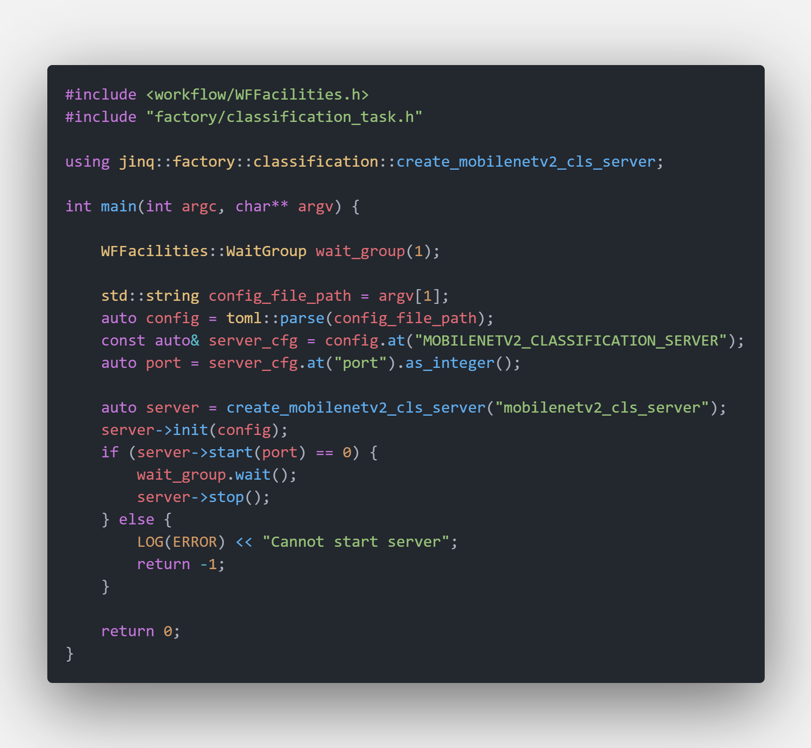
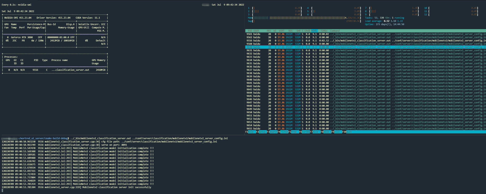
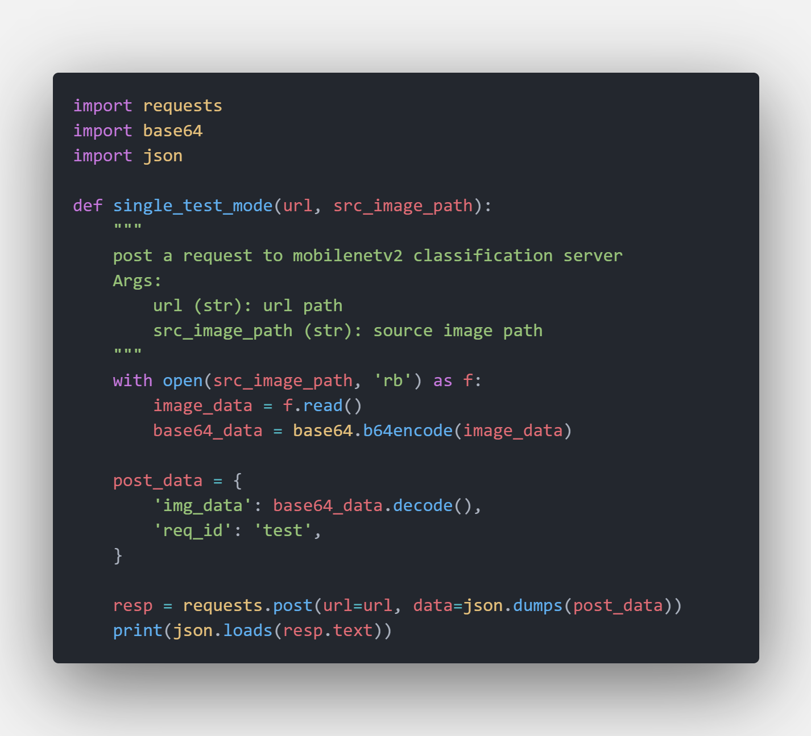
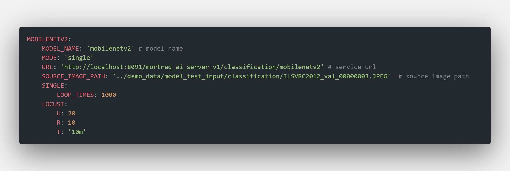
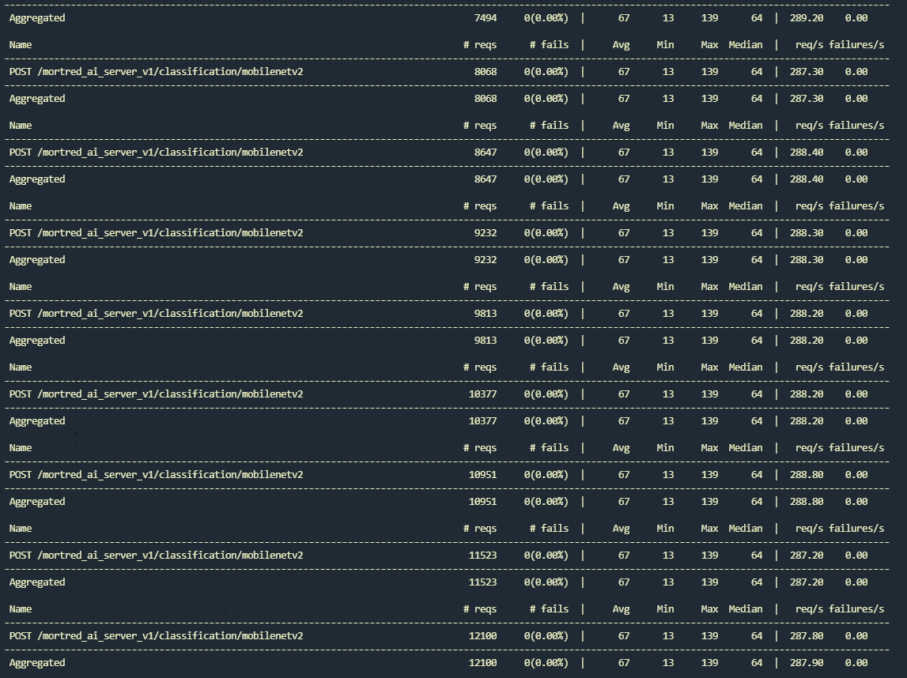
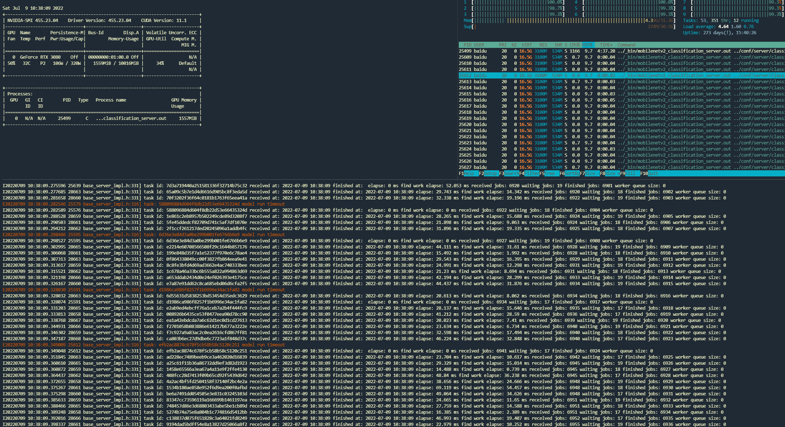
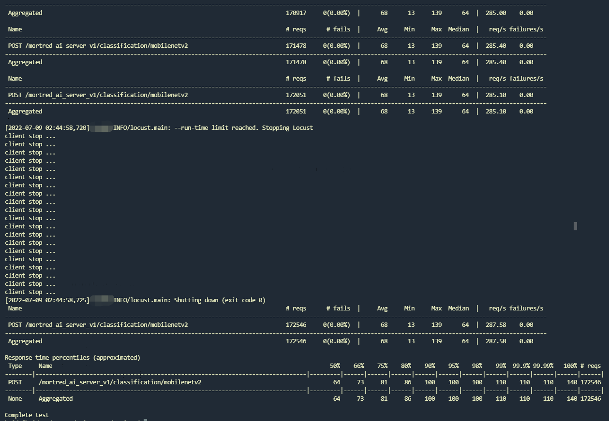
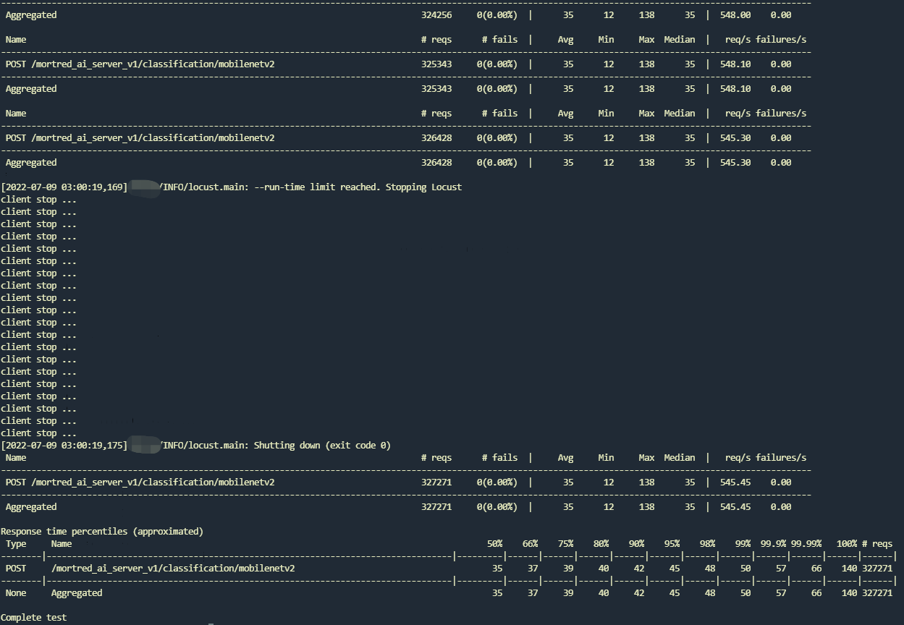
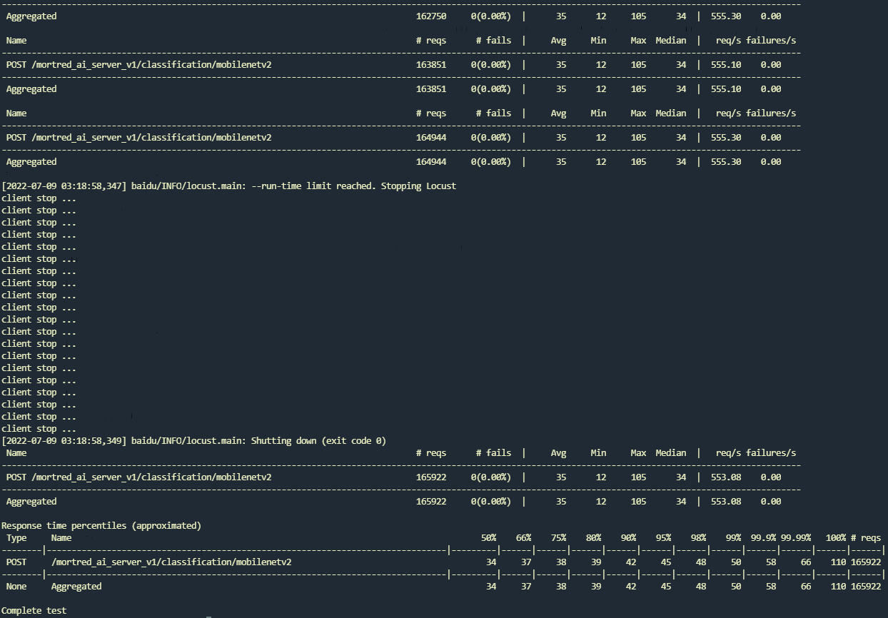

# Toturials Of Classification Model Server

## Start A Classification Server

It's very quick to start a classification server. Main code are showed below

`Classification Server Code Snappit`


The executable binary file was built in $PROJECT_ROOT/_bin/mobilenetv2_classification_server.out. Simply run

```bash
cd $PROJECT_ROOT/_bin
./mobilenetv2_classification_server.out ../conf/server/classification/mobilenetv2/mobilenetv2_server_config.ini
```

When server successfully start on `http:://localhost:8091` you're supposed to see `worker_nums` workers were called up and occupied your GPU resources. By default 4 model workers will be created you may enlarge it if you have enough GPU memory.

`Classification Server Ready to Serve`


## Python Client Example

You may find a demo python client to test the server at [test_server.py#L39-L67](../scripts/server/test_server.py). It's very easy to post a request

`Classification Client Code Snappit`


Server's url can be found in server configuration. For a detailed server configuration refer to [about_model_server_configuration](../docs/about_model_server_configuration.md)

To use test python client you may run

```python
cd $PROJECT_ROOT/scripts
export PYTHONPATH=$PWD:$PYTHONPATH
python server/test_server.py --server mobilenetv2 --mode single
```

The client will send [the default test image](../demo_data/model_test_input/classification/ILSVRC2012_val_00000003.JPEG) 1000 times sequencially.

`mobilenetv2 classification server output`


`mobilenetv2 client server output`


You may get the class_id and the score from the response.

## Description Of Python Client

The script at [test_server.py](../scripts/server/test_server.py) not only supports a sequencially toy client but also supports locust pressure test mode.

Python test config file was stored at [py_demo_scripts_cfg.yaml](../conf/py_demo/py_demo_script_cfg.yaml).

`Sample Client Config File`


**URL:** the server's url path

**SOURCE_IMAGE_PATH:** the source image path used for testing

**MODE:** client test mode only supported `single` and `locust`. The client will simply post the same requests `LOOP_TIMES` times when switched to `single` mode but run a bunch of concurrent requests when switched to `locust` mode.

**U:** The max concurrent client counts

**R:** started client counts every seconds

**T:** how long will the pressure test lasts

For detailed usage of Locust library you may find some help from [locust documents](https://docs.locust.io/en/stable/)

Simply start the pressure test via

```python
cd $PROJECT_ROOT/scripts
export PYTHONPATH=$PWD:$PYTHONPATH
python server/test_server.py --server mobilenetv2 --mode locust
```

Here is server's output under pressure test with default 4 workers

`mobile client output with locust mode`


`mobile server output with locust mode`


As you can see up above the rps only reaches around 288 req/s which is far from meeting my expectations. When you look at the server's output you may find the GPU usage was pretty low and some of the task even timed out. Besides the worker queue size remain empty at any time which means you may enlarge worker counts to promote the server's rps. The test result shows avg resp time is 68ms minimu resp time is 13ms.


Now enlarge the worker nums from 4 to 12 and let's see what happens.

You may find almost no timed out task and worker queue size remains at least one worker. Gpu utilization also rise a lot. The test result shows avg resp time reduced to 35ms minimu resp time remains around 13ms and the rps reaches 546 req/s which is almost the same speed as model's inference benchmark result. :fire::fire::fire:


But do expect to enlarge more workers to unlimitedly promote the server's performance. It may benefit nothing when you enlarge worker to 24. Rps remains the same.

