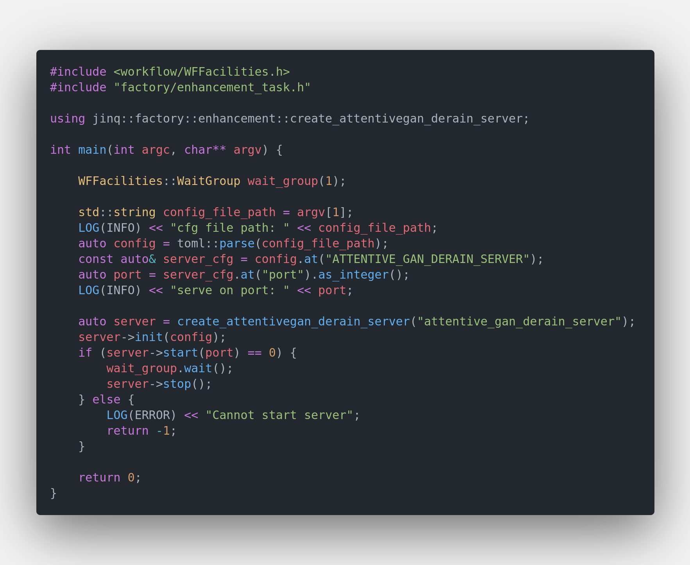
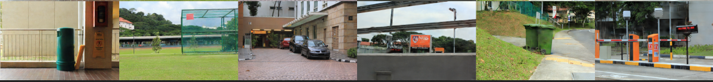
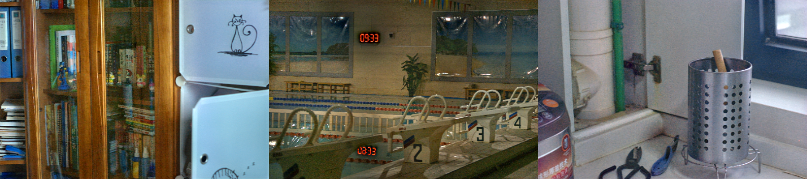

# Toturials Of Enhancement Model Server

## Start A Enhancement Server

It's very quick to start a enhancement server. Main code are showed below

`Enhancement Server Code Snappit`


The executable binary file was built in $PROJECT_ROOT/_bin/attentive_gan_derain_server.out Simply run

```bash
cd $PROJECT_ROOT/_bin
./attentive_gan_derain_server.out ../conf/server/enhancement/attentive_gan_derain/attentive_gan_server_cfg.ini
```

When server successfully start on `http:://localhost:8091` you're supposed to see `worker_nums` workers were called up and occupied your GPU resources. By default 4 model workers will be created you may enlarge it if you have enough GPU memory.

## Python Client Example

Local python client test is similiar with mobilenetv2 classification server you may read [toturials_of_classfication_model_server.md](../docs/toturials_of_classification_model_server.md) for details.

To use test python client you may run

```python
cd $PROJECT_ROOT/scripts
export PYTHONPATH=$PWD:$PYTHONPATH
python server/test_server.py --server attentive_gan --mode single
```

## Unique Tips For Enhancement Model Python Client

Most of the enhancement's model output is a image corresponding to the origin image. The enhancement server's response is a json obj 

```python
resp = {
    'req_id': '',
    'code': 1,
    'msg': 'success',
    'data': {
        'enhance_result': base64_image_content
    }
}
```
`enhance_result` contains the model's output encoded with base64. If you want to save the model's output info local file you may do

```python
with open(src_image_path, 'rb') as f:
    image_data = f.read()
    base64_data = base64.b64encode(image_data)

    post_data = {
        'img_data': base64_data.decode(),
        'req_id': 'demo',
    }
    resp = requests.post(url=url, data=json.dumps(post_data))
    output = json.loads(resp.text)['data']['enhance_result']
    out_f = open('result.png', 'wb')
    out_f.write(base64.b64decode(output))
    out_f.close()
```

## Enhancement Model's Visualization Result

### AttentiveGan Derain Model

[attentive_gan_derain](https://arxiv.org/abs/1711.10098) model was designed for derain task. You may refer to repo https://github.com/MaybeShewill-CV/attentive-gan-derainnet for details about training details.

`Server's Input Image`


`Server's Output Image`


### EnlightenGan Model

[enlighten_gan_derain](https://arxiv.org/abs/1906.06972) model was designed for low light image enhancement task. You may refer to repo https://github.com/VITA-Group/EnlightenGAN for details about training details.

`Server's Input Image`


`Server's Output Image`
