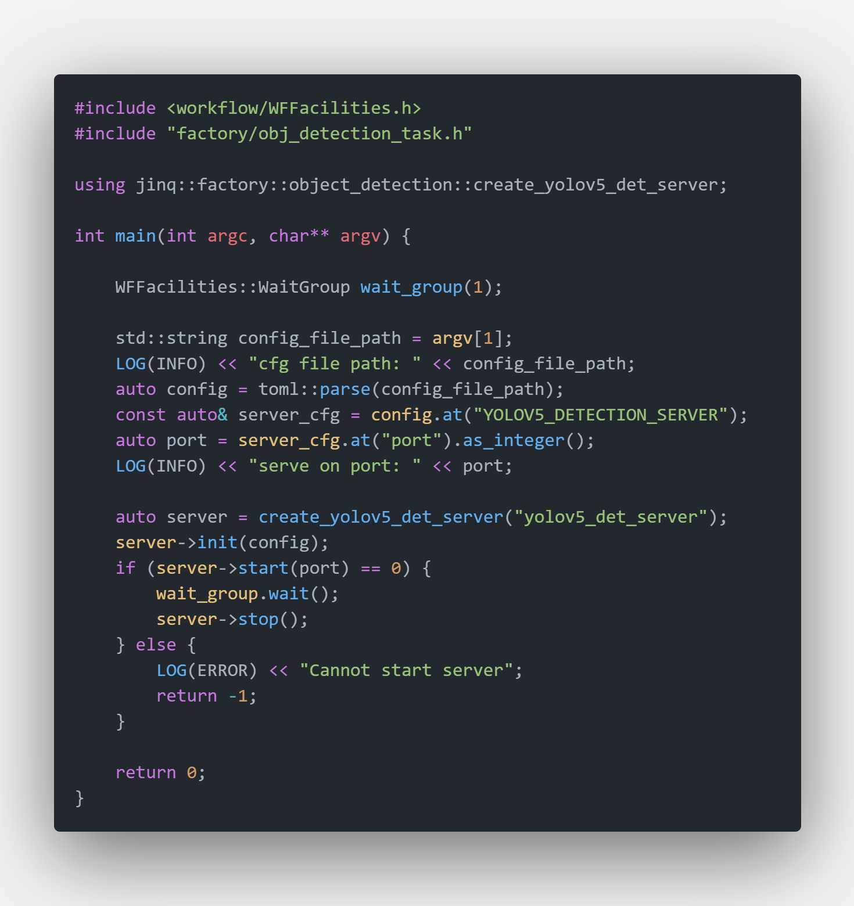
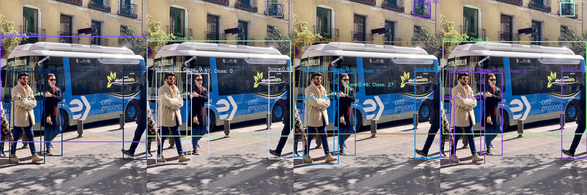
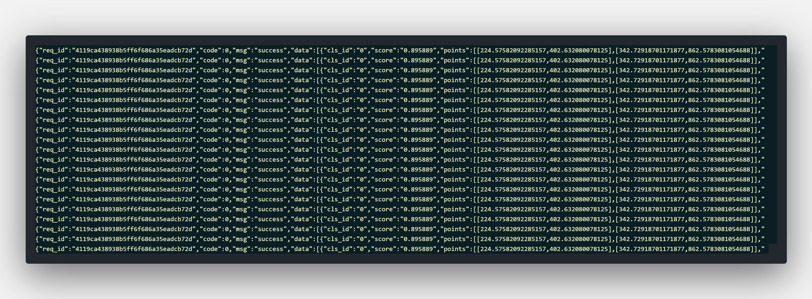
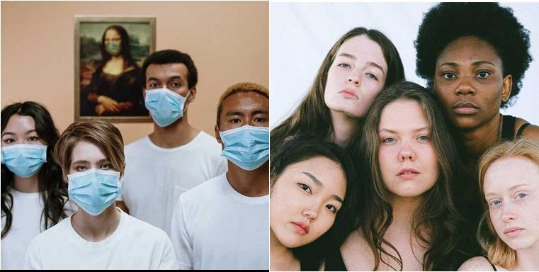
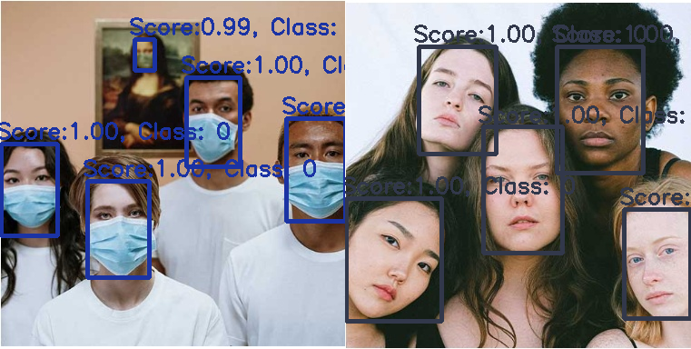

# Toturials Of Object Detection Model Server

## Start A Object Detection Server

It's very quick to start a object detection server. Main code are showed below

`Object Detection Server Code Snappit`


The executable binary file was built in $PROJECT_ROOT/_bin/yolov5_detection_server.out Simply run

```bash
cd $PROJECT_ROOT/_bin
./yolov5_detection_server.out ../conf/server/object_detection/yolov5/yolov5_server_config.ini
```

When server successfully start on `http:://localhost:8091` you're supposed to see `worker_nums` workers were called up and occupied your GPU resources. By default 4 model workers will be created you may enlarge it if you have enough GPU memory.

You may switch yolov5 model eg. yolov5s yolov5m etc by modifying model configuration. You may find instruction at [about_model_configuration.md#L20](../docs/about_model_configuration.md)

## Python Client Example

Local python client test is similiar with mobilenetv2 classification server you may read [toturials_of_classfication_model_server.md](../docs/toturials_of_classification_model_server.md) for details.

To use test python client you may run

```python
cd $PROJECT_ROOT/scripts
export PYTHONPATH=$PWD:$PYTHONPATH
python server/test_server.py --server yolov5 --mode single
```

## Unique Tips For Object Detection Model Python Client

Object deteciton model's output is set of bounding boxes. A single bounding box consist of location, class_id and confidence. Server's response is a json like

```python
resp = {
    'req_id': '',
    'code': 1,
    'msg': 'success',
    'data': [
        {
            'cls_id': 6,
            'score': 0.65,
            'points': [[tl_x, tl_y], [rb_x, rb_y]],
            'detail_infos': {}
        },
        {
            ...
        },
    ]
}
```

## Unique Tips For Face Detection Model Python Client

Face deteciton model's output is set of bboxes. A single bounding box consist of location, landmarks and confidence. Server's response is a json like

```python
resp = {
    'req_id': '',
    'code': 1,
    'msg': 'success',
    'data': [
        {
            'cls_id': 6,
            'score': 0.65,
            'box': [[tl_x, tl_y], [rb_x, rb_y]],
            'landmark': [[x1, y1], [x2, y2], [x3, y3], ...]
        },
        {
            ...
        },
    ]
}
```

## Object Detection Model's Visualization Result

### Yolov5 Model

Yolov5 :rocket: is a family of object detection architectures and models pretrained on the COCO dataset, and represents Ultralytics open-source research into future vision AI methods, incorporating lessons learned and best practices evolved over thousands of hours of research and development.

`Server's Input Image`


`Server's Output Image With Different Model`





### LibFcae Model

Libface is a remarkable open source library for CNN-based face detection in images designed by [ShiqiYu](https://github.com/ShiqiYu). You may refer to [https://github.com/ShiqiYu/libfacedetection](https://github.com/ShiqiYu/libfacedetection) for details.

`Server's Input Image`


`Server's Output Image`

