# 图像分类服务器说明

## 启动一个图像分类服务器

你可以快速启动一个图像分类服务器. 主要的函数如下所示

`图像分类服务器代码段`
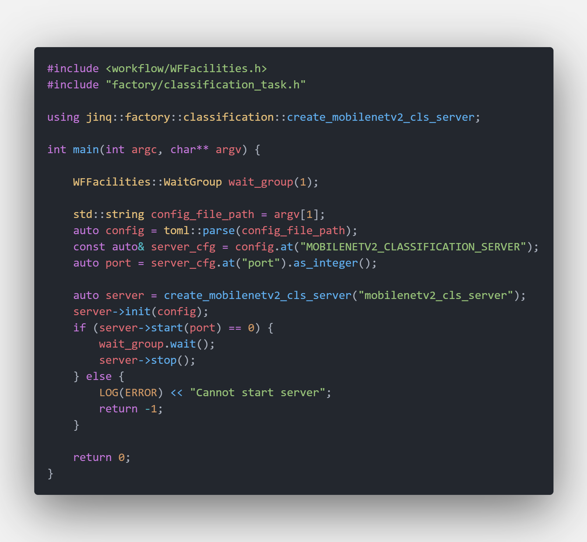

编译好的可执行文件存放在 `$PROJECT_ROOT/_bin/mobilenetv2_classification_server.out`, 启动方式如下所示

```bash
cd $PROJECT_ROOT/_bin
./mobilenetv2_classification_server.out ../conf/server/classification/mobilenetv2/mobilenetv2_server_config.toml
```

正常启动后，服务会运行在服务器配置（`conf/server/<task>/<model>/*.toml`）中 `port` 指定的端口，`worker_nums` 个模型实例会被创建并占用 GPU 资源。仓库自带配置默认 `worker_nums=1`，你可以按 GPU 显存情况适当调整。

`图像分类服务器被正常启动`
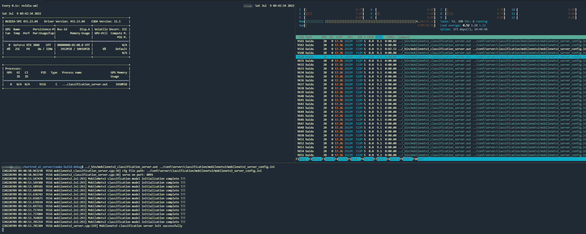

## Python 客户端示例

在文件 [test_server.py#L39-L67](../scripts/server/test_server.py) 处有一个简单的python客户端代码来测试上述启动的server，你可以很容易的post一个请求

`python客户端代码片段`
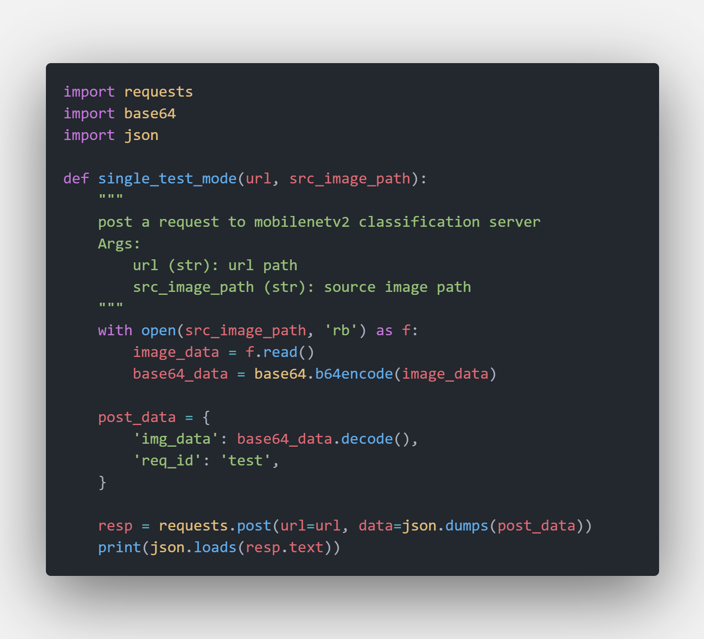

服务的url地址可以在服务启动之前在配置文件中进行配置修改。你可以在 [模型服务器配置说明文档](../docs/about_model_server_configuration.zh-cn.md) 中找到详细说明。

调用python客户端的方式如下

```python
cd $PROJECT_ROOT/scripts
export PYTHONPATH=$PWD:$PYTHONPATH
python server/test_server.py --server mobilenetv2 --mode single
```

在 `single` 模式下，客户端会顺序发送 [默认测试图像](../demo_data/model_test_input/classification/ILSVRC2012_val_00000003.JPEG) 1000次

`mobilenetv2 图像分类服务器输出`
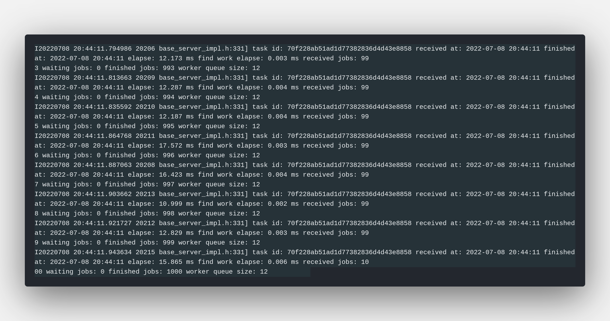

`mobilenetv2 图像分类客户端输出`
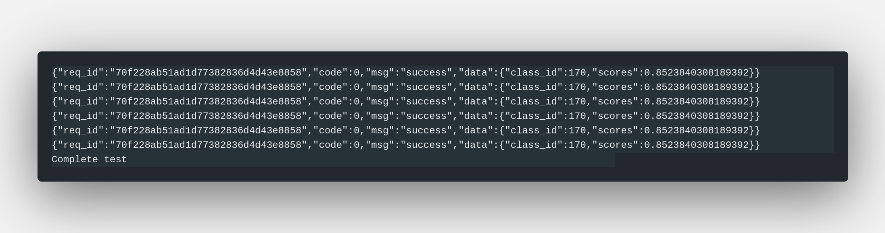

你可以从服务端返回的response信息中获取图像的分类结果和具体置信度分数。

## Python 客户端代码说明

[test_server.py](../scripts/server/test_server.py) 所创建的简单python客户端不仅支持顺序发送并且支持基于locust的并发压测模式。客户端直接读取 `conf/server/` 下的服务器配置（`host` / `port` / `server_uri`），因此测试目标 URL 始终与正在运行的服务器一致：

```bash
# 列出所有可用的模型服务器
python server/test_server.py --list

# single 模式：发送演示图片 1000 次
python server/test_server.py --server mobilenetv2 --mode single

# locust 压测模式
python server/test_server.py --server mobilenetv2 --mode locust --users 20 --spawn-rate 10 --time 10m
```

**--server:** 服务器配置段名或唯一前缀，例如 `mobilenetv2`、`yolov5`

**--mode:** `single` 顺序发送 `--times` 次请求；`locust` 并发压测

**--image:** 覆盖演示输入图片（默认使用 `demo_data/model_test_input` 下按模型选择的示例图）

**--dry-run:** 只打印请求计划，不发送任何请求

**--users / --spawn-rate / --time:** locust 并发数、每秒启动数与压测时长

关于 `Locust` 库的详细文档可以查询 [locust documents](https://docs.locust.io/en/stable/)

启动python客户端进行压测的方式如下

```python
cd $PROJECT_ROOT/scripts
export PYTHONPATH=$PWD:$PYTHONPATH
python server/test_server.py --server mobilenetv2 --mode locust
```

在服务器配置 `worker_nums=4` 的情况下，服务端和客户端的输出如下图所示

`压测模式下的客户端输出`
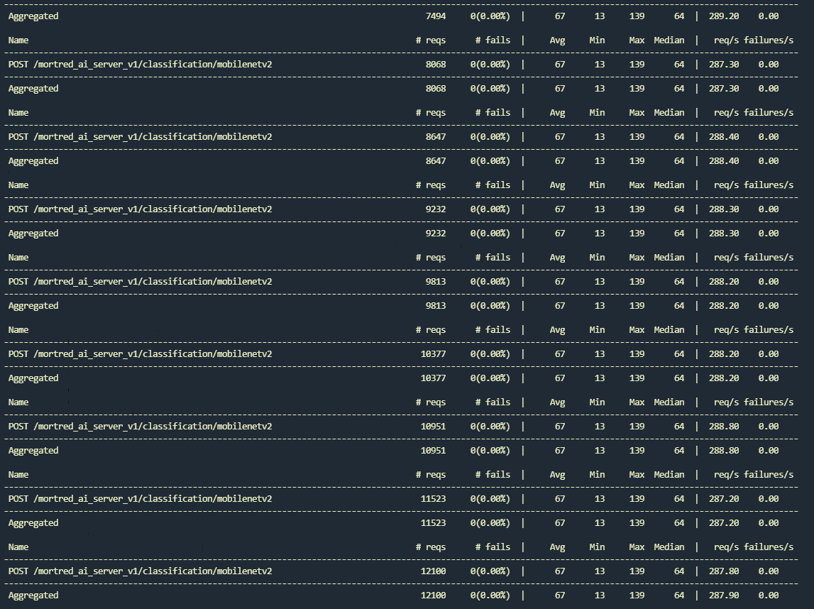

`压测模式下的服务端输出`
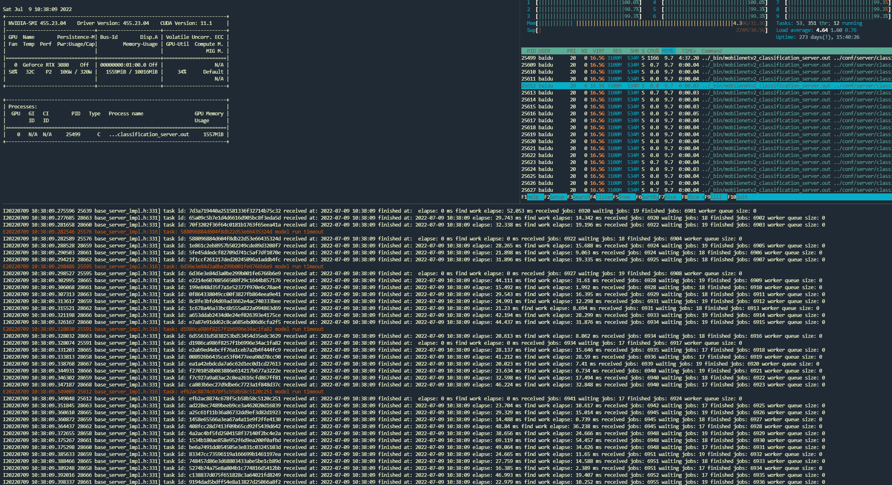

正如上述输出看到压测结果，服务端只能达到288 req/s，平均响应时间为68ms，最小响应时间为13ms，这个结果显然不能让人满意。当你仔细观察服务器gpu资源你会发现gpu利用率其实是不高的，甚至某些请求会计算超时，并且 `worker queue` 持续为空。这种情形下可以尝试增大服务器配置文件中的 `worker_nums` 来提高整个服务器的吞吐。
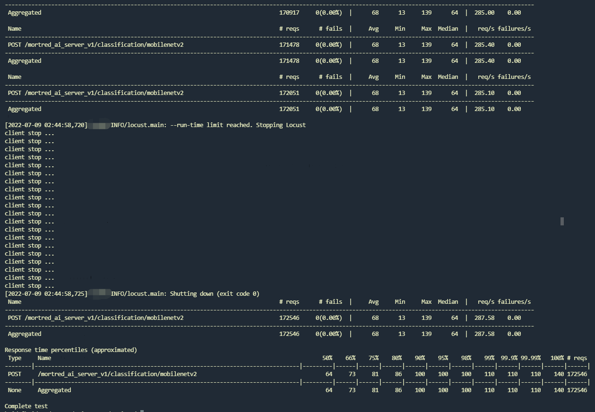

下面让我们增大 `worker_nums` 到12来看看效果如何
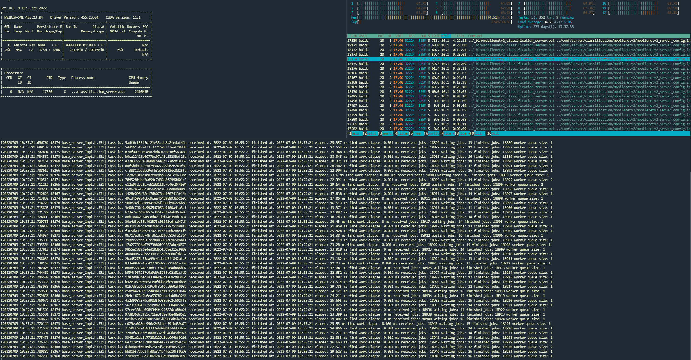

你可以看到几乎没有超时的请求再次出现并且 `worker queue` 不会持续性枯竭，服务器上的gpu利用率也提升了不少。压测结果显示平均响应时间减少到了35ms，最小响应时间13ms，rps则提升到了546 req/s 这个数据几乎和本地的模型基准测试结果无二了 :fire::fire::fire:
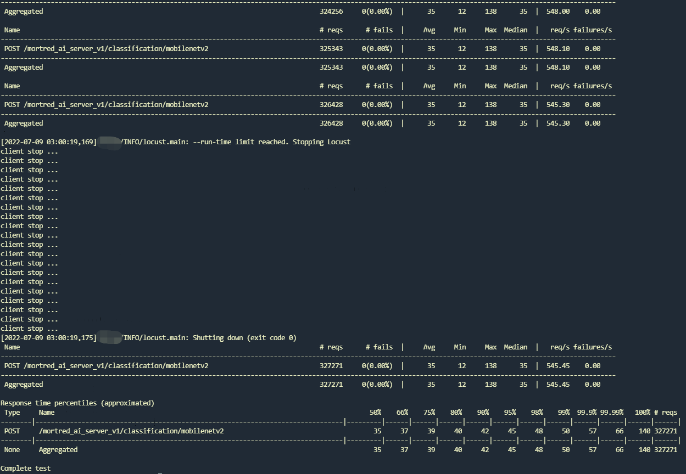

当然你不能通过无限制的增大 `worker_nums` 来获取服务性能上的增益，例如当增大 `worker_nums` 到24的时候压测的 `rps` 数据几乎没有什么提升
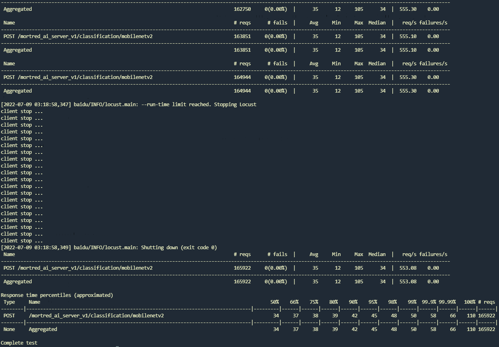
