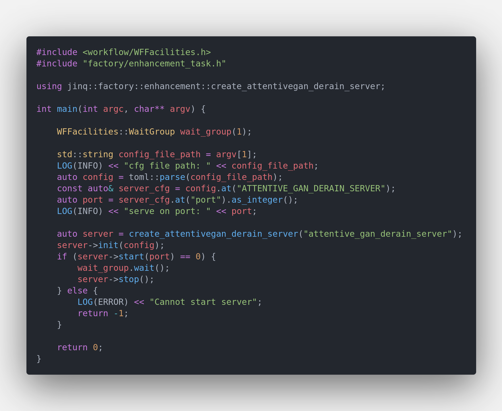
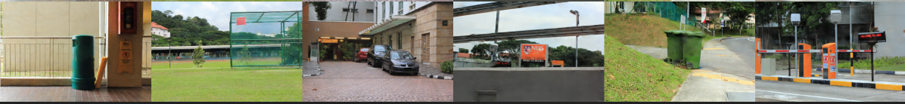
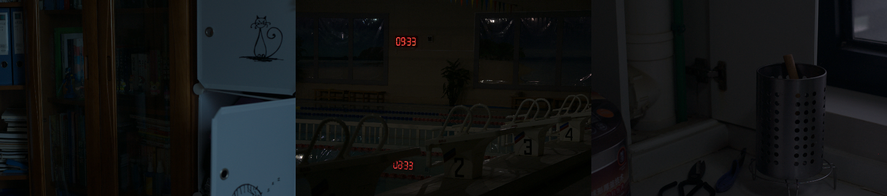
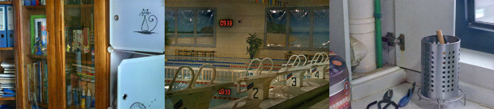

# Tutorials Of Enhancement Model Server

## Start A Enhancement Server

It's very quick to start a enhancement server. Main code are showed below

`Enhancement Server Code Snappit`


The unified server binary is `$PROJECT_ROOT/_bin/mortred-model-server.out`. Simply run

```bash
cd $PROJECT_ROOT/_bin
./mortred-model-server.out --model ATTENTIVE_GAN_DERAIN ../conf/server/enhancement/attentive_gan_derain/attentive_gan_server_cfg.toml
```

When the server starts successfully at the `port` configured in your server config (`conf/server/<task>/<model>/*.toml`), `worker_nums` workers will be spawned and occupy your GPU resources. The shipped configs default to `worker_nums=1`; you may enlarge it if you have enough GPU memory.

## Python Client Example

The Python client is the same as the classification tutorial:
[tutorials_of_classification_model_server.md](tutorials_of_classification_model_server.md).

```bash
cd $PROJECT_ROOT
python3 scripts/server/test_server.py --server attentive_gan --mode single
```

## Unique Tips For Enhancement Model Python Client

Enhancement returns one image in `results[0].data.image` (JPEG/PNG base64).

```json
{
  "status": 0,
  "status_str": "OK",
  "task_id": "demo",
  "results": [
    {
      "status": 0,
      "data": {
        "image": "<jpeg base64>"
      }
    }
  ],
  "partial": false
}
```

To save the result:

```python
import base64
import json
import urllib.request

with open(src_image_path, "rb") as f:
    img_b64 = base64.b64encode(f.read()).decode()

body = json.dumps({"images": [img_b64], "req_id": "demo"}).encode()
req = urllib.request.Request(
    url, data=body, headers={"Content-Type": "application/json"}
)
resp = json.loads(urllib.request.urlopen(req).read())
output = resp["results"][0]["data"]["image"]
with open("result.jpg", "wb") as out_f:
    out_f.write(base64.b64decode(output))
```

## Enhancement Model's Visualization Result

### AttentiveGan Derain Model

[attentive_gan_derain](https://arxiv.org/abs/1711.10098) model was designed for derain task. You may refer to repo [https://github.com/MaybeShewill-CV/attentive-gan-derainnet](https://github.com/MaybeShewill-CV/attentive-gan-derainnet) for details about training details.

`Server's Input Image`


`Server's Output Image`


### EnlightenGan Model

[enlighten_gan_derain](https://arxiv.org/abs/1906.06972) model was designed for low light image enhancement task. You may refer to repo [https://github.com/VITA-Group/EnlightenGAN](https://github.com/VITA-Group/EnlightenGAN) for details about training details.

`Server's Input Image`


`Server's Output Image`
