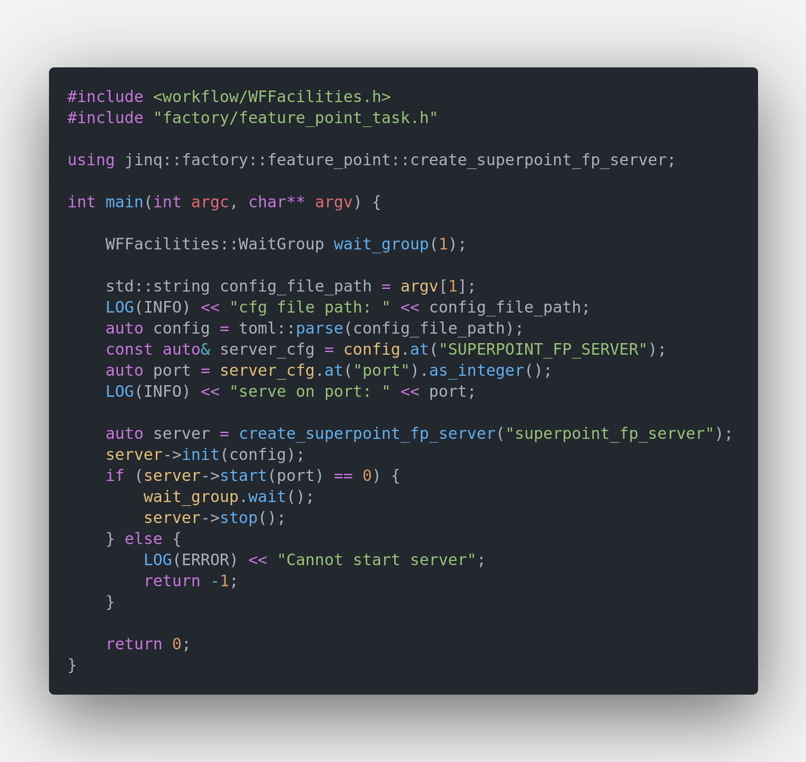
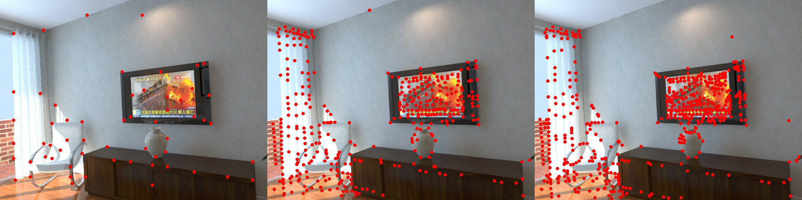
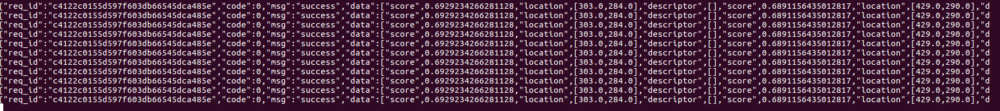

# Tutorials Of Feature Point Model Server

## Start A Feature Point Server

It's very quick to start a feature point server. Main code are showed below

`Feature Point Server Code Snappit`


The unified server binary is `$PROJECT_ROOT/_bin/mortred-model-server.out`. Simply run

```bash
cd $PROJECT_ROOT/_bin
./mortred-model-server.out --model SUPERPOINT ../conf/server/feature_point/superpoint/superpoint_server_cfg.toml
```

When the server starts successfully at the `port` configured in your server config (`conf/server/<task>/<model>/*.toml`), `worker_nums` workers will be spawned and occupy your GPU resources. The shipped configs default to `worker_nums=1`; you may enlarge it if you have enough GPU memory.

## Python Client Example

Local python client test is similiar with mobilenetv2 classification server you may read [toturials_of_classfication_model_server.md](../docs/toturials_of_classification_model_server.md) for details.

To use test python client you may run

```python
cd $PROJECT_ROOT/scripts
export PYTHONPATH=$PWD:$PYTHONPATH
python server/test_server.py --server superpoint --mode single
```

## Unique Tips For Feature Point Model Python Client

Most of the feature's model output is a set of feature points. A single feature point consists of location and descriptor. The JSON payload is built by [`fill_feature_points`](../src/server/response_serializers.h) and already includes both. Server's response is a json like

```python
resp = {
    'req_id': '',
    'code': 1,
    'msg': 'success',
    'data': [
        {
            'score': 0.95,
            'location': [100.5, 85.4],
            'descriptor': []
        },
        {
            ...
        },
    ]
}
```

`location` contains the feature points' location information and you can visualization the result by yourself.

## Feature Point Model's Visualization Result

### SuperPoint Model

[superpoint](https://arxiv.org/abs/1712.07629) model was designed for detect and describe feature point on images. You may refer to repo [https://github.com/magicleap/SuperPointPretrainedNetwork](https://github.com/magicleap/SuperPointPretrainedNetwork) for details about training details.

`Server's Input Image`


`Server's Output Image With Different Model`
<center>*********** 120x160_model **************** 240x320_model ********************* 480x640_model ******************* 960x1280_model ***********</center>




