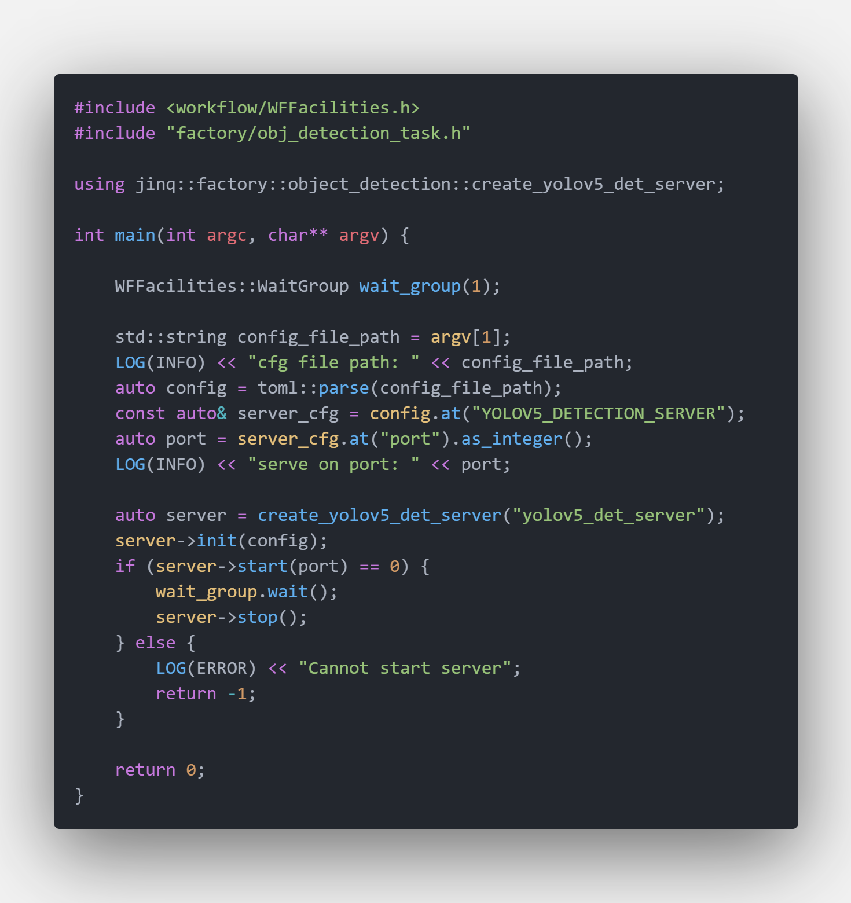
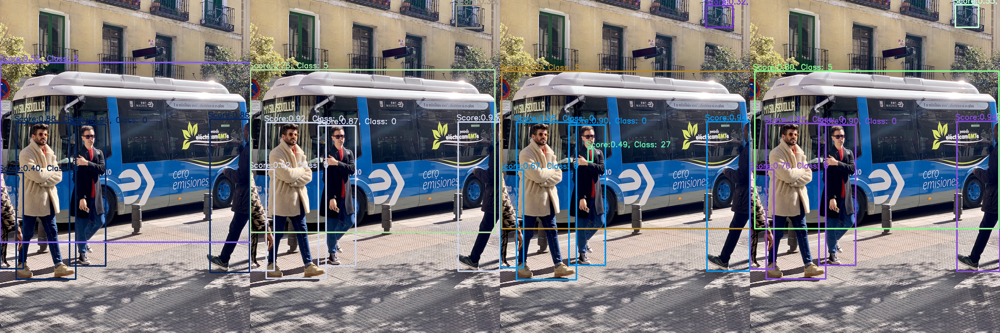
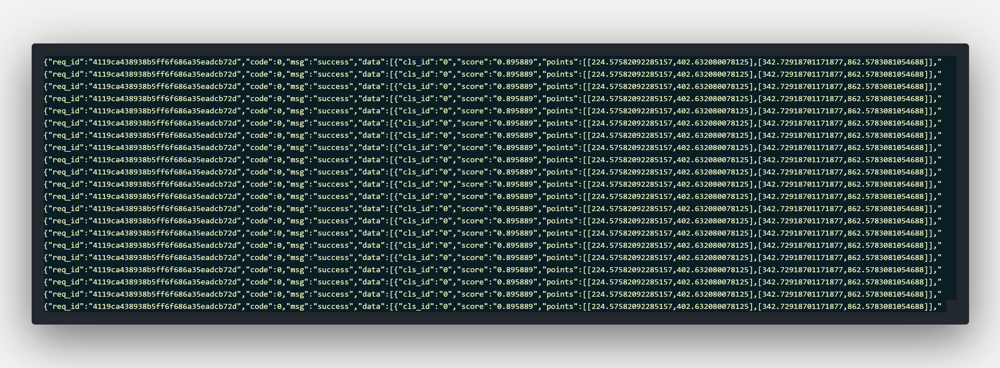
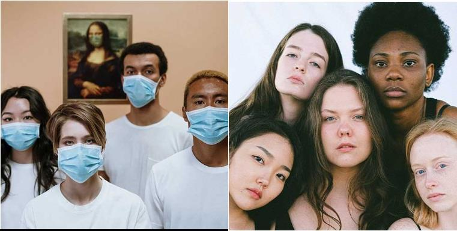
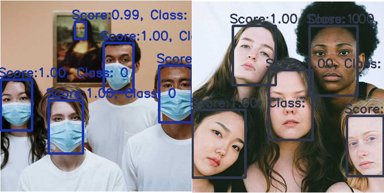

# Tutorials Of Object Detection Model Server

## Start A Object Detection Server

It's very quick to start a object detection server. Main code are showed below

`Object Detection Server Code Snappit`


The unified server binary is `$PROJECT_ROOT/_bin/mortred-model-server.out`. Simply run

```bash
cd $PROJECT_ROOT/_bin
./mortred-model-server.out --model YOLOV5 ../conf/server/object_detection/yolov5/yolov5_server_config.toml
```

When the server starts successfully at the `port` configured in your server config (`conf/server/<task>/<model>/*.toml`), `worker_nums` workers will be spawned and occupy your GPU resources. The shipped configs default to `worker_nums=1`; you may enlarge it if you have enough GPU memory.

You may switch yolov5 model eg. yolov5s yolov5m etc by modifying model configuration. See [about_model_configuration.md](about_model_configuration.md).

## Python Client Example

The Python client is the same as the classification tutorial:
[tutorials_of_classification_model_server.md](tutorials_of_classification_model_server.md).

```bash
cd $PROJECT_ROOT
python3 scripts/server/test_server.py --server yolov5 --mode single
```

## Unique Tips For Object Detection Model Python Client

Object detection returns an array under `results[0].data`. Each box is
`class_id`, `score`, `category`, `bbox` as `[x1, y1, x2, y2]`.

```json
{
  "status": 0,
  "status_str": "OK",
  "task_id": "demo",
  "results": [
    {
      "status": 0,
      "data": [
        {
          "class_id": 6,
          "score": 0.65,
          "category": "bus",
          "bbox": [10.0, 20.0, 100.0, 200.0],
          "detail_infos": {}
        }
      ]
    }
  ],
  "partial": false
}
```

## Unique Tips For Face Detection Model Python Client

Face detection uses the same envelope plus `landmarks` as `[x, y]` pairs.

```json
{
  "status": 0,
  "status_str": "OK",
  "task_id": "demo",
  "results": [
    {
      "status": 0,
      "data": [
        {
          "class_id": 1,
          "score": 0.65,
          "category": "face",
          "bbox": [10.0, 20.0, 100.0, 200.0],
          "landmarks": [[12.0, 24.0], [90.0, 24.0]],
          "detail_infos": {}
        }
      ]
    }
  ],
  "partial": false
}
```

## Object Detection Model's Visualization Result

### Yolov5 Model

Yolov5 :rocket: is a family of object detection architectures and models pretrained on the COCO dataset, and represents Ultralytics open-source research into future vision AI methods, incorporating lessons learned and best practices evolved over thousands of hours of research and development.

`Server's Input Image`


`Server's Output Image With Different Model`





### LibFace Model

Libface is a remarkable open source library for CNN-based face detection in images designed by [ShiqiYu](https://github.com/ShiqiYu). You may refer to [https://github.com/ShiqiYu/libfacedetection](https://github.com/ShiqiYu/libfacedetection) for details.

`Server's Input Image`


`Server's Output Image`

