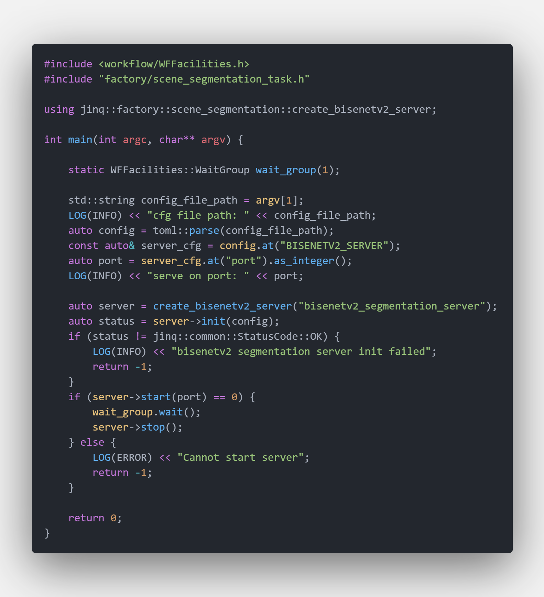

# 图像分割服务器说明

## 启动一个图像分割服务器

图像分割服务器启动代码如下

`图像分割服务器代码段`


编译好的可执行文件存放在 `$PROJECT_ROOT/_bin/bisenetv2_segmentation_server.out`。运行

```bash
cd $PROJECT_ROOT/_bin
./bisenetv2_segmentation_server.out ../conf/server/scene_segmentation/bisenetv2/bisenetv2_server_config.ini
```

默认状态下服务会启动在 `http:://localhost:8091` 并且有4个模型实例被启动。

## Python 客户端示例

Python客户端运行仅需

```python
cd $PROJECT_ROOT/scripts
export PYTHONPATH=$PWD:$PYTHONPATH
python server/test_server.py --server bisenetv2 --mode single
```

## 关于图像分割服务器的一些特殊说明

图像分割服务器的输出是一张类别图，图像标记了每个像素点的类别信息. 服务器response json对象结构如下

```python
resp = {
    'req_id': '',
    'code': 1,
    'msg': 'success',
    'data': {
        'segment_result': base64_image_content
    }
}
```

`segmentation_result` 保存了模型输出的结果图. 如果想保存分割结果可以运行

```python
with open(src_image_path, 'rb') as f:
    image_data = f.read()
    base64_data = base64.b64encode(image_data)

    post_data = {
        'img_data': base64_data.decode(),
        'req_id': 'demo',
    }
    resp = requests.post(url=url, data=json.dumps(post_data))
    output = json.loads(resp.text)['data']['segment_result']
    out_f = open('result.png', 'wb')
    out_f.write(base64.b64decode(output))
    out_f.close()
```

## 图像分割服务器的可视化输出结果

### BisenetV2 模型

[BisenetV2](https://arxiv.org/abs/2004.02147) :fire: 是一个实时图像分割模型. 你可以参考 [https://github.com/MaybeShewill-CV/bisenetv2-tensorflow](https://github.com/MaybeShewill-CV/bisenetv2-tensorflow) 来获取模型结构和训练细节.

模型主要结构如下
`Bisenetv2 Network Architecture`


`客户端输入图像`


`服务端输出图像`

