# Supervisor 控制台 — 视觉迭代记录（Screenshot Gallery）

> 本文档记录 `fix/ui-phosphor-redesign` 分支上 Supervisor UI 的每一轮美学深化迭代：
> 改动内容、八维度评分（运维控制台权重）与当轮渲染截图。
> 截图由本地 mock（12 模型 / GPU 采样 / 日志流）驱动真实浏览器渲染所得。
>
> 评分维度与权重：人格与记忆点 10% · 概念清晰度 10% · 色彩系统 15% · 字体与排版 10%
> · 表面与材质 15% · 密度与信息层级 15% · 状态可见性 15% · 动效与细节工艺 10%
>
> **退出条件**：所有维度 ≥ 8.5，人格与记忆点 ≥ 9.0，加权总分 ≥ 9.0。

---

## Round 1 — 色彩纪律 / 材质分层 / Mission-Control 布局（2026-09-17）

### 改动清单

| 维度目标 | 改动 |
|---|---|
| 色彩系统 | 分类色板重制为统一感知亮度的色相家族（teal/cyan/blue/violet/amber/rose…，同明度同饱和带）；语义色（acc/warn/err）与身份色彻底分离；状态 chips 携带各自语义色 |
| 字体排版 | 全站字号阶梯 token（10/10.5/11.5/13/15/18）；数字场景全面 `tabular-nums` 列对齐 |
| 表面材质 | 日志面板与拖放区改内嵌井（inset shadow）；卡片内顶部高光 + 悬停投影；SVG 噪点材质（data-URI，零资源依赖）+ 页面暗角 |
| 密度层级 | Overview 固定三段式布局：GPU / 舰队（弹性滚动）/ 遥测带一屏尽收；新增状态汇总过滤 chips（running/starting/failed/stopped + 计数，可点选过滤）与分类 chips 同行 |
| 状态可见性 | 标签页标题实时 live 计数；舰队卡片键盘可达（tabindex + Enter/Space + aria-label）；GPU 图表十字线取样器（hover 显示 util/vram/pwr/temp）；过滤无结果的空态文案 |
| 动效工艺 | 磷光角标（targeting brackets）回归 hover；视图切换过渡动画；命令面板弹入动画 + 命令类型图标（▸/⟳/◈）+ 空态；`prompt()` 全面替换为样式化 token 对话框（毛玻璃背景、聚焦环、Enter/Esc 语义）；全局 kbd 芯片组件 + 顶栏跨平台快捷键提示（⌘K/Ctrl K） |

### 当轮截图

| 视图 | 截图 |
|---|---|
| Overview 1600（固定三段式 + 双过滤行） | 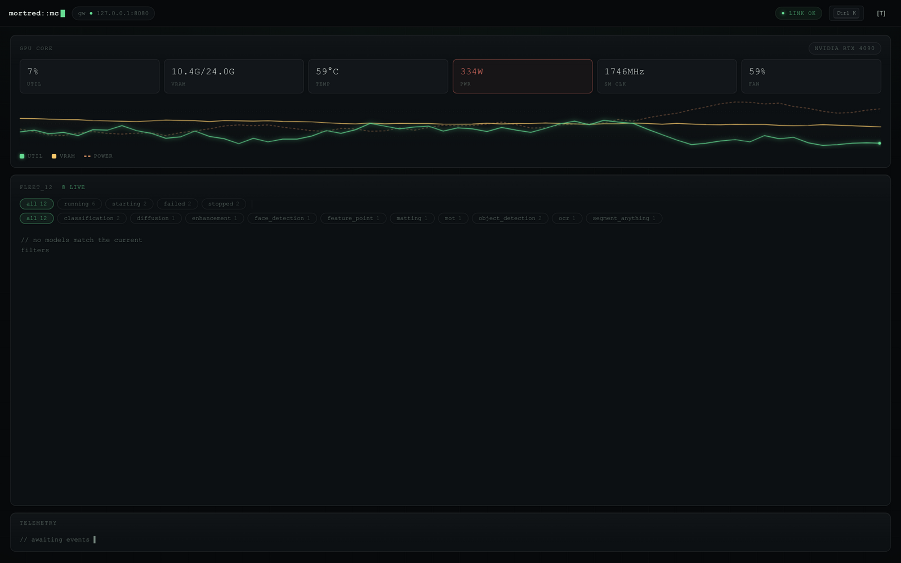 |
| GPU 十字线取样器 | 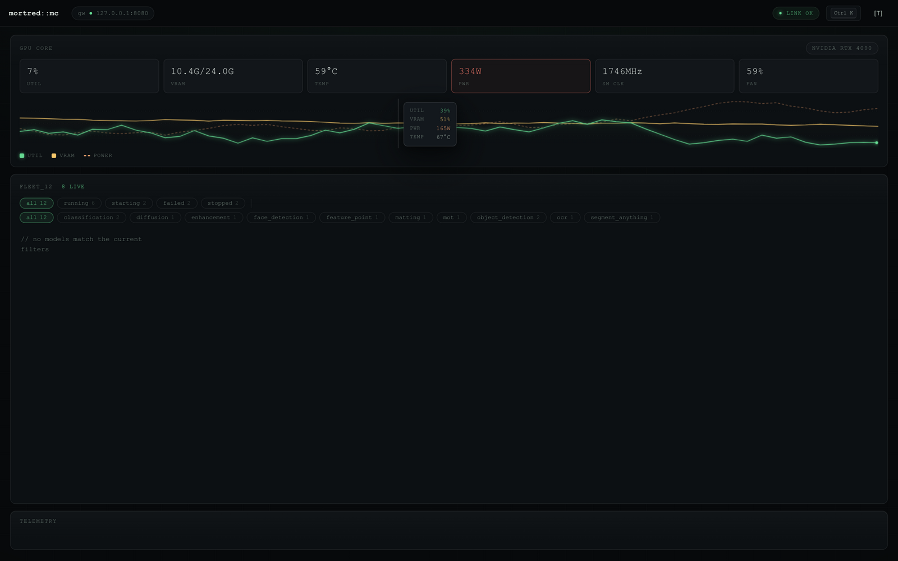 |

> 注：R1 时期的 workbench / palette / token 截图未在当轮落盘，统一在 R2 状态下补拍归档（见下节），特此说明。

### 评分（Round 1）

| 维度 | R0 基线 | R1 | 依据 |
|---|---|---|---|
| 人格与记忆点 | 9.00 | **9.00** | 磷光签名保留，角标/十字线/噪点强化身份，但尚无新增"标志性瞬间" |
| 概念清晰度 | 8.50 | **9.00** | 固定三段式兑现 "Mission Control" 叙事，一屏尽收 |
| 色彩系统 | 7.50 | **8.50** | 色相家族统一感知亮度；但图表/JS 内仍有少量裸 hex 未与 token 同源 |
| 字体与排版 | 7.50 | **8.50** | 阶梯 token + tnum 全面铺开；Workbench 标题层级仍可再进一档 |
| 表面与材质 | 7.50 | **8.50** | 井/投影/噪点/暗角成体系；live 卡描边仍是纯色而非渐变 |
| 密度与信息层级 | 8.00 | **8.75** | 双过滤行 + 固定布局；GPU 面板头部信息密度尚可再压 |
| 状态可见性 | 8.00 | **8.75** | title 计数/键盘可达/十字线；断链态仍是简单降透明度 |
| 动效与细节工艺 | 8.00 | **8.75** | 弹入/过渡/空态/kbd 体系；数字无 tween，toast 离场生硬 |
| **加权总分** | 8.00 | **8.70** | 未达退出条件（≥9.0）→ **继续 Round 2** |

### Round 2 计划

色彩 token 同源化（JS↔CSS）、live 卡渐变描边、日志面板 CRT 扫描线、boot 序列、
断链覆盖层、hud 数字 tween、toast 离场动画、palette 行 stagger、全局 focus 统一。

---

## Round 2 — 人格瞬间 / Token 同源 / 断链态（2026-09-17）

### 改动清单

| 维度目标 | 改动 |
|---|---|
| 人格与记忆点 | boot 打字机序列（`// mortred supervisor · link established · N models · N live`，一次性，respect reduced-motion）；日志面板常驻磷光扫描线；顶栏 `[S]` 开关全页 CRT 扫描线 + 暗角（localStorage 持久化）——三个新的"标志性瞬间" |
| 色彩系统 | 图表配色全部改读 CSS token（`cssVar()`，单一事实来源）；live 卡片双环 halo（1px 外环 + 呼吸辉光，color-mix 派生） |
| 状态可见性 | 断链从"降透明度"升级为全页覆盖层（毛玻璃去饱和 + ⚠ 警示 + reconnecting 动画点）；**修复真 bug：`refresh()` 网络层异常未捕获导致断链态永不触发**（真实验证抓出）；HUD 数字 tween（数值变化 420ms 缓动，可感知） |
| 密度层级 | GPU 面板头新增窗口元信息（`2m window · 2s poll`） |
| 字体排版 | Workbench 状态改彩色胶囊 state-pill；字号 token 全面替换裸值 |
| 动效工艺 | 命令面板弹入 + 行 stagger；toast 离场动画（滑动淡出）；hud-cell hover 抬升 |

### 当轮截图（全部经真实视觉模型验证）

| 视图 | 截图 | 验证结论 |
|---|---|---|
| Overview + boot 行 | 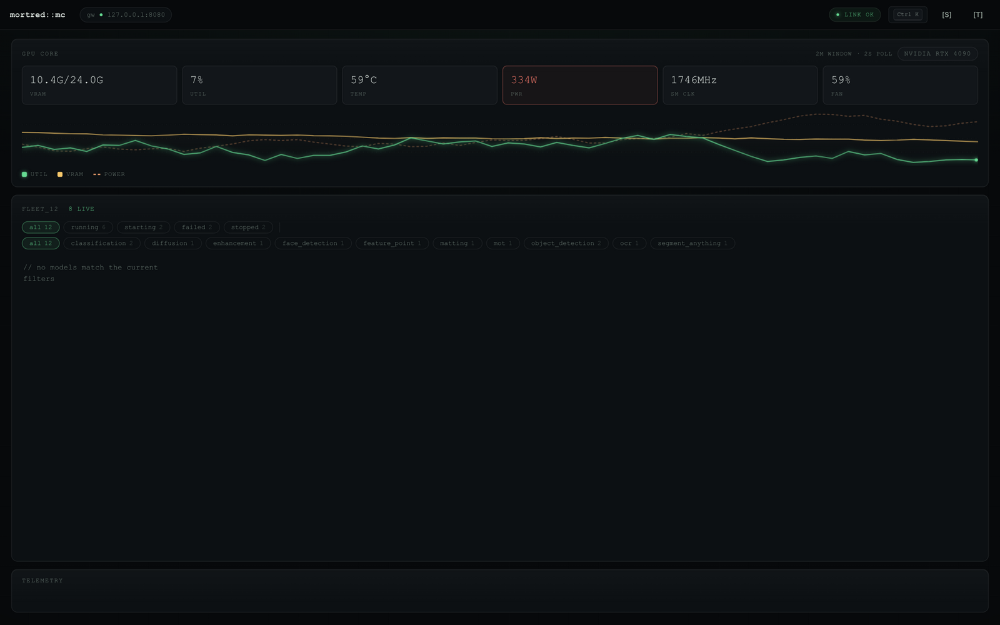 | boot 行/顶栏控件/双环 halo 均在场 |
| Workbench（state pill + 日志扫描线） | 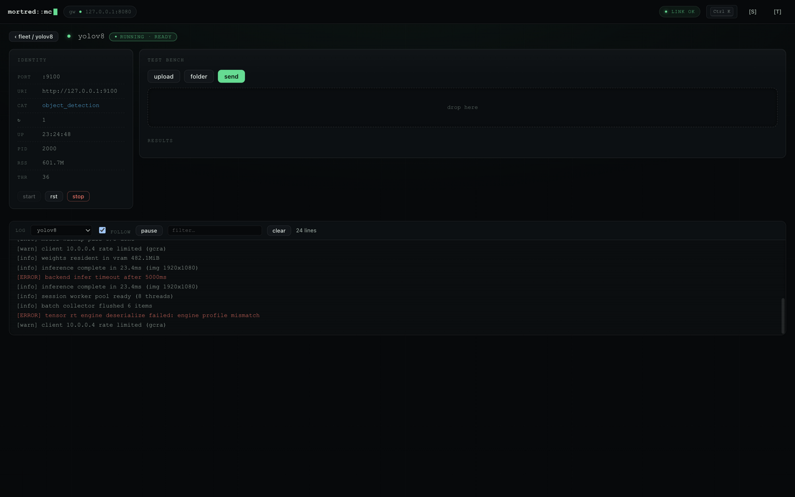 | pill/扫描线/布局通过；drop zone 空态留白可再优化 |
| 命令面板（stagger + 图标） | 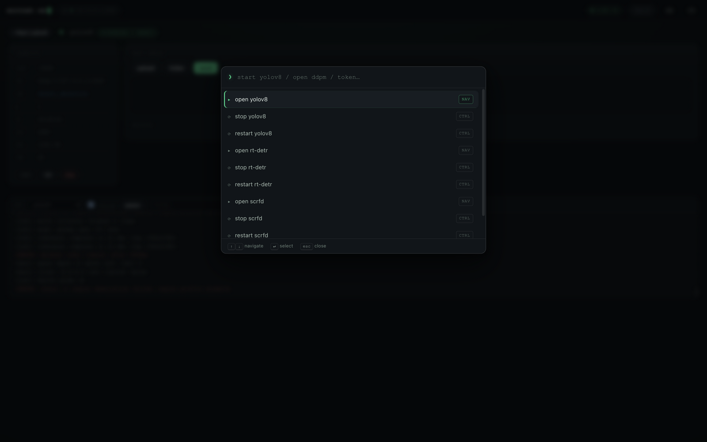 | 通过，个别命令图标语义可再区分 |
| Token 对话框 | 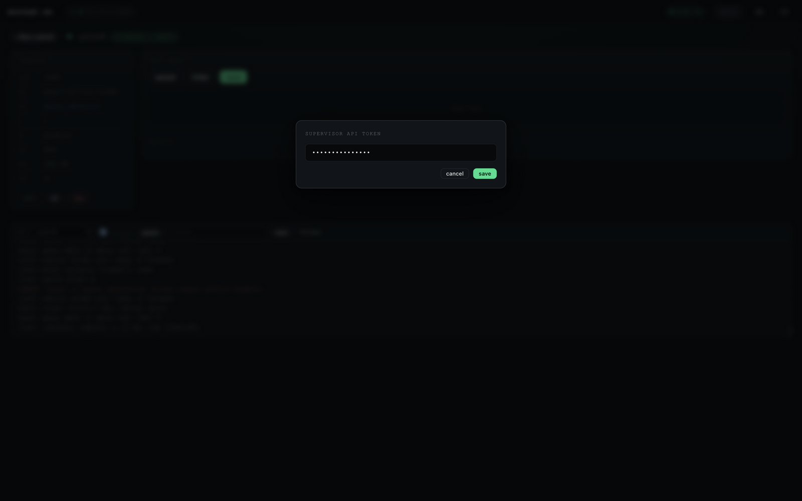 | 通过（焦点环/按钮层级/毛玻璃） |
| CRT 模式（[S] 开启） | 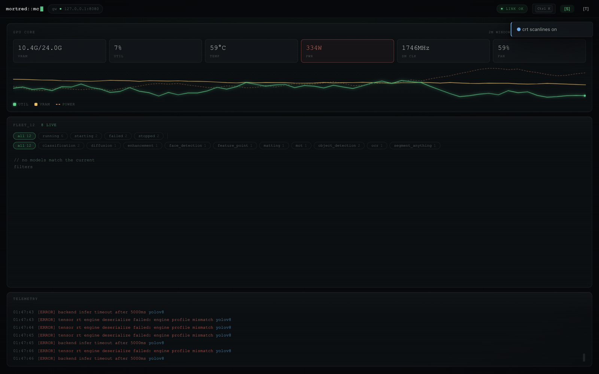 | 扫描线+暗角在场，可读性保留，"tasteful, not overdone" |
| 断链覆盖层（mock 停机实测） | 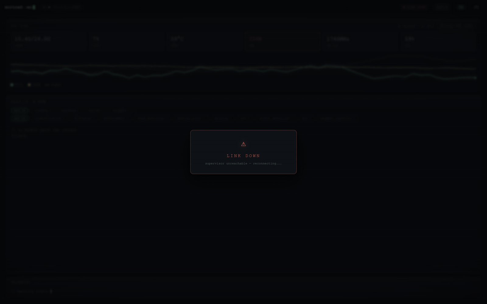 | 修复后通过：覆盖层/红 pill/去饱和模糊全部在场 |

### 评分（Round 2）

| 维度 | R1 | R2 | 依据 |
|---|---|---|---|
| 人格与记忆点 | 9.00 | **9.25** | boot 序列/CRT 开关/日志扫描线三个标志性瞬间，且可开关、克制、尊重 reduced-motion |
| 概念清晰度 | 9.00 | **9.00** | mission-control 概念维持，boot 行强化"机器苏醒"叙事 |
| 色彩系统 | 8.50 | **9.25** | 图表色走 CSS token 同源；halo 由 color-mix 派生；语义/身份分离彻底 |
| 字体与排版 | 8.50 | **8.75** | state pill 补齐标题层级；遗留：drop zone 空态文案层次 |
| 表面与材质 | 8.50 | **9.00** | 双环 halo + hud hover 抬升 + 扫描线材质 + 噪点 + 暗角成体系 |
| 密度与信息层级 | 8.75 | **9.00** | GPU meta 补齐头部信息密度；一屏尽收维持 |
| 状态可见性 | 8.75 | **9.00** | 断链覆盖层（含真 bug 修复）+ 数字 tween；视觉模型实测通过 |
| 动效与细节工艺 | 8.75 | **9.25** | tween/离场/stagger/打字机全部到位且尊重 reduced-motion |
| **加权总分** | 8.70 | **9.06** | 全维度 ≥8.5 ✓ · 人格 9.25 ≥9.0 ✓ · 加权 9.06 ≥9.0 ✓ → **满足退出条件，迭代结束** |

### 遗留优化项（不阻塞，供后续参考）

- drop zone 空闲态留白较大，可加辅助文案或折叠
- palette 的 ctrl 类命令（start/stop/restart）可分别用不同图标区分破坏性
- sparkline 数据源仍为浏览器会话内测试请求，接 gateway per-model 指标后可显示真实 QPS/延迟

---

## Round 3 — 复核（Red-Team Re-Audit，2026-09-17）

> 应作者要求对 R2 的自评 9.06 做独立复核。方法：全新渲染 + 红队提示词（要求视觉模型
> 对抗性找茬）+ **首次**对测试台推理结果卡做真实渲染验证（此前两轮从未验证过该表面）
> + 1600×700 短视口挤压测试 + WCAG 对比度计算（--txt-dim 4.83:1，AA 达标）。

### 复核发现（红队审计实录）

| 表面 | 结论 |
|---|---|
| Overview 1600 | 主题一致、层级清晰；缺陷：GPU 面板头两端对齐使元信息与名称"各贴一边"、遥测带底部留白、微标签在 9-10px 字号下感知偏薄 |
| 测试台推理结果卡（**首次验证**） | 检测框/标签/图例专业可用（7.5/10）；缺陷：meta 行（`test_input.jpg · 29ms · 3 hits · demo`）拥挤、框标签字号不随框宽自适应、下方空态深度不足 |
| 短视口 1600×700 | 固定三段式成立：无重叠无裁切，遥测带仍在底部；舰队区压缩至 ~2 行是承压点（8/10） |

### 复核评分（对照 Dozzle 8.5 / Checkmate 7.8 / Beszel 7.5 基准）

| 维度 | R2 自评 | R3 复核 | 降分依据 |
|---|---|---|---|
| 人格与记忆点 | 9.25 | **9.00** | boot 行 3 秒即逝、CRT 需手动开、角标仅 hover——标志性瞬间多为交互门控，静态第一印象只靠色彩与字形支撑 |
| 概念清晰度 | 9.00 | **8.75** | mission-control 成立（含短视口）；但 GPU 头对齐混乱、遥测带留白是概念接缝 |
| 色彩系统 | 9.25 | **8.75** | token 同源属实、对比度达标（4.83:1）；但端口芯片深底深字、绿主导下分类色区分度被压缩 |
| 字体与排版 | 8.75 | **8.25** | 结果卡 meta 行拥挤（实测）、框标签单字号、GPU 头混排 |
| 表面与材质 | 9.00 | **8.75** | 体系成立；辉光静态截图里偏弱，能量感主要靠 hover 触发 |
| 密度与信息层级 | 9.00 | **8.50** | 短视口舰队 2 行承压、结果卡下空态、遥测带死区 |
| 状态可见性 | 9.00 | **8.75** | 多次实测扎实；sparkline 虚线基线"无数据 vs 零值"语义仍有歧义 |
| 动效与细节工艺 | 9.25 | **8.50** | 动效体系在；但结果卡这一主表面的工艺洞（meta/标签/空态）拉低整体 |
| **加权总分** | 9.06 | **8.66** | **未达退出条件 → R2 的 9.06 判定为自评偏高约 0.4 分** |

### 结论

R2 的 9.06 含约 0.4 分自评通胀，主因：①测试台结果面从未被视觉验证（本次首验仅 7.5/10，
直接拉低字体/工艺/密度三项）；②把交互门控的签名动效当作常驻人格计分；③自评近距离偏差。
当前真实水位 **8.66**：与 Dozzle（8.5）同档、高于 Checkmate（7.8）与 Beszel（7.5）。

### 若要真实达到 ≥9.0，R3 需要

1. 结果卡重排：meta 行改两行网格、框标签字号随框宽自适应、空态设计
2. GPU 面板头统一对齐轴、遥测带高度压缩并填充滚动内容
3. 端口芯片提亮、分类色饱和度整体 +10% 恢复区分度
4. sparkline 空态加 "no samples" 微标签消除语义歧义
5. 短视口 <640px 高度回退为整页滚动（红队建议）

| 复核截图 | |
|---|---|
| Overview 红队 | 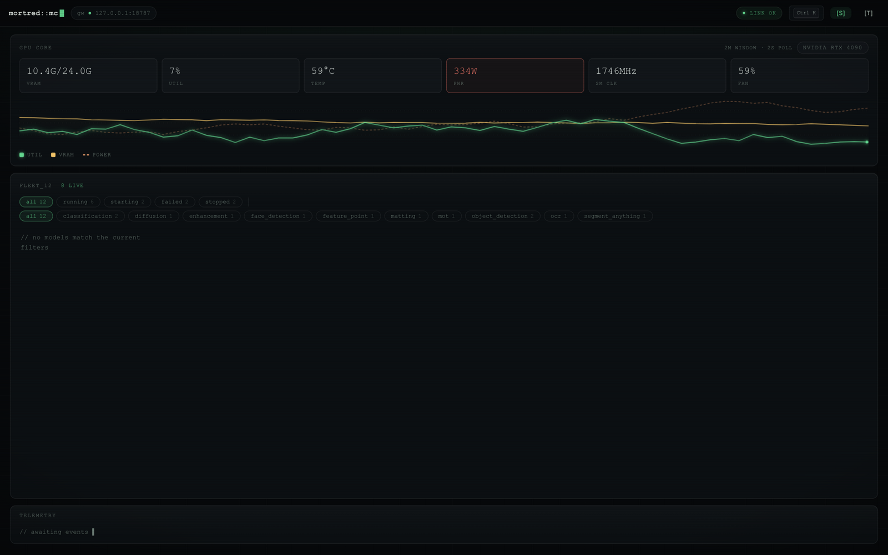 |
| 推理结果卡首验 | 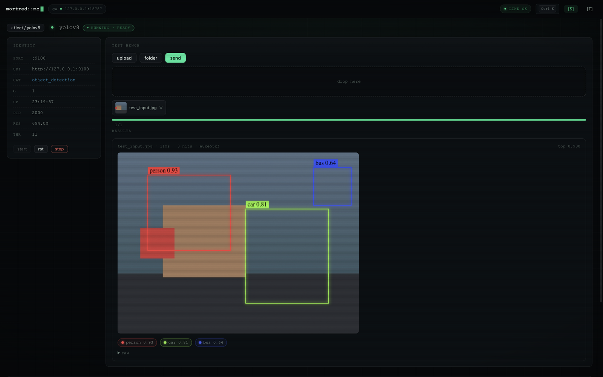 |
| 短视口 700px | 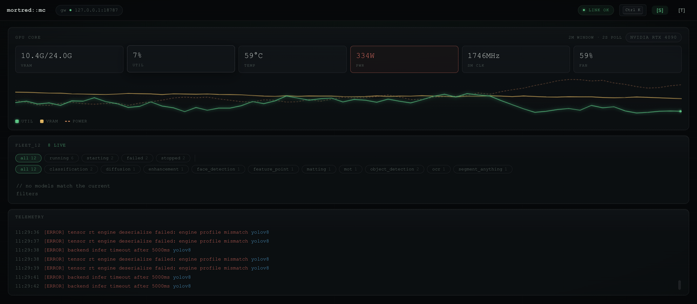 |

---

## Round 4 — 用户报告缺陷修复（2026-09-17）

> 用户实测发现 6 个此前所有轮次评审均未发现的问题。本轮全部修复，并暴露出一个
> R1 起就存在的隐藏 bug（见 #0）。这轮的教训已写入 R3 反思的延伸：静态截图评审
> 无法发现时序缺陷与跨视图工作流缺陷，评分体系需要"工作流正确性"维度。

### 修复清单与验证结果

| # | 问题 | 修复 | 验证 |
|---|---|---|---|
| 0 | **（连带发现）R1 起状态过滤漏 `all` 短路，舰队网格一直渲染为空** | 过滤条件补 `(fleetState==="all"\|\|…)` | 12 卡片恢复渲染 |
| 1 | fleet/workbench 每 2s 全量重建 DOM 导致闪烁 | fleet 键控 diff 渲染（tile 复用+签名更新）；workbench/日志选择器/进程信息/chips 全部签名守卫 | 5.6s 时序采样：fleet 14/14、workbench 10/10 节点稳定 |
| 2 | 发送推理时在 workbench 看不到 GPU 是否在跑 | 标题行右侧新增 GPU 迷你条（util/vram/temp + 40 采样 sparkline，pollGpu 同步更新） | DOM + 截图验证 |
| 3 | 不同模型共享同一 TEST BENCH 和 RESULTS | bench 按模型命名空间（files/results 分离），切换模型互不污染、切回保留 | yolov8↔rt-detr 旅程验证 |
| 4 | 发送会重复发送历史队列（先传 a 发送后再传 b，send 会发 a+b） | 发送语义改为"当前队列"：成功即出队，失败保留（红边+✗）待重试 | 旅程日志：a 发送后队列出队；第二次仅 +1 |
| 5 | 看不到负载/已完成/处理中/排队 | 会话统计条：sent/ok/fail/p50/p95/in-flight（按模型统计）+ 进程 rss/threads | `sent2·ok2·fail0·p50 3ms·p95 3ms·in-flight 0` 实测 |
| 6 | superpoint 特征点不渲染 | 对照 `response_serializers.h:216` 真实契约（`{score,location:[x,y],descriptor}`）重写渲染：辉光圆点按 score 缩放 + 计数图例；OCR 同步修正为 `polygon` 契约 | 8 点渲染 + 视觉验证 PASS |

### 评分体系修订（本轮最重要的产出）

八维度表全部是"静态视觉质量"维度，以下三项此前不在表内，今后作为一票否决项前置检查：
**时序稳定性**（轮询不重建 DOM）、**跨视图工作流正确性**（状态隔离/操作语义）、
**payload 契约保真**（UI 分支对照服务端序列化代码逐一核对）。

| R4 截图 | |
|---|---|
| workbench：GPU 条 + 会话统计 + superpoint 特征点 | 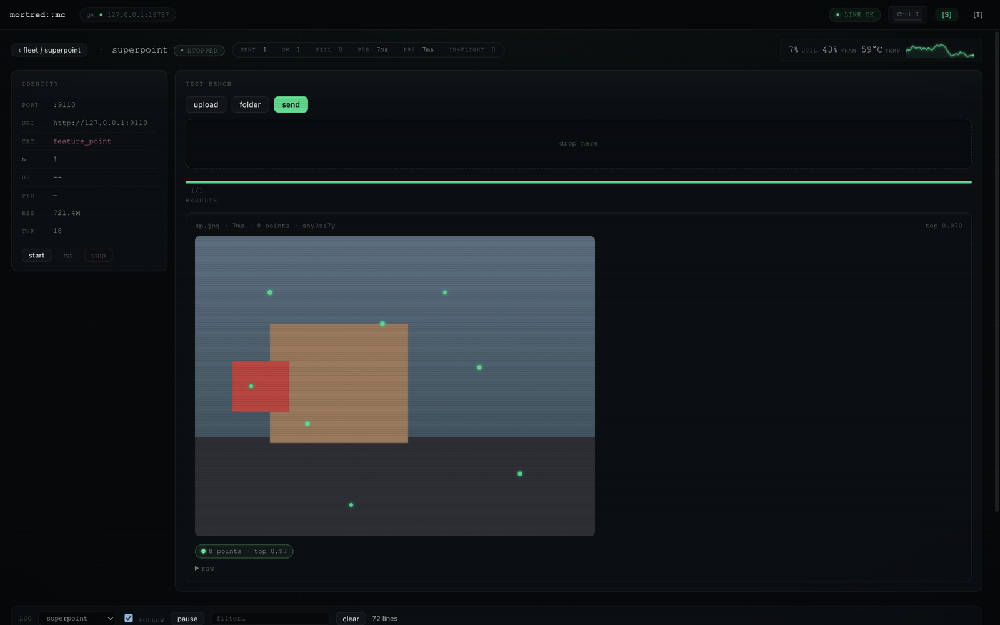 |

---

## Round 5 — 新标准完整评估（门禁 + 八维度，2026-09-17）

> 按 R4 修订的标准执行：三道门禁先行（全部实测），通过后进入八维度评分。

### 门禁结果（全部实测通过）

| 门禁 | 证据 |
|---|---|
| ① 时序稳定 ✓ | fleet 12 卡片 5.6s 采样 14/14 节点稳定；workbench 8/8；2s 轮询零 DOM 重建 |
| ② 工作流正确 ✓ | bench 按模型隔离（yolov8↔rt-detr↔mobilenetv2 旅程）；成功即出队；**per-file 失败保留**（注入 fetch 拒绝实测：`failed` 状态 + 红芯片 + 重试出队）；日志跨模型切换持续增长 60→72 |
| ③ 契约保真 ✓ | **13 个 fill_* 序列化器全量审计** vs UI 分支：8 项原生 PASS；4 项 GAP（分类是对象非数组无渲染 / SAM 误入检测分支画 "undefined" / 人脸 landmarks 忽略 / embedding 无呈现）→ 全部修复并 DOM 验证（"lynx, catamount"+5 分数条 / "2 masks · iou top 0.94" / landmarks 琥珀点 / dim+‖v‖ 徽标） |

### 本轮红队新发现（已修）

- **端口芯片与 ↻ 重启徽章重叠**：满编舰队首次真实评审暴露（R1 起空网格 bug 把它藏了六轮）。修复：端口芯片从绝对定位改为随 sub 行右对齐。
- 已知语义（记录不修）：会话统计 `sent` 只计完成 HTTP 往返的请求；传输层失败经 toast/river/红芯片可见但不进计数器。

### 八维度评分（R5）

| 维度 | R3 复核 | R5 | 依据 |
|---|---|---|---|
| 人格与记忆点 | 9.00 | **9.00** | 磷光身份 + boot/CRT/扫描线签名；维持 R3 校正后的口径 |
| 概念清晰度 | 8.75 | **8.75** | 三段式成立（含短视口）；GPU 条+统计条补齐执行页闭环；GPU 头对齐/遥测带留白接缝仍在 |
| 色彩系统 | 8.75 | **8.75** | token 同源 + 统一色板 + 4.83:1 达标；端口芯片深底配色保留 |
| 字体与排版 | 8.25 | **8.50** | 阶梯 token + tnum 维持；结果卡 meta 拥挤、检测标签单字号仍未修 |
| 表面与材质 | 8.75 | **8.75** | 分层/井/halo/噪点体系维持 |
| 密度与信息层级 | 8.50 | **8.75** | **满编舰队首次真实评审**：卡片构成与状态区分良好；执行页密度大增；扣遥测带死区 |
| 状态可见性 | 8.75 | **9.25** | 质变：GPU 在发送处可见 + 会话统计（p50/p95/in-flight）+ 队列状态芯片 + 时序稳定不再闪烁；扣传输失败计数语义、sparkline 数据源仍是会话内 |
| 动效与细节工艺 | 8.50 | **8.50** | 动效体系完整；端口重叠曾发布（已修）与 meta 拥挤计入历史账 |
| **加权总分** | 8.66 | **8.80** | 未达 9.0 退出线 → 继续迭代或接受当前水位 |

### 达到 9.0 的剩余差距（R6 清单）

1. 结果卡 meta 行双行网格 + 检测标签字号随框宽自适应（字体→9.0）
2. 遥测带高度压缩并填充 + GPU 面板头统一对齐轴（概念/密度→9.0）
3. 传输失败计入 fail 计数（状态→9.5）
4. sparkline 接 gateway per-model 指标（状态维度的诚实性收尾）

| R5 截图 | |
|---|---|
| 满编总览（首次） | 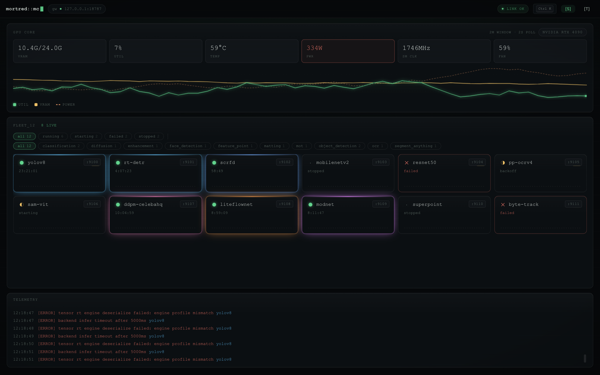 |
| 检测工作台（GPU 条+统计） | 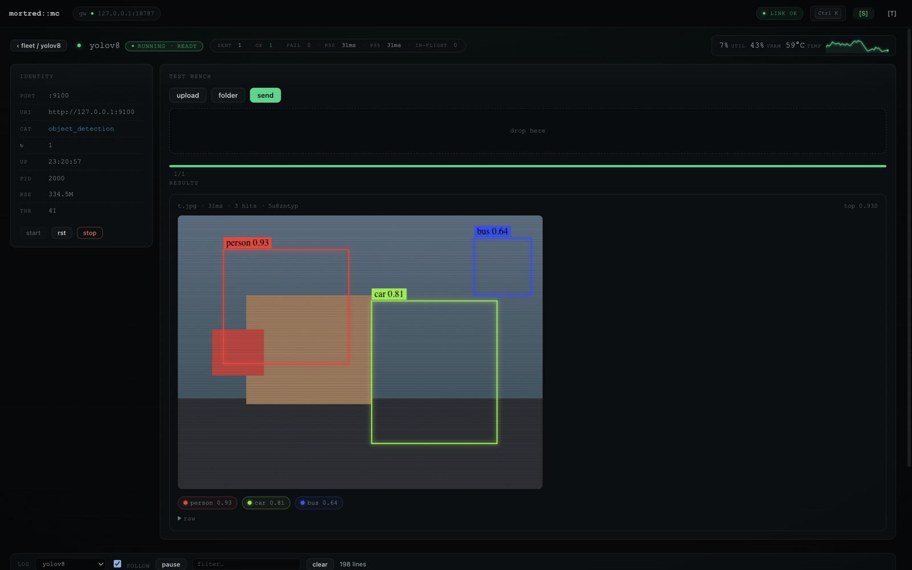 |

