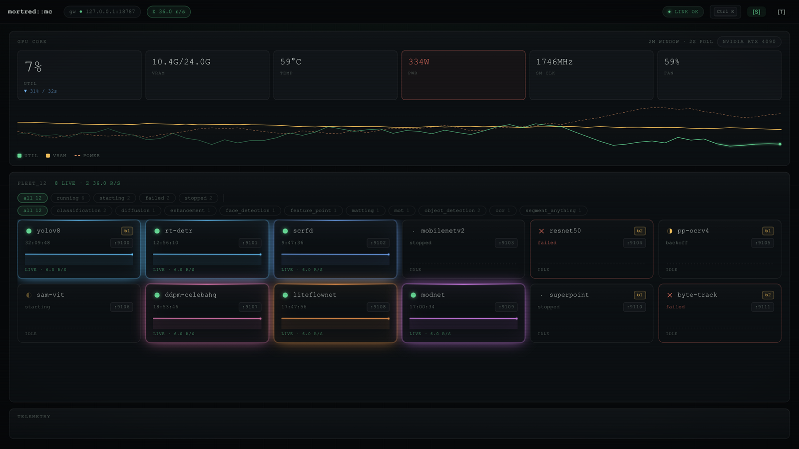
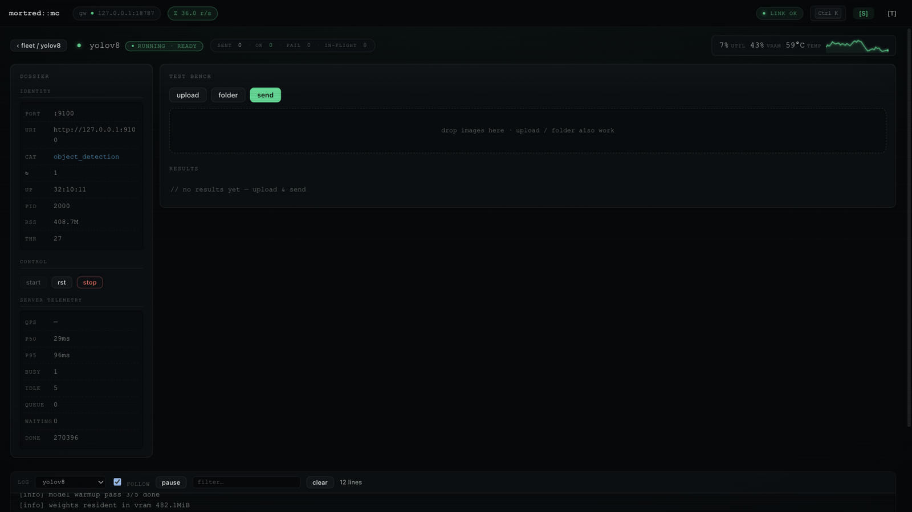
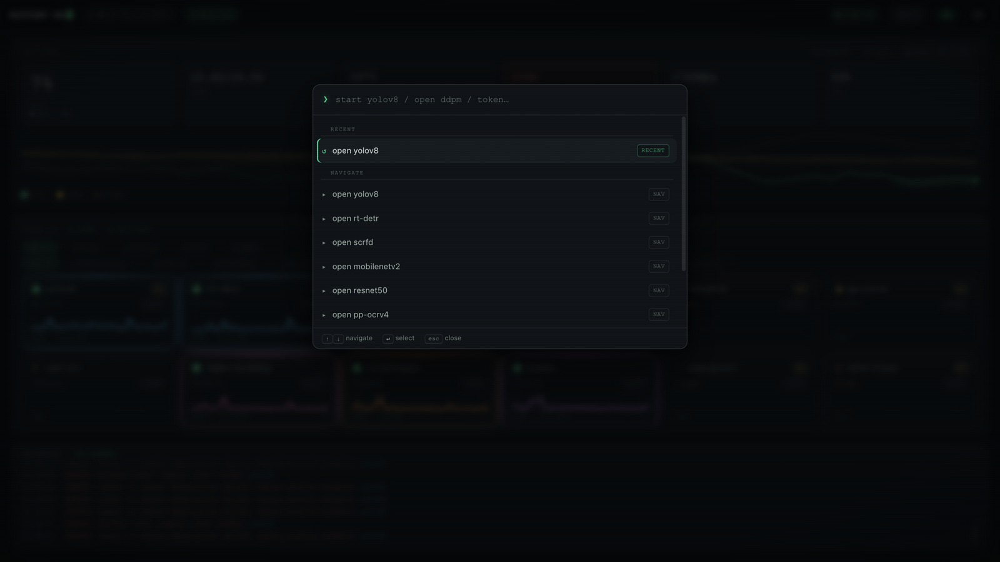
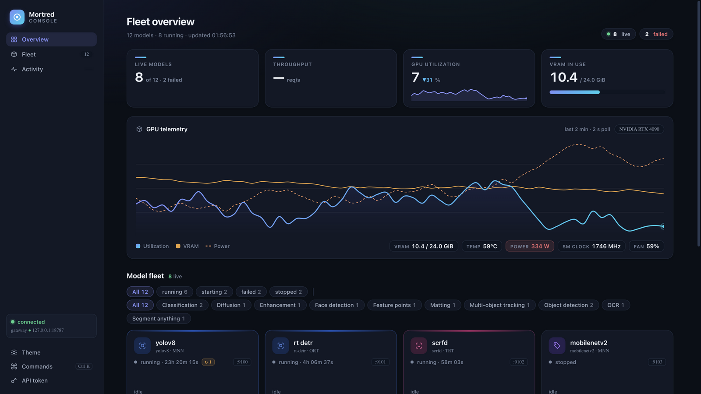
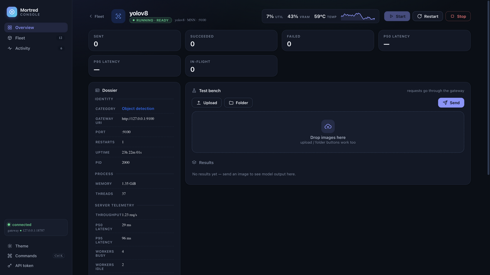

# R1 — Lumen 设计系统：三文件全量重写

**日期**：2026-09-18　**分支**：`fix/ui-phosphor-redesign`

## 决策：放弃磷光风，重写而非修补

旧版「Terminal Linear / 磷光 CRT」体系工程功底扎实（token 系统、a11y、
keyed reconciliation），但七维度评审只有 **6.00**：审美方向小众（近黑底 +
荧光绿 + 扫描线 + ASCII 字形）、字号 8.5–11px 全等宽、辉光特效堆叠、
无真实图标。修补无法解决「方向选错」，故全量重写为 **Lumen**：

- **产品级浅色主题为默认**（附高质量夜间模式，跟随系统偏好，可切换）
- **左侧边栏产品骨架**（品牌 + 导航 + 连接状态 + 快捷键提示 + 操作）
- **system sans 为主、mono 只管数据**；最小字号 11px；30px tabular 数值体系
- **一套内联 SVG 图标**（lucide 风格描边）+ 每个任务类目专属图标与色相
- **靛蓝→青渐变**作为唯一品牌签名（品牌标、主按钮、图表填充、进度条）
- 移除 CRT 扫描线、噪点、辉光呼吸、打字机 boot 等全部「特效」
- 布局改为正常滚动文档流 + hero 式页头（旧版 100vh 固定分割在笔记本上局促）

## 迭代前（磷光风基线）

| 视图 | 截图 |
|---|---|
| Overview |  |
| Workbench |  |
| 命令面板 |  |

## 迭代后（Lumen 首版渲染）

| 视图 | 截图 |
|---|---|
| Overview（夜间，系统深色偏好首启） |  |
| Workbench（夜间） |  |

> 注：R1 首次渲染截图落在系统深色偏好的夜间主题上；日间主题定稿见 R2。

## 改动清单

| 领域 | 改动 |
|---|---|
| 信息架构 | 侧边栏（品牌/导航/连接/主题/命令/令牌）+ 主内容列；Overview = KPI 条 → GPU 遥测卡 → 舰队网格 → 活动流；Workbench = hero 页头 + 档案/试验台双列 + 日志台 |
| KPI 条 | 4 张统计卡：Live models（of N · failed 计数）、Throughput（Σ req/s + sparkline）、GPU util（趋势箭头 + sparkline）、VRAM（用量 + 渐变进度条） |
| GPU 卡 | Catmull-Rom 平滑曲线 + 渐变描边/填充 + 十字线取样 tooltip + 线尾数值标签；图例带实时值；stat chips（VRAM/Temp/Power/SM clock/Fan） |
| 舰队卡片 | 类目图标（着色 squircle）+ 显示名（catalog `name`）+ id·框架徽章（catalog `type`，旧版未使用）+ 状态点/运行时长/重启徽章/端口 + sparkline |
| 图标 | 约 40 个内联 SVG（stroke 1.8），类目级映射（detection→scan、ocr→type、diffusion→aperture…） |
| 主题 | `data-theme` day/night 双 token 集；`prefers-color-scheme` 初始化；持久化；切换带 240ms 色彩过渡 |
| 修缺陷 | 旧版 `renderRiver` 引用未定义 `var(--ok)`/`var(--mid)`（颜色回落正文色）——已修；全英文文案统一（旧版混中文 toast） |
| 工程保持 | 三文件结构、零依赖、全部功能与快捷键保留 |

## 评分（R1，独立视觉模型盲评）

| 维度 | R0 | R1 | 依据 |
|---|---|---|---|
| ① 视觉第一印象 (25%) | 5.0 | 7.3 | 骨架立刻「像产品」，但空态/过滤行/图表锚点拖后腿 |
| ② 信息架构 (15%) | 7.0 | 7.0 | 结构清晰，均质密度压平层级 |
| ③ 排版 (15%) | 5.0 | 7.0 | 体系成立，微标签对比度不足 |
| ④ 色彩 (10%) | 6.5 | 7.1 | 双主题和谐，警示色语义混用 |
| ⑤ 组件质感 (15%) | 7.5 | 7.6 | 卡片/按钮/chips 精致，图表图例无样本区分 |
| ⑥ 用户契合 (10%) | 4.5 | 7.0 | 「接近商业产品」，但日间主题未验证 |
| ⑦ 一致性/状态 (10%) | 7.0 | 7.0 | 状态齐全，空态设计待加强 |
| **加权** | **6.00** | **7.05** | 未达退出条件 → R2 |

## 遗留问题（进入 R2）

吞吐 KPI 空态难看、过滤行重复拥挤、图表无坐标锚点、功率过热误用错误红、
VRAM 线橙色出戏、微标签对比度低、日间主题未截图验证。
