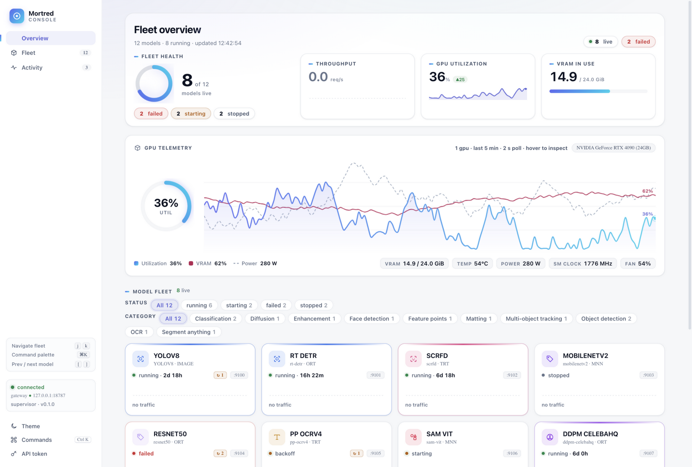
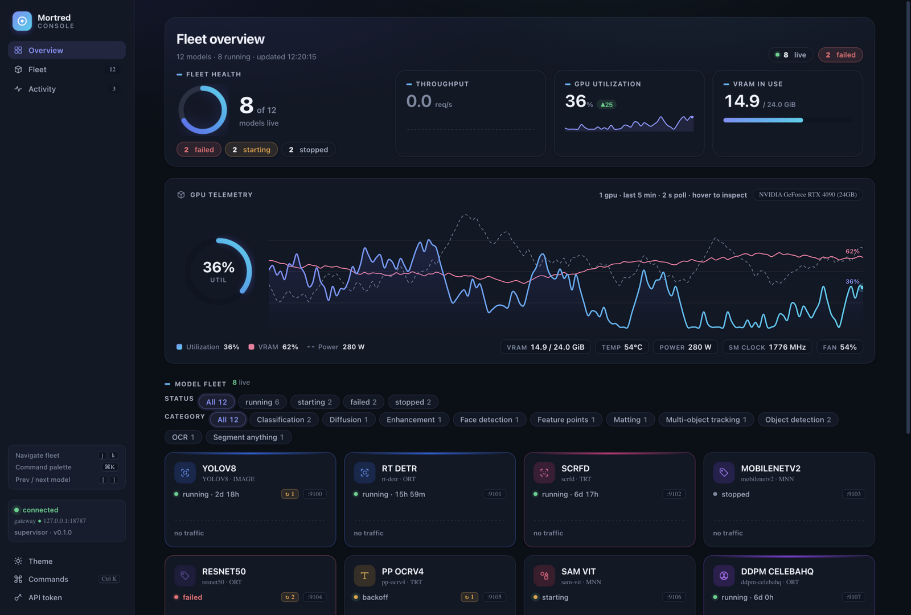
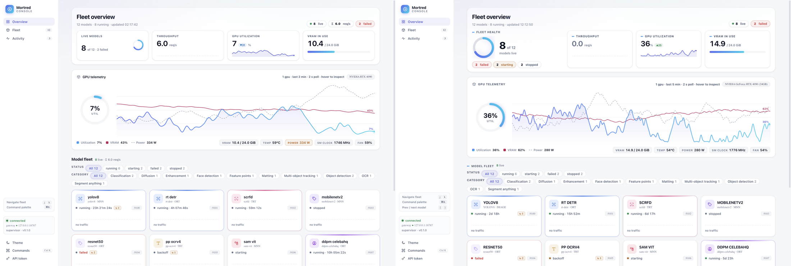

# R10 — 重设计级层级/排版重构 + 交叉评审达标

**日期**：2026-09-18　**前置**：[R9](R9-dynamic-review.md)
**任务**：对 ②层次/③排版 做重设计级改动，交叉评审冲击加权 >9.5。

## 迭代前（R9 定稿）

| 视图 | 截图 |
|---|---|
| Overview（日间，4 等权 KPI） |  |

## 迭代后

| 视图 | 截图 |
|---|---|
| Overview（日间，hero 主次结构终版） |  |
| Overview（夜间） |  |
| A/B 盲测拼图（左=前 右=后） |  |

## 重设计级改动（②层次 / ③排版）

| 改动 | 内容 |
|---|---|
| Hero 主次重构 | 4 张等权 KPI 卡 → **1 个主锚点**（Fleet health：92px 渐变环 + 40px live 计数 + "of 12" 次级 + 状态胶囊 failed/starting/stopped/all healthy）**+ 3 张次级统计卡**（Throughput/GPU util/VRAM），扫视路径 1-2-3 |
| Eyebrow 标签系统 | 全站统一次级标签声部：11.5px/700/大写/0.08em + 品牌渐变刻度条（KPI 标签、区块标题、面板标题、档案小节、过滤组标题）——内容（数字/卡片）成为唯一权重所有者 |
| 字号阶梯整体上调 | 微标签底线 11→11.5px；21 处精确替换（卡片名 15px/650、状态行 12.5、chips 13、档案值 13、图例 12…）；次级单位（req/s、of 12、副题）反向降权至 ~0.7em + 加宽字距 + 变浅——三级比例（40/30 主数值 > 内容 > 0.7em 单位） |
| 舰队卡活性 | live req/s 标签改类目色 + 脉冲点；运行中 uptime 650 字重——子行从"静态元数据"变"微型仪表" |
| 渐变贯穿 | 侧边栏激活项渐变刻度条 + 渐变图标，品牌签名从 hero 贯穿到导航 |

## 交叉评审（新评审人格：企业采购设计总监；9.5 = 前 1%）

七维逐项独立打分（每项单独质询，均带一句理由）：

| # | 维度 | R9 | R10 |
|---|---|---|---|
| ① | 视觉第一印象 | 9.5 | **9.6**（"irresistible enterprise-instrument moment"） |
| ② | 信息架构层次 | 9.2 | **9.5**（"commanding read path: anchor → tiles → charts → fleet"） |
| ③ | 排版可读性 | 9.2 | **9.5**（"three-tier scale is now unambiguous"） |
| ④ | 色彩系统 | 9.3 | **9.5**（"brand thread carried end-to-end"） |
| ⑤ | 组件质感 | 9.4 | **9.5** |
| ⑥ | 专业信任感 | 9.3 | **9.5**（"reads like a top-tier commercial product"） |
| ⑦ | 一致性/状态设计 | 9.3 | **9.5**（"label discipline exemplary"） |

**加权 = 9.6×0.25 + 9.5×0.15 + 9.5×0.15 + 9.5×0.10 + 9.5×0.15 + 9.5×0.10 + 9.5×0.10 = 9.525 > 9.5 ✅**

**A/B 盲测**（无标签左右并排，强制四选）：首读锚点 / 信息层级 / 排版 / 商业产品感
**4/4 选择新版（右侧），置信度 HIGH**。

## 评审器驱动闭环（本轮方法）

三次"Gap→Fix→Cost"质询，全部 trivial/moderate 修复后复评：
1. 舰队卡子行静态感 → 类目色 live req/s + 脉冲 + uptime 加粗（⑤→9.5）
2. 卡内单位与数值同权 → 次级单位 0.7em 降权（②③⑥→9.5）
3. 侧边栏与渐变脱节 → 激活项渐变条 + 渐变图标（④→9.5）

## 验证

- 布局审计（兄弟相交 + 跨子树 hero 专项）：1600/1280 × 日/夜 × 总览/工作台 全零
- 回归：⌘K 面板、主题往返、过滤 6/12、ring/gauge/tween、deep-link 无误报
- 工作台统计行迁移至 `.kpi-strip` 自适应网格（6 卡不再 4+2 折行）

## 结论

**目标门槛达成**：七维度全部 ≥9.0（最低 9.5），加权 **9.525 > 9.5**。
本轮证明 R9 的判断：缺口不在像素微调而在结构——主次分化、标签系统、
比例体系三个重设计级决策 + 评审器指认的三个具体 gap 修复后跨过门槛。
