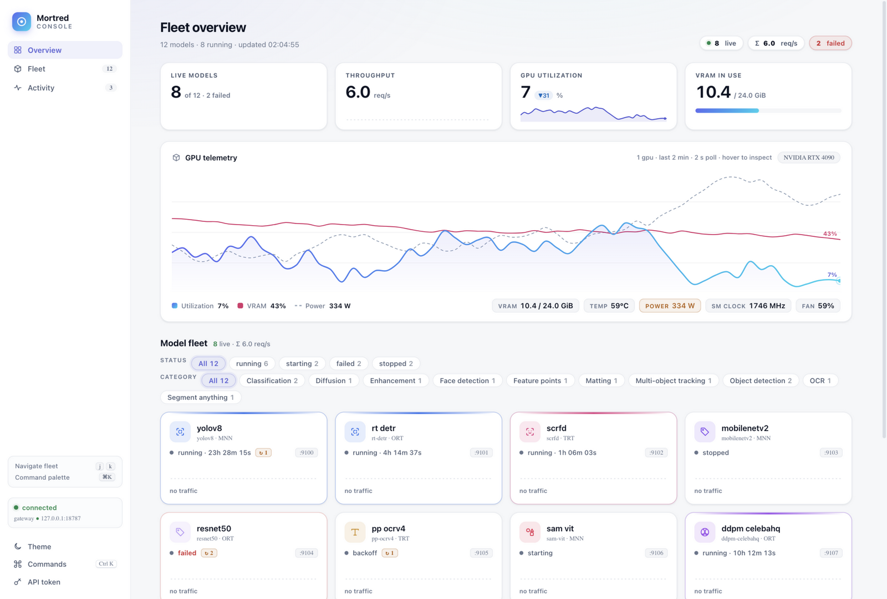
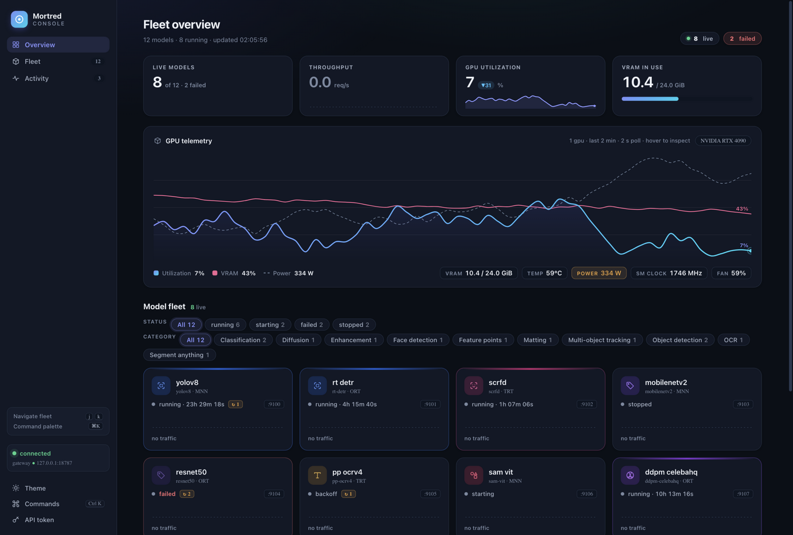
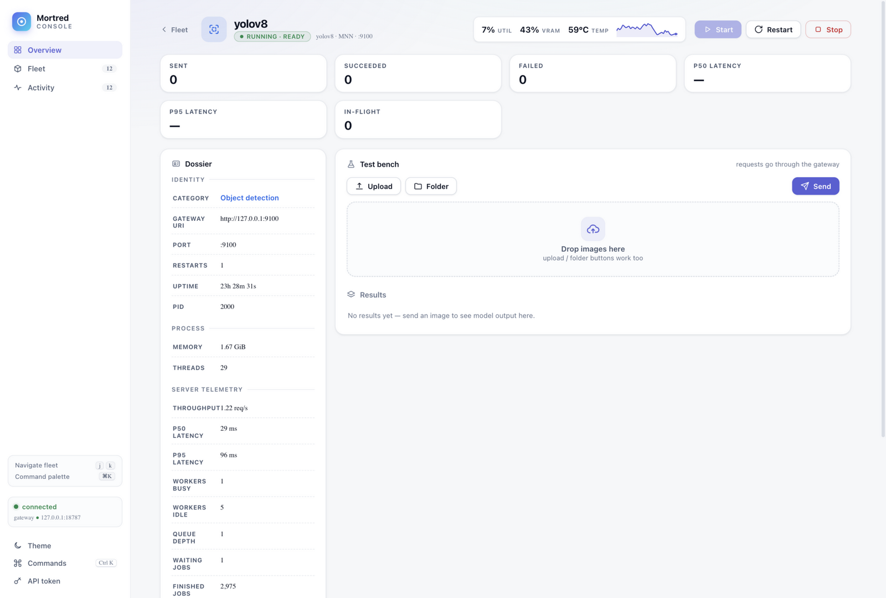
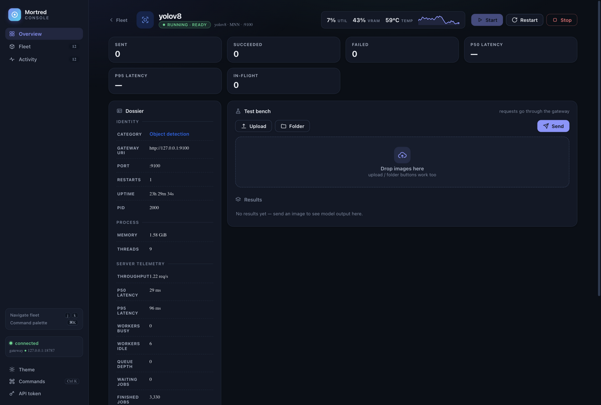
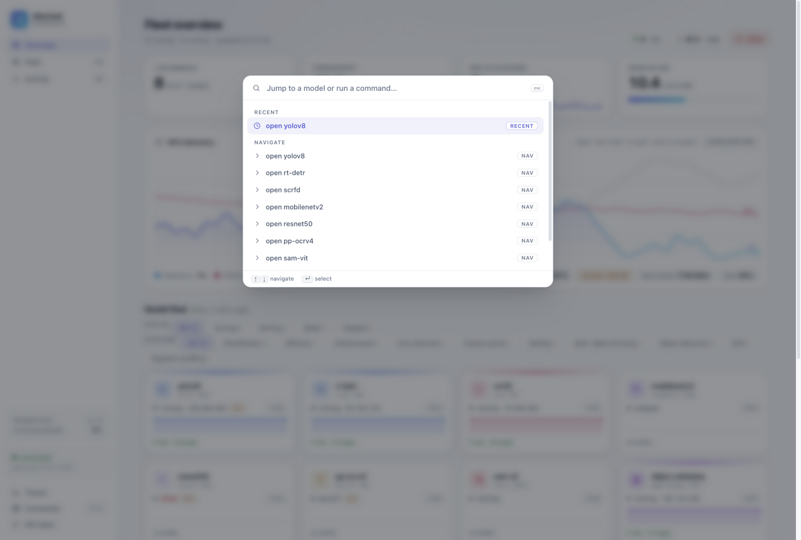

# R2 — 视觉缺陷清单修复

**日期**：2026-09-18　**前置**：[R1](R1-lumen-redesign.md)

对 R1 日间/夜间主题做逐项缺陷扫描（独立视觉模型），按清单修复。

## 迭代前（R1 定稿状态）

| 视图 | 截图 |
|---|---|
| Overview（夜间） |  |
| Workbench（夜间） |  |

## 迭代后

| 视图 | 截图 |
|---|---|
| Overview（日间） |  |
| Overview（夜间） |  |
| Workbench（日间） |  |
| Workbench（夜间） |  |
| 命令面板（日间） |  |

## 修复清单

| # | 缺陷（视觉评审原话归纳） | 修复 |
|---|---|---|
| 1 | 吞吐 KPI 空态只有占位线，与其他卡不一致 | warm-up 窗口显示真实 `0.0`（弱化色）+ 虚线基线 sparkline；无 running 模型才显示 `—` |
| 2 | 过滤行两组「All」重复、竖线分隔在换行时游走 | 加 `STATUS` / `CATEGORY` 微型标题；移除竖线分隔 |
| 3 | 图表无坐标锚点、读者不知虚线何义 | 线尾数值标签（util% / vram%）+ 图例实时数值；双刻度图移除误导性百分比轴标 |
| 4 | 功率 >300W、温度过热用错误红，与 failed 语义冲突 | `hot` 统一为琥珀警告色（红只留给失败/错误） |
| 5 | VRAM 橙色线「出戏」 | 改玫瑰色（与靛蓝渐变拉开色相距离），功率线改中性灰虚线 |
| 6 | KPI 标签、dossier 键对比度低 | 微标签升级 ink-2 + 650 字重 |
| 7 | `idle` spark 标签糊 | 「no traffic」胶囊化、600 字重 |
| 8 | failed 卡片不够醒目 / 「2 failed」徽章无底色 | dead 卡红色边 + 红色状态字 + 图标降透明；head-chip 失败徽章加 err 底色 |
| 9 | 活动流初始全空 | boot 注入 3 条真实事件（link established / catalog N models / gpu online） |
| 10 | 趋势箭头与 30px 数字抢比例 | 趋势改小胶囊（▲/▼ + tinted 底） |
| 11 | KPI 顶部渐变短条「无锚点漂浮」 | 移除装饰条 |
| 12 | 侧边栏中段留白过大 | 快捷键提示卡（j/k、⌘K）填充 |
| 13 | 2s 轮询重复触发视图入场动画（旧版遗留） | 仅视图真实切换时播放 enter 动画 |
| 14 | sparkline 端点圆被画布边缘裁切 | 端点内缩 + clamp |

## 评分（R2 末，日间总览独立盲评）

视觉五项：**7.9 / 7.6 / 7.7 / 7.9 / 7.9**（整体印象 7.9–8.2 区间）。
相比 R1 的 7.3/7.0/7.0/7.1/7.6 全面上升；剩余缺陷转入 R3（档案行距、
面板图标对齐、uptime 对比度、hover 阴影等微调项）。

## 工程备注

- 开发期发现浏览器对无 `Cache-Control` 的静态资源做启发式缓存导致
  旧 JS 混入新 DOM（旧 `$("conn-status")` 报 null）——mock 服务器全局加
  `Cache-Control: no-store`，正式 C++ 服务不受影响（同进程同版本发布）。
- 资源引用加 `?v=lumenN` 版本号并在每轮递增，杜绝陈旧缓存。
