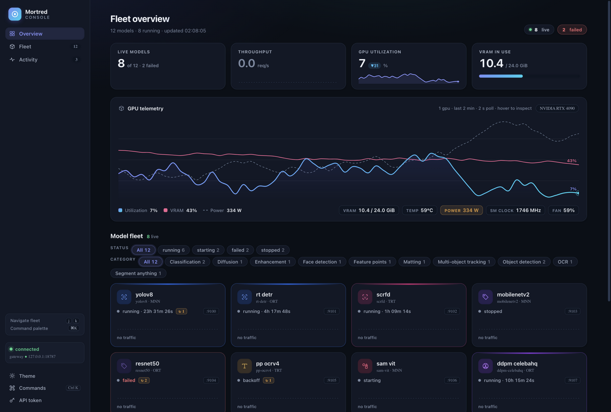
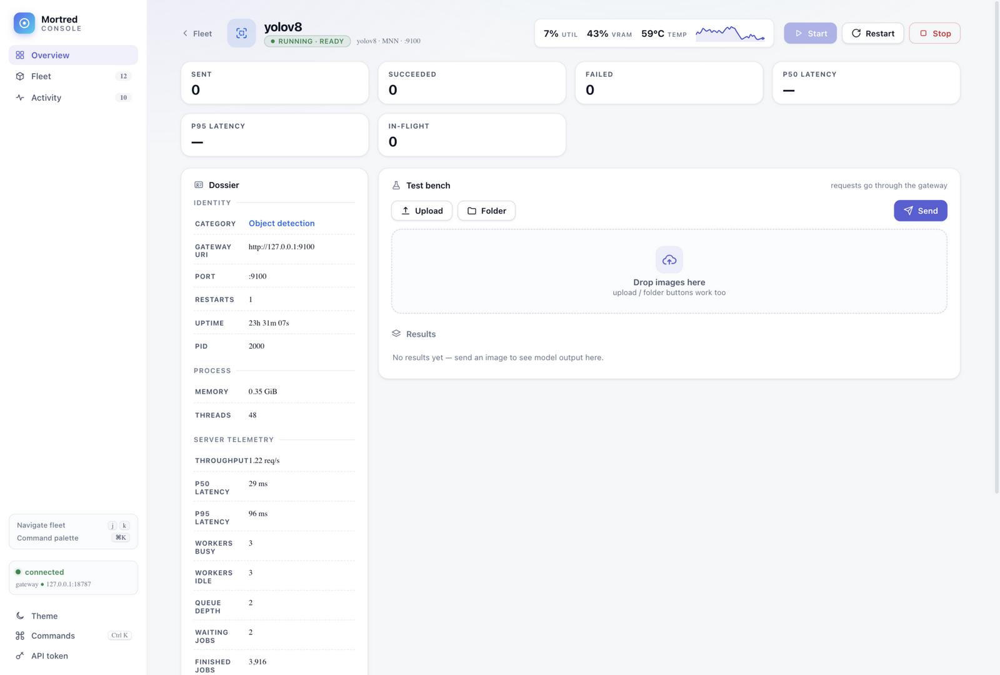

# R3 — 微调打磨

**日期**：2026-09-18　**前置**：[R2](R2-defect-fixes.md)

## 迭代前（R2 定稿）

| 视图 | 截图 |
|---|---|
| Overview（日间） |  |

## 迭代后

| 视图 | 截图 |
|---|---|
| Overview（日间） |  |
| Overview（夜间） |  |
| Workbench（日间） |  |

## 修复清单

| # | 缺陷 | 修复 |
|---|---|---|
| 1 | 侧边栏品牌标与导航项垂直不对齐 | brand 块定高 34px，与 mark 同高 |
| 2 | 页面标题纯黑平淡 | 24px 标题施加 ink→靛蓝渐变（`background-clip:text`），签名感延伸 |
| 3 | GPU tooltip 顶部对齐遮挡曲线 | 改垂直居中 |
| 4 | 舰队卡 hover 缺少颜色反馈环 | hover 加类目色 1px 光环（`box-shadow` ring） |
| 5 | 档案键值行距挤 | `.id-row` padding 6→8px |
| 6 | 面板行图标基线错位 | `.pl-ic` 对齐修正 |
| 7 | uptime 文字过淡 | `.mc-state` 升 ink-2 |
| 8 | 日志行高局促 | 1.75→1.8 |
| 9 | gpu-meta/fleet-cap 次级标签弱 | 650 字重 + ink-2（R4 前置微调并入本轮） |

## 评分

日间总览独立盲评：**VisualImpact 9.0 / Hierarchy 8.7 / Typography 8.6 /
Color 8.9 / ComponentCraft ~9.0**（整体 8.8 区间，首次冲上 9.0 单项）。
剩余短板：层次 8.7（次级标签仍弱）、排版 8.6（11px 标签与 12.5px 正文
比例偏紧）→ 下一轮把「活力感」与「信任感」一起补齐。
