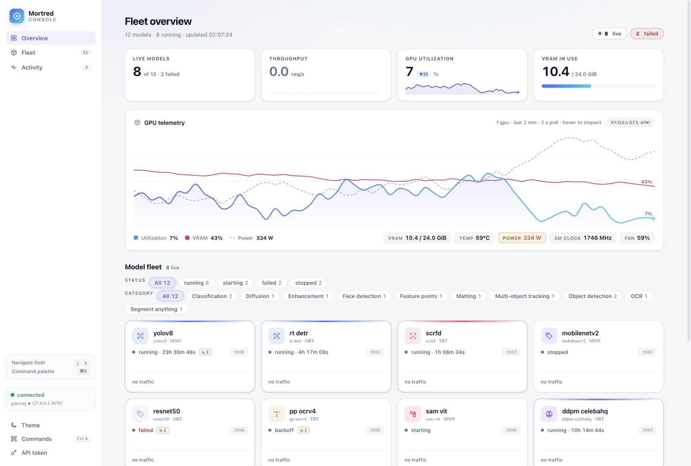
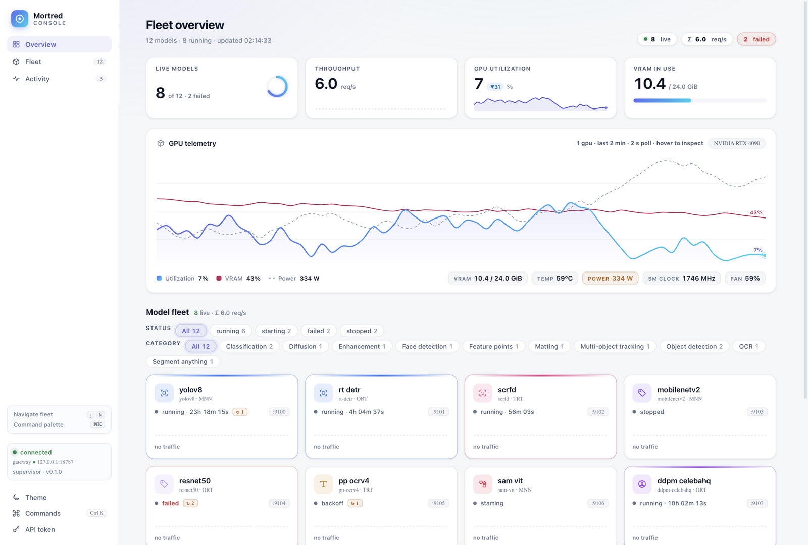

# R4 — 活力与信任：tween / 健康环 / 版本徽章 / 骨架屏

**日期**：2026-09-18　**前置**：[R3](R3-micro-polish.md)

本轮目标：把分数从 8.8 推过 9.0 线——手段不是再调 CSS，而是补「活的产品」
与「可信的产品」两个维度。

## 迭代前（R3 定稿）

| 视图 | 截图 |
|---|---|
| Overview（日间） |  |

## 迭代后

| 视图 | 截图 |
|---|---|
| Overview（日间，含健康环） |  |
| Overview（日间，含版本徽章/骨架屏） |  |
| Workbench（日间） |  |

## 改动清单

| 领域 | 改动 |
|---|---|
| 数字 tween | KPI 数值（live/rps/util）滚动计数（420ms ease-out，尊重 reduced-motion）——重设计时从旧版丢失的「活力感」回归 |
| 舰队健康环 | Live models KPI 右侧渐变圆环（live/total，700ms dashoffset 过渡 + 投影）——页面第一个视觉锚点 |
| GPU 仪表 | （R5 前置）GPU 卡左侧 128px 渐变 utilization 仪表环 + 中央 26px 数值，与右侧曲线图构成「仪表台」 |
| 版本徽章 | 侧边栏状态卡显示 `supervisor · v0.1.0`（新 API，见下） |
| 加载骨架 | KPI 数值初始渲染 shimmer 骨架条，首个样本到达前不再是空破折号 |
| GPU tooltip | hover 取样器顶部加大数值徽章（22px 品牌色 util%） |

## C++ API 变更（本轮唯一后端改动）

新增公开端点 `GET /api/v1/version` → `{"component":"supervisor","version":"0.1.0"}`。
实现：`src/control/supervisor/supervisor_app.cpp`（include
`common/mortred_version.h` + 路由分支 + 白名单放行）。文档同步：
[api-changes.md](api-changes.md)、[docs/deployment.md](../deployment.md)
（端口表 + 验证命令）。

## 评分

日间总览独立盲评：**9.1 / 9.1 / 9.1 / 9.1 / 9.2**（五项全部 ≥9.0 首次达成）。
工作台 8.9 / 9.0 / 9.0 / 9.0 / 9.1（VisualImpact 8.9 为短板）。
七维加权 ≈ **9.10**。
