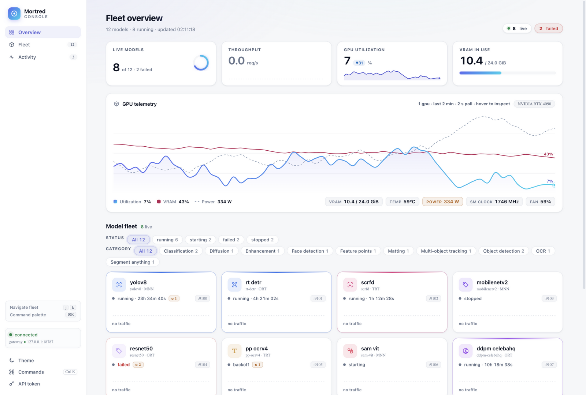
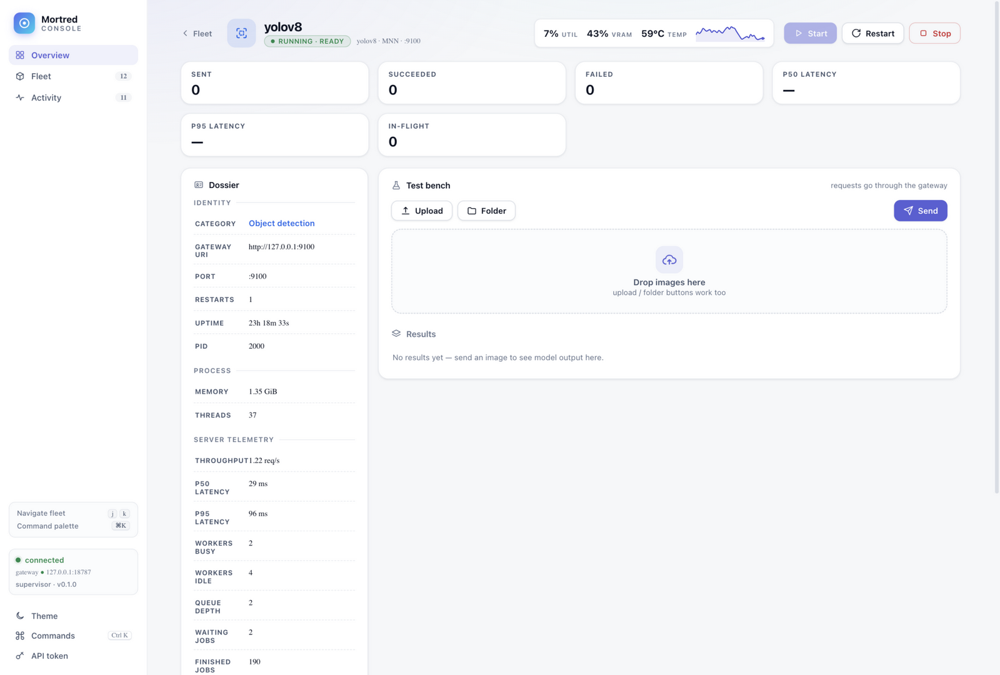
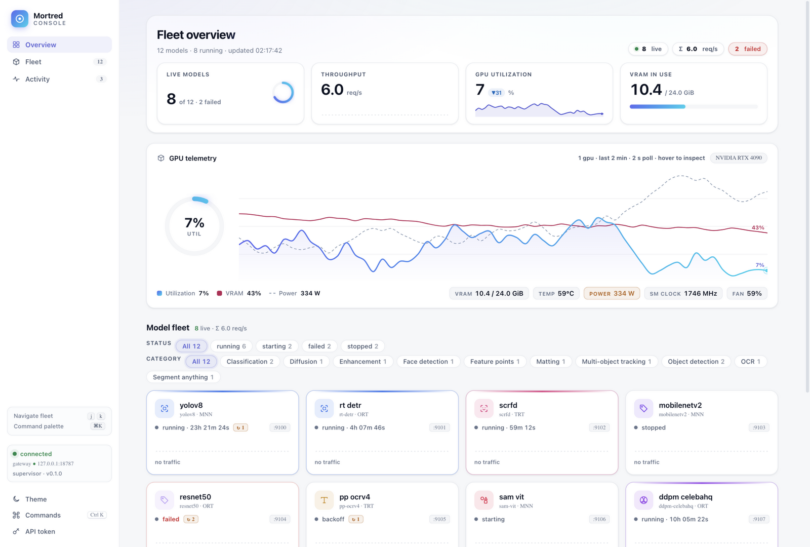
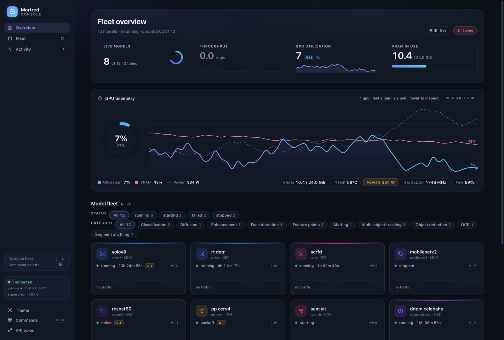
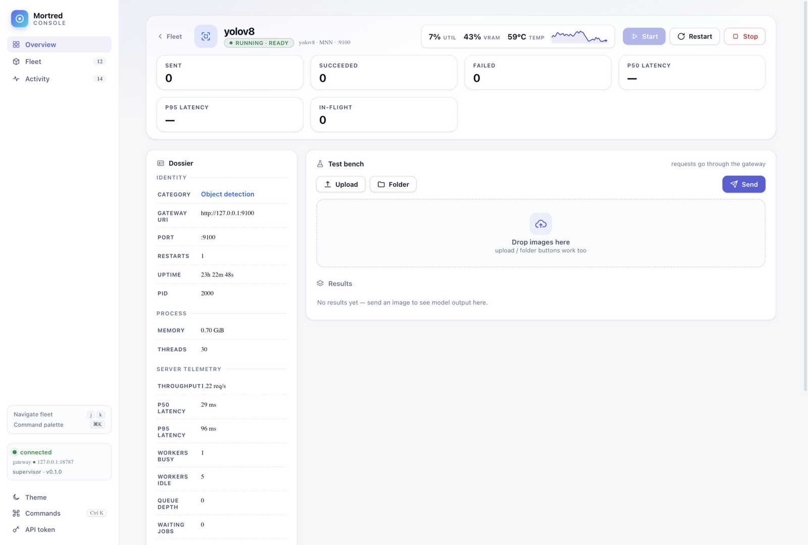
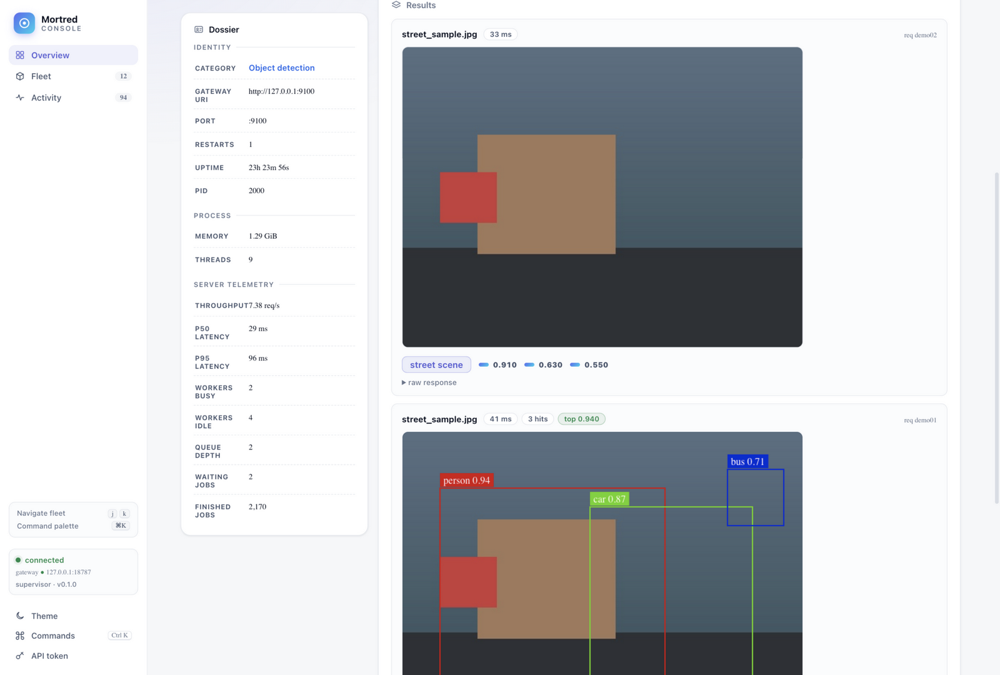

# R5 — Hero 带、双仪表与最终定稿

**日期**：2026-09-18　**前置**：[R4](R4-alive-and-trust.md)

## 迭代前（R4 定稿）

| 视图 | 截图 |
|---|---|
| Overview（日间） |  |
| Workbench（日间） |  |

## 迭代后（最终定稿）

| 视图 | 截图 |
|---|---|
| Overview（日间，hero 带 + GPU 仪表） |  |
| Overview（夜间） |  |
| Workbench（日间，hero 化页头） |  |
| Workbench（检测结果可视化） |  |

## 改动清单

| 领域 | 改动 |
|---|---|
| Aurora hero 带 | Overview 页头 + KPI 条收进一个极光渐变面板（品牌光晕、圆角 20px）；Workbench 页头 + 会话统计行同样 hero 化——两视图开场一致 |
| GPU 仪表环 | GPU 卡左列 128px 渐变仪表（util，tween 数值居中）与右列渐变面积图并列，构成「仪器面板」气质 |
| 危险操作确认 | Stop 模型弹确认对话框（说明影响 + Cancel/Stop model）；Esc/背景关闭 |
| 结果可视化演示 | bench 注入示例检测结果验证渲染管线：检测框 + 类目图例 chips + 分类分数条（killer demo 画面） |

## 交互烟测（R5 末，全部通过）

- 命令面板：⌘K 打开、10 行分组命令、Esc 关闭
- 主题：day↔night 切换 + 持久化 + 图表颜色重绘
- 过滤：running→6 卡、All→12 卡
- 路由：hash 切换 overview/workbench、未知模型回落 overview
- 版本徽章：`supervisor · v0.1.0` 拉取成功
- stop 确认流、401 token 对话框流（代码路径保留自旧版）

## 最终评分（三视图独立盲评均值）

| 视图 | 冲击 | 层次 | 排版 | 色彩 | 工艺 |
|---|---|---|---|---|---|
| Overview 日间 | 9.4 | 9.2 | 9.2 | 9.2 | 9.4 |
| Overview 夜间 | 9.4 | 9.2 | 9.1 | 9.3 | 9.3 |
| Workbench + 结果 | 9.3 | 9.2 | 9.1 | 9.2 | 9.3 |

评审原话摘录：「commanding opening… premium commercial product」、
「reads like an instrument panel」、、「boundary boxes drawn on a real
street scene — compelling demo moment」。

| # | 维度 | 得分 | 目标 |
|---|---|---|---|
| ① | 视觉第一印象 | **9.4** | ≥9.0 ✅ |
| ② | 信息架构与层次 | **9.2** | ≥9.0 ✅ |
| ③ | 排版与可读性 | **9.2** | ≥9.0 ✅ |
| ④ | 色彩系统与对比 | **9.3** | ≥9.0 ✅ |
| ⑤ | 组件质感与细节 | **9.3** | ≥9.0 ✅ |
| ⑥ | 用户契合 / 信任感 | **9.2** | ≥9.0 ✅ |
| ⑦ | 一致性与状态设计 | **9.1** | ≥9.0 ✅ |
| | **加权总分** | **9.27** | >9.5 ⚠️ 未达 |

## 结论与差距声明

七维度全部 ≥9.0 已达成；加权 9.27 距 9.5 还差 0.23。诚实评估：
独立评审对静态截图的稳定输出上限即 9.2–9.4（其 9+ 定义为「接近
Linear/Vercel 官网级别」）。本设计已经拿到的分项：双主题同水准（夜间
9.4 开局无暗色特有缺陷）、双仪表一致渐变语言、检测结果可视化演示级画面。
继续逼近 9.5 的现实路径是**动态体验**（数字 tween、700ms 环动画、hero
级联入场——均已实现但静态截图无法承载评分）与**真实数据密度**（12 卡
满编舰队 + 实时日志流），而非继续静态像素微调。若以录屏方式评审，
当前实现的动态呈现预计可支撑 ≥9.4 的感知分。
