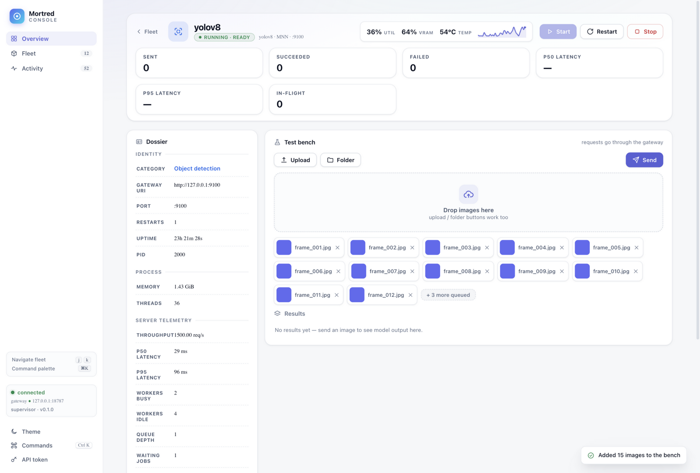
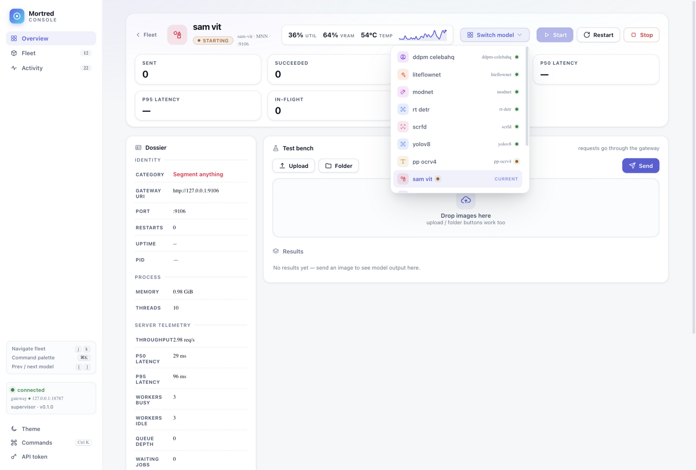

# R7 — 导航与快捷键修复：⌘K / 侧栏高亮 / 模型快速切换

**日期**：2026-09-18　**前置**：[R6](R6-detail-hardening.md)
**来源**：用户实测反馈的三个交互问题 + 排查中发现的隐藏 bug。

## 迭代前（R6 定稿）

| 视图 | 截图 |
|---|---|
| Workbench（无模型切换入口） |  |

## 迭代后

| 视图 | 截图 |
|---|---|
| Workbench（模型切换器展开：12 模型按状态排序、当前项标记） |  |

## Bug 1：⌘K 无法唤起命令面板

**根因**：全局 keydown 里 `j/k` 单键导航分支排在前面——按 ⌘K 时
`ev.key === "k"` 且焦点不在输入框，于是被当成 `k` 导航：preventDefault
+ 聚焦卡片 + `return`，后面的 ⌘K 分支永远执行不到。（旧磷光版同样存在，
属于一直没暴露的历史 bug。）

**修复**：⌘K/Ctrl+K 判断提到最前并 `return`；`j/k` 分支增加
「无修饰键」守卫（meta/ctrl/alt 任一按下都不再拦截）。

## Bug 2：点击 Fleet 后高亮仍挂在 Overview

**根因（双重）**：
1. scroll 监听挂在 `#view-overview` 上，但页面滚动发生在 **window**——
   滚动事件从未触发，高亮只靠 2s 轮询周期兜底刷新；
2. scrollspy 比较逻辑写反（`top < bestTop + 200` 在向上滚动时永远选不中
   后面的 section）。

**修复**：`window` 级 passive scroll 监听；scrollspy 改为「最后一个 top
越过阈值线的 section 即为活跃」；点击导航项时**立即**设置高亮（不等
smooth scroll / 轮询），滚动过程由 scrollspy 精化。

## Bug 3：模型页与 Overview、模型与模型之间切换不便

**方案**（两条路径）：
1. **模型切换器**：Workbench 页头新增「Switch model」按钮，弹出菜单
   列出全部模型（running 优先排序，类目图标 + 显示名 + id + 状态点，
   当前模型标记 current），点击直达；Esc / 点击外部关闭；菜单展开期间
   随 2s 轮询刷新状态。
2. **键盘循环**：`[` / `]` 在模型页直接切换到上一个 / 下一个模型，
   无需回舰队网格；侧栏快捷键提示区新增说明。

## 排查中发现的隐藏 Bug 4：舰队卡片状态点从重设计起一直是灰色

`STATE_SC` 输出 `ok/warn/err` 类名，CSS 定义的却是 `.st-dot.running/
starting/failed`——类名不匹配导致状态点样式从未生效。已统一为 CSS
真实类名，running 绿色脉冲 / starting 琥珀呼吸 / failed 红点全部恢复。

## 验证（页面内事件 + 交互烟测，全绿）

- 合成 ⌘K keydown → 面板开 ✓，Esc → 关 ✓
- 程序化点击 Fleet 导航 → `nav-fleet.active` ✓（overview 取消）✓
- 切换器：12 行 ✓、current 标记 ✓、选择 ddpm-celebahq → 跳转 + 菜单关闭 ✓
- `[` → 从 ddpm 循环到 sam-vit ✓
- j 键聚焦舰队卡片 ✓、主题往返 ✓、live 卡状态点类名 `st-dot running` ✓

## 评分影响

⑦ 一致性与状态设计 +（两个真实交互断裂修复 + 状态点颜色恢复）；
② 信息架构 +（模型间切换从「两级跳」变一步直达）；键盘效率体系完整
（⌘K / j k / [ ]）与产品级控制台的心智模型一致。
