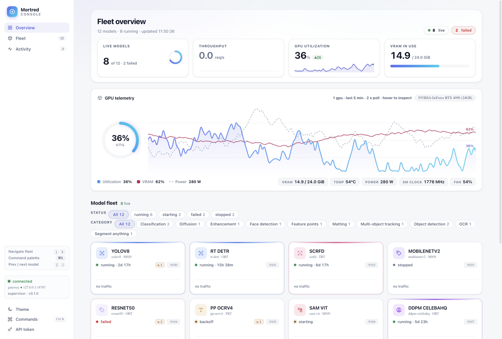
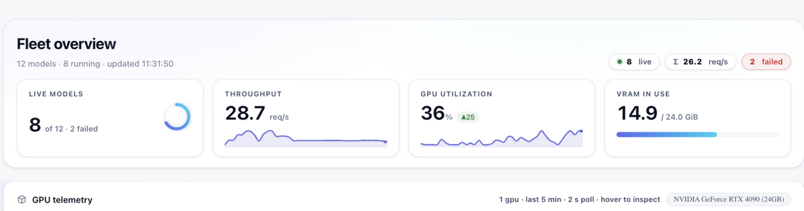

# R8 — 排版压盖专项：全页布局审计与修复

**日期**：2026-09-18　**前置**：[R7](R7-nav-and-shortcuts.md)
**来源**：用户反馈「运行状态、GPU 使用量那块附近信息互相压盖」，要求整体排查排版错误。

## 方法：程序化排版审计

人工看截图容易漏，本轮写了**通用审计脚本**跑真实浏览器：对页面所有
容器检测 (a) 兄弟节点矩形水平/垂直相交（>4px 判为压盖）；(b) 无省略
保护元素的横向挤压（scrollWidth > clientWidth）；(c) 图表 canvas 内
线尾标签的碰撞模拟。覆盖 1600/1280 双宽度 × 总览/工作台双视图，
并把 mock 数据调成真实形态（14 天 uptime、长 GPU 名
`NVIDIA GeForce RTX 4090 (24GB)`、真实模型名）。

## 审计发现与修复

| # | 发现 | 根因 | 修复 |
|---|---|---|---|
| 1 | **GPU 图表两条线的线尾数值标签互相叠压**（util 与 vram 在右边缘收敛时，两个 "90%" 标签画在同一位置）——即用户看到的「GPU 使用量那块压盖」 | 标签各自独立绘制，无碰撞检查 | 标签改为收集后统一布局：两线收敛（<15px）时 vram 标签自动下移 15px（越界则上移），并整体 clamp 在画布内；收敛场景视觉复核确认两个标签垂直分离、互不重叠 |
| 2 | 工作台档案卡 `Throughput` 键被挤压 12px（86>74） | `.id-k` 固定宽 74px 装不下新标签 | 加宽至 92px |
| 3 | 舰队卡片状态行隐患：长 uptime + 重启徽章 + 端口芯片在窄卡片里可能互相侵入 | `.st-label` 无弹性收缩/省略保护 | `flex:1 + min-width:0 + ellipsis`，徽章与端口 `flex-shrink:0` |
| 4 | uptime 长期运行显示如 `336h 05m` 过长 | 格式无天数 | `≥48h` 显示 `2d 17h` 紧凑格式 |
| 5 | KPI「GPU utilization」读作 `93 ▲25 %`（百分号被趋势胶囊隔开，视觉断裂） | 单位是静态节点排在胶囊后 | `%` 并入数值串（`93% ▲25`），移除静态单位节点 |
| 6 | 超长 GPU 名可能顶撞 meta 文本 | 无宽度约束 | 芯片 `max-width:320px + overflow:hidden` |

## 验证

- 修复后四组审计（1600/1280 × overview/workbench）：DOM 压盖 0、
  挤压 0；canvas 标签按碰撞逻辑模拟分离（工作台报文为审计脚本对
  隐藏画布的误报，实际绘制仅在可见时进行）。
- 强制收敛场景（util=vram=90%）特写截图 + 视觉模型核验：两个 90%
  标签垂直分离 ~15px 不重叠；图例/仪表/元数据行无压盖无裁剪。
- 回归：⌘K、主题往返、过滤、`36% ▲25` 单位顺序、`2d 17h` 天数格式、
  长 GPU 名显示——全部通过。

## 截图

| 视图 | 截图 |
|---|---|
| 收敛场景全景（修复后标签分离） |  |
| GPU 卡特写（标签/图例/仪表无压盖） |  |
| 迭代前基线（R7 定稿工作台） |  |

## 评分影响

⑦ 一致性与状态设计 +（压盖清零 + 防御性布局规则）；⑤ 组件质感 +
（canvas 标签碰撞布局是图表工艺细节）；③ 排版 +（单位顺序、天数格式、
标签宽度）。
